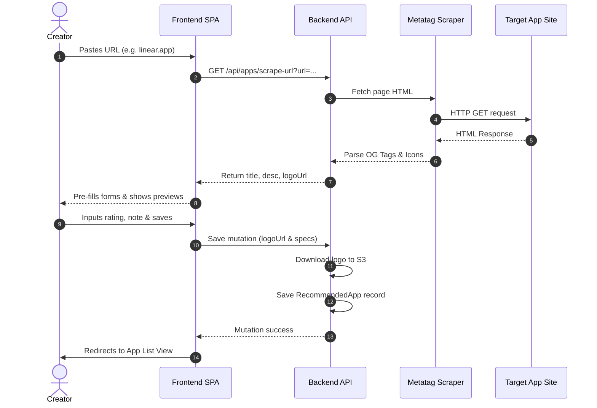

# Apps & Tools — User Flow

## Creator Dashboard Flows

### Flow 1: Navigating to Apps
1. Creator logs in -> Dashboard landing.
2. Clicks **Apps & Tools** (desktop sidebar or mobile card).
3. Apps Home view loads. If empty, displays: "No app lists created yet."
4. Prominent "+ Create List" button shown.

### Flow 2: Create App List
1. Creator clicks "+ New List".
2. Modal prompts for: List Name, Description, Cover Image.
3. Slug auto-generates (e.g., "Developer Productivity" -> `developer-productivity`).
4. Clicks "Create". List is saved as "Draft" visibility by default.

### Flow 3: Scraping & Adding an App
1. Inside an App List, creator clicks "+ Add App/Tool".
2. Full-page Add App view loads.
3. Creator pastes app link into "App Website URL" input field.
4. **Scraping Pipeline:**
   - Client sends URL to `/api/apps/scrape-url?url=...` via debounced check or submit.
   - Backend fetches page, extracts Open Graph meta, title, favicon/logo, developer name.
   - Backend returns payload.
5. Form auto-fills: Title, Description/Synopsis, and Logo Preview.
6. Creator reviews pre-filled data and enters:
   - Personal recommendation note (rich text editor).
   - User Rating (1-10 slider/stars).
   - Platforms supported (Checkboxes: Web, macOS, Windows, Linux, iOS, Android, etc.).
   - Price Tier (Dropdown: Free, Freemium, Paid, Subscription).
   - Optional screenshot uploads.
   - Custom Download/Purchase Link (e.g. affiliate link).
7. Creator clicks "Save".
   - Backend downloads logo and screenshots, uploads to S3, and writes the RecommendedApp entity to Strapi.

### Flow 4: Reordering and Pinning
- **Drag-to-Reorder:** Creator drags rows to reorder. Updates `display_order` value in database.
- **Pinning (⭐):** Creator clicks star icon. Toggles `is_pinned`. If pins > 15, block and show error toast.

---

## Visitor/Public Flows

### Flow 5: Browsing Apps
1. Visitor loads `/:username/apps`.
2. **Top Apps Hero:** Pinned apps show in a desktop cinematic hero carousel or mobile card stack.
3. **List Rows:** Published app lists display as horizontal scrollable card rows.
4. **Category grid:** Clicking a category card (e.g., "Developer Tools") opens the category grid page.

### Flow 6: Detail Slide-up Modal
1. Visitor taps an App Card.
2. Slide-up details modal shows:
   - High-res logo, app title, developer.
   - Creator's personal note and 1-10 rating.
   - Price Tier badge, Platform badges.
   - Screenshots slider.
   - "Visit Website / Download" action button (includes affiliate tracking).
