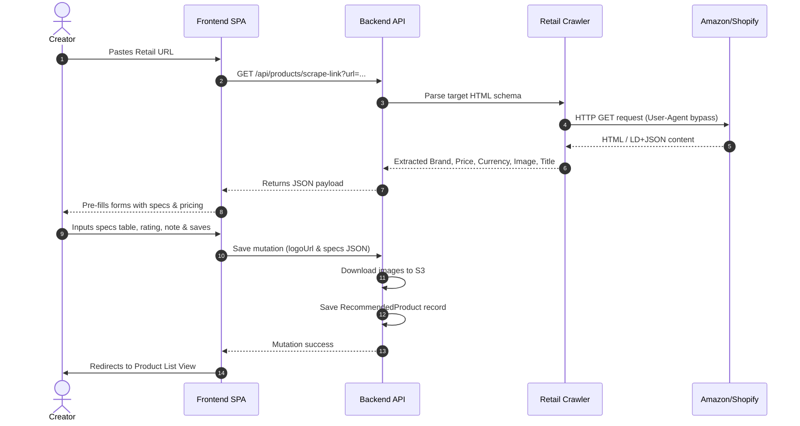

# Products — User Flow

## Creator Dashboard Flows

### Flow 1: Navigating to Products
1. Creator logs in -> Dashboard.
2. Clicks **Products** (sidebar or mobile dashboard landing card).
3. Products Home view loads showing active lists.
4. Clicks "+ Create List" if creating a new one.

### Flow 2: Create Product List
1. Creator clicks "+ New List" on Products dashboard.
2. Inputs List Name, Description, and uploads cover.
3. Slug auto-generates (e.g. "Photography Essentials" -> `photography-essentials`).
4. Clicks "Create". List begins in "Draft" state.

### Flow 3: Scraping & Adding a Product
1. Inside a product list, creator clicks "+ Add Product/Gear".
2. Paste link overlay loads. Creator inputs target retailer link (e.g. Amazon product page).
3. **Scraping Pipeline:**
   - Client sends link to `/api/products/scrape-link?url=...`.
   - Backend scraper retrieves page, extracts Open Graph metadata, JSON-LD price details, and image arrays.
   - Server returns JSON response.
4. Form auto-fills: Product Title, Description, Brand, Price, Currency, Cover Image preview.
5. Creator customize fields and adds:
   - Affiliate buy link (defaults to scraped URL if none provided).
   - Dynamic Specifications (key-value table: e.g. "Color" | "Space Grey").
   - Personal recommendation note (rich text editor).
   - User Rating (1-10 slider/stars).
   - Additional gallery uploads.
6. Clicks "Save". Images are uploaded to S3 and RecommendedProduct saves in Strapi.

### Flow 4: Reordering and Pinning
- **Drag-to-Reorder:** Creator reorders cards in the Recommendations list.
- **Pinning:** Creator clicks star icon. Toggles `is_pinned`. Maximum 15 items allowed.

---

## Visitor/Public Flows

### Flow 5: Browsing Products
1. Visitor loads `/:username/products`.
2. **Top Products Hero:** Pinned products showcase displays.
3. **List Rows:** Lists display as scrollable product rows.
4. **Category grid:** Clicking category links filters products.

### Flow 6: Detail Slide-up Modal
1. Visitor clicks a product card.
2. Slide-up details modal shows:
   - High-res image gallery, Brand, Title, formatted Price badge.
   - Creator's note and 1-10 rating.
   - Specifications list (formatted key-value table).
   - "Buy Now" affiliate action button.
