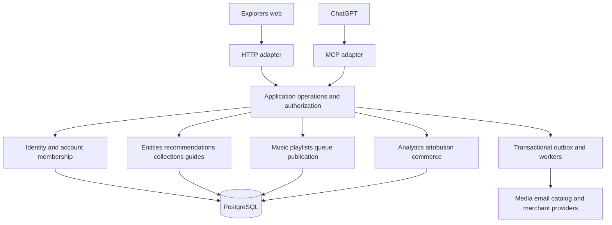

# Explorers.Earth unified platform: architecture investigation

> **Updated review direction:** Read [the revised direction](revised-direction.md) first. The product owner confirmed an empty database, Google-only auth, full existing frontend parity, deferred admin/monetization and ChatGPT immediately after web completion. Strapi source has now been inspected. The live-user migration assumptions and “backend source absent” limitations below describe the original audit and are superseded where the revised document says otherwise.

**Discovery only · 30 September 2026 · source: origin/main `79ef17d0b88c7e11b49d618fc7c888a513f29fa8`**

No application code, migrations, deployed services, credentials, or production data were changed. Origin main was fetched and inspected in an isolated checkout. The existing working checkout and its unrelated changes were preserved. This report describes source reachability, not verified production traffic. No production database, Strapi administration, vendor dashboard, or live deployment was available for inspection.

Companion documents:

- [Complete source inventory](source-inventory.md): GraphQL declaration, HTTP declaration, socket, and coupling-file indexes, with source line numbers.
- [Machine-readable inventory](source-inventory.json): operation bodies and network-call candidates for migration planning.
- [Target contracts, schema, and migration plan](target-schema-and-migration.md).
- [Current OpenAI/MCP research](mcp-and-identity-research.md).

## 1. Recommendation and decisions

Proceed toward a TypeScript modular monolith, PostgreSQL, and versioned SQL migrations with Drizzle as a query/schema tool. This fits the actual backend and early-stage workload. Keep the working Music runtime during migration; absorb its tested operations and operational controls gradually. Strapi retirement should be the result of completed domain cutovers, not the first step.

Adopt **shared entities plus creator-owned recommendations for ordinary recommendation categories**, with typed detail tables and explicit provenance. Do not force guide sections, live music queues, guest requests, commerce, or account identity into a generic recommendation row. Keep collections and guides as structured editorial resources. A recommended person is an entity, not necessarily an Explorers user. A creator/account is not the same thing as a login identity.

The earliest dependencies are an authoritative source inventory/export, immutable identity mappings, authorization contracts, and migration/reconciliation infrastructure. Replacing every login before migrating any public read is unnecessary: the existing public gateway is already a useful seam. Build the replacement behind that contract while identity proof and import are validated in parallel.

Use one application operation behind HTTP and MCP. Initially `/mcp` can be another transport in the same API process; `apps/mcp` does not need an independent deployment. Keep workers separately runnable for imports, email, reconciliation, and webhooks, using the same modules and database. Music sockets may later need independent scaling, but no evidence establishes that requirement today.

Use an established authentication implementation after an import/OAuth proof of concept. Following our discussion, **Better Auth is the preferred open-source candidate** because it fits TypeScript, Drizzle and the unified backend. Auth0 is the managed alternative if reducing authentication operations matters more. Supabase Auth remains an alternative; Keycloak is unnecessary without a firm self-hosted identity-service requirement. Adopting Better Auth means operating an existing implementation, not writing OAuth ourselves. Final selection depends on migration and actual ChatGPT compatibility tests.

Launch public, organic discovery before authenticated edits in ChatGPT. Current plugin rules prohibit digital-product/subscription sales and upgrade promotion, while allowing access to existing paid accounts; advertising, checkout, location collection and analytics also have constraints. Keep web monetization separate. External-to-ChatGPT dynamic prompt/context deep links are not a foundation for the product. See the [official-policy research](mcp-and-identity-research.md).

### Principal corrections to the initial model

| Initial assumption | Source-supported correction | Consequence |
|---|---|---|
| Tunes is just a separate music application | Its server also contains the optional public profile gateway and active Explorers analytics endpoints | Deleting Tunes can break non-music experiences |
| PostgreSQL already stores Explorers analytics | PostgreSQL stores delivery receipts; the adapter still writes event payloads to Strapi | Analytics needs an actual event-store migration |
| All Tunes integrations remain operational | Many routes are deliberately returned as 410; services and old UI remain | Reusing code must not revive retired surfaces |
| A shared user ID can replace the bridge trivially | The bridge checks source identity, completed account cardinality, immutable mappings, lifecycle and credential versions | Preserve these guarantees during consolidation |
| Categories are the conceptual future list | Current categories include Apps & Tools and People; events/experiences/routes are not demonstrated standalone domains | Migrate actual data before expanding taxonomy |
| GraphQL inventory captures all calls | Untagged and dynamically constructed operations exist, including Tunes server reads | Use both parsed declarations and network candidates |
| Switching traffic back is a complete rollback | Once the new system accepts writes, old data is stale | Reverse synchronization or forward repair is required |

## 2. Evidence method and confidence

Runtime composition, policies, schemas, migrations and deployment files take precedence over planning documents. Sources below are relative to the pinned checkout. The companion inventory gives exact line locations. The scanner is reproducible with `inventory.cjs`, GraphQL, and TypeScript; it reads tracked runtime TS/JS, excludes tests, and does not execute application code.

| Evidence | What it establishes |
|---|---|
| `explorers-earth/src/routes/{AuthRoutes,ProtectedRoutes,PublicRoutes}.tsx` | Frontend route and feature inventory |
| `explorers-earth/src/components/AuthSyncManager.tsx`, `hooks/useLogout.ts` | Browser identity orchestration and local logout behavior |
| `tunes/server/app.ts`, `routes/index.ts`, `routes/legacyRemainingRoutes.ts` | Canonical server composition and route registration |
| `tunes/server/policies/musicRetirementPolicy.ts` | Explicitly removed surfaces, including integrations still present as files |
| `tunes/server/services/strapiIdentityGateway.ts`, `musicTokenService.ts`, `middleware/musicPrincipal.ts` | Source-proof exchange and authorization |
| `tunes/server/repositories/musicIdentityRepository.ts`, `services/strapiIdentityAbsenceProof.ts` | Immutable mappings and lifecycle reconciliation |
| `tunes/server/publicProfile/*`, `routes/explorersPublicProfileRoutes.ts` | Optional Strapi-backed public read adapter and disclosure policy |
| `tunes/server/services/explorers-analytics-*.ts` | Receipt/payload separation and target checks |
| `tunes/shared/schema.ts`, `shared/music-migration-contract.ts`, SQL migrations | Intended database structure; not proof of actual production catalog |
| `docker-compose.yml`, `.github/workflows/{explorers,tunes,tunes-deploy,tunes-test-direct-deploy}.yml` | Declared build and deployment paths |

**High confidence:** code shapes, exact route declarations, mounted/tombstoned behavior under the reviewed composition, identity checks, intended migration contract. **Conditional:** actual environment flags, reachable deployed variants, production schema/data consistency and external integration configuration. **Unknown:** full external Strapi content schemas, role permissions, policies, hooks, password hashes, upload provider, plugin versions and production rows. Fixtures are not exports.

### Operation counts

The audit scanned **956 tracked runtime TS/JS files** and found:

| Location/style | Query declarations or template sites | Mutation declarations or template sites |
|---|---:|---:|
| Explorers tagged GraphQL | 108 | 86 |
| Tunes tagged GraphQL | 1 | 4 |
| Tunes client untagged GraphQL | 7 | 15 |
| Tunes server untagged GraphQL | 12 | 3 |
| **Total** | **128** | **108** |

There are zero GraphQL subscription declarations and zero tagged parse failures. These are **occurrences**, not unique operation names, active requests, or backend schema counts. Dynamic category templates can generate several concrete operations. The inventory also records **72 HTTP declaration sites, 18 literal socket declaration sites, 1,045 network-call candidate lines and 292 files with coupling signals**. Dynamic emissions and composed URLs require the semantic analysis below; regex counts alone are not a reachability proof. Build/deployment files were reviewed separately from this runtime scan.

## 3. Actual applications and deployment

The root package is an orchestration wrapper using package-prefix commands, not a fully unified workspace. Explorers and Tunes have separate packages and lockfiles.

| Area | Current source |
|---|---|
| Explorers frontend | React 18, TypeScript 5.6, Vite 8, Apollo 3, Zustand 5, React Router 7, TanStack Query 5 for parts of Music, Tailwind, Formik/Yup, Radix/Framer, Maps and i18n |
| Tunes frontend | React/Vite, Wouter, TanStack Query, retained Apollo/client administration flows |
| Tunes server | Express 5.2, TypeScript, PostgreSQL, Drizzle 0.45, pg/Neon drivers, Passport/session, Socket.IO 4.8 |
| External backend | Strapi GraphQL and REST, including user/account/media contracts; backend source absent |
| Build/deployment | Separate frontend publish and Tunes image/deployment pipelines; multiple retained operational paths |

Do not copy dependency versions from old CLAUDE/planning text: current packages supersede them. Express 5 alongside Express 4 types is a cleanup item to validate during consolidation, not a reason to rewrite the backend.

The Explorers workflow builds and copies `dist` to an SSH/Nginx host, deleting the previous frontend directory before copying and reloading Nginx. Retained Netlify configuration includes GraphQL/API and external-provider proxies. Neither proves which host receives today's traffic. The static sitemap generator primarily emits known static routes using a configured base URL; it is not evidence of a complete dynamic creator sitemap.

Tunes CI builds an immutable image and includes integration, coverage/type checks, dependency/graph smoke and vulnerability/provenance steps. The main deploy workflow and compose describe PostgreSQL 15, Traefik, blue/green slots, immutable digests, migration/readiness gates and retained-image rollback. A separate manual direct-deploy workflow still operates a legacy container path, performs a backup/migration and replacement. Reconcile these paths before migration: bypassing the gated path could invalidate its guarantees.

The public gateway requires feature/configuration prerequisites, including a read token and allowed origin; its variables are not visible in the root compose declaration. Current email code calls Resend, while retained deployment configuration/documentation references other email settings. These are **configuration questions**, not proof that live production is broken. Collect redacted effective configuration, deployment manifests and release attestations.

## 4. Frontend and domain inventory

### Routes and parity surface

| Surface | Current behavior to preserve or explicitly retire |
|---|---|
| Authentication | Login, register, forgot/reset password, reset-link sent, email verification/confirmation, Google callback, account reactivation |
| Public utility | Landing, about, contact, use cases, privacy, cookies, terms, claim-account flow |
| Owner | Profile, recommendation hub, analytics, settings, home, onboarding, retained Instagram/subscription/checkout screens |
| Category management | Places, guides, music, movies/shows, books, games, apps/tools, products, people; list/add/edit and category-specific detail operations |
| Guides | New guide, guide edit/detail and section editor; retained `/guides` alias |
| Place-linked resources | Add people/products to a place/list; legacy `/:listId/new` and `/:placeId/edit` owner routes |
| Public creator | `/:username` plus category lists; places slug/maps, guides slug, movie genres, book subjects, game genres, people sectors and category-specific lists |
| Music | Owner recommendation/music surface, public profile music, public share slug and guest-player/request experiences; `/music` and `/hub` aliases |

Desktop/mobile shells and guards duplicate some presentation paths. Migration parity must exercise both. Existing public URLs, printed QR targets, slugs and aliases are durable contracts; username rename should create a reserved historical alias rather than break links. QR utilities generate ordinary profile/place URLs with optional campaign parameters; a persistent QR database is not demonstrated.

The actual nine navigation categories are **Places, Guides, Music, Movies & Shows, Books, Games, Apps & Tools, Products, People**. Movies and TV share a category but require distinct upstream identities. Events, experiences and routes can remain future entity types. Guides can represent itineraries without becoming route entities.

### Reconstructed Strapi data contracts

These are client-observed fields/relations, not a complete authoritative schema. Names and casing are heterogeneous; retain a mapping dictionary during migration.

| Model family | Observed ownership/relationships and significant payload |
|---|---|
| Users | Users-permissions user numeric ID and `documentId`, username/email/provider/confirmed/blocked, accounts relation |
| Accounts | Separate numeric ID and `documentId`, account username, `Account_Name`, type/bio, multiple address concepts, mobile/phone disclosure, social media, feed JSON, profile/background media, public/category flags, pinned tabs and auto-pinning |
| Places | Account → recommendation lists → recommended places; list name/location JSON, slug, visibility/order/pins; place-details JSON, type/category/subcategory, contact details, commentary, social/media metadata and user/Google ratings |
| Place taxonomy/claims | Recommendation categories/subcategories; claimable place profiles and verification submissions/uploads; claim evidence must not become verified ownership automatically |
| Movies/shows | Movie lists → recommended movies; TMDB ID **plus media type**, title/poster, genres/cast/provider metadata, ratings/commentary/media/order |
| Books | Book lists → recommended books; volume ID, ISBN13, authors/subjects, publisher/pages, links, ratings/commentary/media |
| Games | Game lists → recommended games; IGDB ID/slug, release/cover, genres/platforms/modes/screenshots, commentary/rating |
| Apps/tools | App lists → recommended apps; app URL, title, developer/platforms, pricing tier, download URL, logo/screenshots and commentary |
| Products | Product lists → recommended products; product/buy URLs, title/brand, floating price/currency, specs/images and commentary; can link to place list |
| People | Person lists → recommended people; name/handle/headline/location, avatar, platform/social URLs, skills/tags and commentary; can link to place list |
| Guides | Account → guide → ordered sections; guide budget/type/days/multicity/location/tags/tips/media; section sequence, timeline, transport, stay, activities, maps, packing, pre-tasks and budget JSON |
| Platform content | FAQs, terms and reasons for leaving; retained subscription-plan/user-plan/song-limit contracts |
| Analytics | Public-page analytics keyed by account/location/recommendation, `Stats` JSON event array and event IDs |

Do not equate “Favorites” in the place recommendation experience with a proven private bookmark/following subsystem. No complete existing follows/saves domain was established. Add those as new features only with explicit semantics.

### Visibility and public reads

The current frontend public shell/category hooks call a Tunes-hosted gateway (`VITE_PUBLIC_PROFILE_GATEWAY_URL`, then Tunes URL fallback), with anonymous requests, ETags and conditional reads. The server registration is optional and requires live mode and valid configuration. The adapter still reads Strapi.

Its policy requires exact `public_profile === "Yes"` and category flag `"Yes"`, applies list visibility and strips sensitive nested values. Phone disclosure is deliberate policy, not a blanket “all contacts public” rule. Preserve this boundary; client-side guards are not authorization. Public Music uses its own publication model.

Pagination currently uses bounded offset cursors (`o<number>`), defaults of 12 and maxima of 24, with bounded nested previews and separate detail pagination. Title-derived legacy slug fallback also exists. The replacement should preserve initial semantics and links before adopting opaque keyset cursors; never convert a preview cap into silent data loss. Book visibility casing differs from several other categories. Null/missing flags need explicit import policy and fixtures.

## 5. Strapi dependency classification and replacement

The inventory is a file-level drill-down; this table supplies the meaning and replacement obligation for each dependency class.

| Class | Verified dependency | Replacement / required evidence |
|---|---|---|
| AUTH | GraphQL login/register/reset/forgot/change-password and user mutation; JWT browser storage; provider/blocked/confirmed checks | Established IdP, immutable subject map, import/recovery and session policy |
| GOOGLE | Redirect to `/api/connect/google`; callback exchanges Google-style `ya29` token through `/api/auth/google/callback`, or accepts the existing Strapi token path, then `/api/users/me` | Provider-backed Google login, state/PKCE/session flow; verify external callback configuration |
| GRAPHQL READ | Profile/category/list/detail/guide/taxonomy/content/analytics and bridge queries | Domain query contracts, explicit DTOs, authorization and pagination |
| GRAPHQL WRITE | CRUD across lists/items/guides/sections/profile/settings/claims and retained plan data | Owned application commands, revisions, idempotency, audit and constrained input |
| REST READ | `/api/users/me`, filtered and paginated `/api/accounts`, upload/numeric IDs | Identity verification adapter until cutover; explicit ID mappings |
| UPLOAD | Multipart `/upload` with `files`, `ref`, `refId`, `field`; file deletion `/upload/files/:id` | Object storage/media service with ownership, MIME/size checks, checksums, relation maps and deletion policy |
| MEDIA | Strapi URLs and metadata embedded in domain JSON and relations | Inventory originals/variants and embedded URLs; copy then verify before remapping; retain redirects/origin while cached links exist |
| PERMISSIONS | Frontend flags plus server gateway filters; direct GraphQL role behavior outside repo | Export public/authenticated role permissions, custom policies and private-field behavior; deny by default |
| CUSTOM ENDPOINT | Send-email-confirmation caller and provider authentication endpoints | Determine owning backend implementation, templates, anti-abuse and delivery before replacing |
| IDENTITY BRIDGE | Server `/users/me` and complete account scans; immutable user/account mapping | Transitional proof adapter; replace source with canonical identity without weakening owner checks |
| LIFECYCLE | Privileged read-only absence proof, suspension/delete/reconciliation in Music | Preserve absent/present/unknown/outage distinction; inspect external Strapi hooks before relying on events |
| ANALYTICS | Server adapter publishes payload to Strapi; PG delivery receipts only | Dedicated events/rollups and receipt transition with deduplication |
| LEGACY MUSIC/COMMERCE | Untagged plan, subscription and song-limit queries; retained client/admin code | Classify data and active consumers; do not revive 410 endpoints accidentally |
| CONFIG/PROXY | `VITE_API_URL`, `VITE_REST_API_URL`, server Strapi variables, Vite/Netlify/proxy routes | Centralize origin/timeout/error configuration and progressively remove old routes |
| WEBHOOKS/HIDDEN HOOKS | No external Strapi implementation available | Unknown, not “none”; obtain backend schema/plugin/controller/lifecycle/webhook export |

`documentId` is not interchangeable with a numeric REST/upload ID. GraphQL response shapes mix data envelopes and flattened document IDs, and use backend filters, publication state and relation conventions. This suggests a particular Strapi-era contract but does **not** prove the deployed version. New APIs should not perpetuate those serialization quirks; adapters should.

Payment, scraping, Gemini and Instagram calls are not automatically Strapi calls just because they occur beside them. Their configured origin and current server routing determine ownership. Network candidates in the appendix intentionally remain candidates where static evidence is insufficient.

## 6. Current identity sequence and failure behavior

1. The web login receives a Strapi JWT and persists auth state in local storage (`auth-storage`, with `qrtoken` used by Apollo). Google callback has an exchange fallback and a `/users/me` verification step. Browser persistence is not a secure server session.
2. `AuthSyncManager` checks the source user/provider/confirmation/blocking and completed account candidates. Account generation changes invalidate Music state. The eligible account must be unambiguous; different upload/account flows also have cardinality checks.
3. The Music client single-flights `/api/music/identity/ensure`, presenting the **Strapi proof**. The server independently fetches the user and a complete paginated account set, validates counts/duplicates and eligibility, and rejects ambiguous ownership. Client-picked IDs are not trusted.
4. PostgreSQL projects the source user and account into a Tunes numeric user using immutable unique mappings and concurrency control. It does not match by email or username. Internal username/password/guest identifiers are server generated.
5. The server issues a custom signed Music credential with a **600-second lifetime**, issuer/audience, key ID, JTI, source subject and credential/session version. This is not a general OAuth access token.
6. Each protected Music request validates cryptography and claims, resolves the mapped database principal, checks active/tombstoned/version state and applies ownership. Rotation has a bounded prior-key overlap. Public guest capabilities are a separate authority class.
7. Lifecycle operations and reconciliation can suspend/revoke access and disconnect sockets. Absence-proof reads distinguish proven absence from upstream outage or uncertainty; an unavailable Strapi must not imply deletion.

Tunes also retains Passport/scrypt authentication and PostgreSQL-backed `cosmic.sid` sessions with a rolling **30-day** lifetime, session regeneration and CSRF/origin boundaries. Native registration is contained by retirement policy; retained declarations do not make it a supported public flow. The newer frontend's auth configuration also limits what can be inferred from old UI files.

`useLogout` clears browser storage/caches and broadcasts local closure. The inspected path does not establish a network-wide revoke-all operation. Server credential-revocation operations exist, but ordinary local logout must not be described as immediate global revocation. Preserve this distinction and make the target semantics explicit.

## 7. Tunes: retain, adapt, retire deliberately

| Capability | Current reachability / disposition |
|---|---|
| Playlist CRUD, songs, order, visibility | Canonical mounted operations; retain domain behavior and owner isolation |
| Queue replace/append, dashboard, guest controls, currently playing, history | Active Music operations with distinct live state; retain separately from recommendation catalog |
| YouTube search and video URL resolution | Active server-side provider integration; preserve quotas/errors and avoid exposing credentials |
| Publication | Durable idempotent operations, encrypted replay and retirement; reuse the operational pattern |
| Public music/resource and guest URLs | Public/unlisted/revoked capability semantics; retain URL, revocation and guest-policy parity |
| Socket.IO | Owner/guest boundaries, player state, requests/status, publication/owner revision invalidation, reconnect/recheck/disconnect; retain bounded event allowlist |
| Identity/lifecycle/reactivation | Active mapping, suspension/resume, deletion/reconciliation and reactivation infrastructure; adapt rather than replace with unchecked user ID |
| Explorers public gateway | Conditionally mounted Strapi adapter; retain as read-cutover seam |
| Explorers analytics | Standard composition mounts event/owner routes; dedicated local gateway composition differs |
| Entitlements | Core/paid checks and snapshot freshness exist; paid import still returns 410 after checks |
| Razorpay/payments/subscriptions | Legacy implementation and UI remain, but retired route policy and disabled subscription flag prevent treating it as a live commerce foundation |
| Spotify/importers, Gemini, scraping, Instagram | Retained implementation is not evidence of mounted integration; evaluate independently if product requires revival |
| Admin, GraphQL proxy, old auth/config/debug surfaces | Deliberately tombstoned, including `/graphql` and `/api/strapi/graphql`; do not restore while reorganizing |
| Email | Current service uses Resend REST with Handlebars/templates/logging; reconcile older SES/SMTP documentation |

Canonical HTTP families include `/api/playlists`, playlist songs/reorder/visibility, `/api/playlist/songs`, `/api/music/queue/*`, dashboard/guest controls, currently-playing/history, `/api/youtube/*`, `/api/music/publication`, identity/lifecycle, entitlement, public-profile/public-resource and guest request routes. The inventory lists exact declarations. Legacy route modules can merely call the canonical composition; counting their names as separate backends is misleading.

Literal socket extraction is incomplete by design: dynamic event forwarding includes `player_state`, `guest_request`, `guest_request_status`, `music_public_change` and `music_owner_change`, as well as connection/error events. Preserve handshake authentication, revalidation, revision ordering, origin checks, rate limits and suspension disconnects in parity tests.

### Database and operational assets

The migration contract enumerates 27 base tables and nine control tables. Drizzle alone is not the full database definition: SQL migrations include raw tables, constraints, functions and triggers. The append-only sequence reaches `0021_explorers_analytics_receipts`. Preserve migration checksums, advisory locking, catalog verification, separate migration/runtime privileges and deployed-history compatibility.

Base families cover users/profiles/team/session/tokens; playlists/playlist songs/live songs/played songs/playback; guest interaction/activity/analytics snapshots; email/templates/content/settings/SEO/widgets; YouTube catalog/token/usage tables. Control tables cover schema history, identity tombstones/lifecycle, revocation, publication/current/archive, reactivation, owner-operation replay and analytics receipts.

The current `users` row combines external identity, account/venue settings, entitlement snapshots, lifecycle and guest capability state. Split responsibilities gradually while retaining the numeric ID mapping. `songs` is live queue data and `playlist_songs` carries denormalized track data; neither should be renamed into a universal canonical entity table without understanding its references. `played_songs` relationships must survive history migration. Legacy raw API token storage should not be copied as the target credential design.

## 8. Target architecture and fit of the domain abstraction



Proposed organization, after behavioral parity is established:

```text
apps/web                 existing Explorers frontend, moved late
apps/api                 HTTP, MCP and socket composition
apps/worker              same modules; async jobs and reconciliation
modules/identity         canonical users, issuer mapping, memberships
modules/creators          public profiles, usernames, disclosure
modules/catalog          entities, typed details, source assertions
modules/recommendations  owned editorial assertions and visibility
modules/collections      ordered lists and guide sections
modules/music            existing playlist/queue/publication domain
modules/analytics        events, privacy, rollups
modules/attribution      outbound links and conversion correlation
modules/commerce         products, purchases, grants, ledger (later)
packages/contracts       validated transport DTOs, not ORM exports
packages/db              connection, transactions, migration tooling
packages/observability   redacted logs, tracing and metrics
```

Avoid a generic `shared` package becoming a dependency sink. Modules own writes and expose application operations; transport code does not import tables directly. Use SQL transactions for local invariants and an outbox for external effects. PostgreSQL is sufficient for authorization relations, recommendation joins, durable jobs at initial scale, and reporting. Redis, a separate message broker, dedicated search, and service extraction need measured justification.

The entity/recommendation split is valuable because creator commentary, disclosure, rating, visibility and order are not properties of a shared café/book. It enables creator overlap and reliable provenance. However, entity merging is a product and data-quality operation: import source records independently, attach known external identifiers, and merge only when identity is defensible. Never use normalized display title alone. Preserve source snapshots and reversibility.

Collections own ordering and editorial structure, not entity truth. Guides need sections with validated typed blocks and a versioned JSON escape hatch for legacy rich structures. Music recommendations can point to tracks/playlists, while playback, guests and requests remain separate commands. Product price is an observed offer with currency and time, not an eternal entity fact. Claims, sponsorship, purchases and creator payouts each require their own records and policies.

## 9. Search and discovery at early scale

Start with PostgreSQL filtering, joins and full-text search. Use a denormalized, rebuildable public search document whose visibility is checked again when returning results. PostgreSQL recommends GIN for text search; trigram indexes support misspellings and similarity. [PostgreSQL FTS](https://www.postgresql.org/docs/16/textsearch-indexes.html), [pg_trgm](https://www.postgresql.org/docs/17/pgtrgm.html).

| Query | Initial implementation and index |
|---|---|
| Creator-specific/category | Account + visibility + entity type with stable `(published_at,id)` pagination |
| Destination/geographic | Normalized geographic resources and place coordinates; PostGIS GiST when radius/bounds are required; explicit destination rather than inferred precise user location |
| Keyword | Weighted title/category/editorial text `tsvector` GIN; trigram username/title fallback |
| Creator overlap | Group recommendations by canonical entity, `count(distinct account_id)`, intersect requested creator IDs; duplicates from one creator count once |
| Popularity | Time-bounded, deduplicated aggregates with abuse filtering, separate from raw event count |
| Freshness | Explicit reviewed/observed timestamps; creation time alone does not establish a current recommendation |
| Trust/provenance | Return creator identity, source, commentary date, disclosure and confidence; do not invent a universal trust score |
| Following-based | Future follows join with `(follower_user_id,account_id)` uniqueness; this is new scope |
| Collections | Indexed collection metadata plus authorized membership queries; paid/private titles and snippets follow policy |
| Semantic | Add pgvector only after a labeled query set shows lexical/filter failures; version embedding model and respect visibility/deletion in retrieval |

No graph database is needed for creator → recommendation → entity joins or multi-creator overlap. Reconsider only if measured multi-hop graph workloads dominate. OpenSearch adds operational cost; Typesense/Meilisearch may later improve faceting/typos, but introduce another consistency and ACL boundary. An external vector database has no current justification. Search indexes remain derived, never the access-control source of truth.

## 10. Analytics, attribution and commerce

Current browser analytics requires the analytics consent flag before GA/Clarity initialization and custom event submission. The custom path includes event IDs, retry/receipt handling, owner-visit suppression, referrer-origin/UTM treatment and metadata allowlists. Server adapters validate target ownership/publication and rate-limit. These are useful reusable controls.

The PostgreSQL receipt table tracks state, payload hashes, leases and Strapi document references, **not the event payload**. Replacing Strapi without moving that payload loses the analytics source. Existing dashboard charts and their date ranges/country/source transformations must be reconciled against imported events, including legacy duplicates and malformed JSON.

Use distinct events for query execution, result returned, actual observable render, profile/collection view, engagement, outbound redirect and verified conversion. An MCP tool invocation proves neither a ChatGPT impression nor that a user read a recommendation. Do not collect full conversations to fill this gap. Component render telemetry, where available and permitted, remains a separate limited signal with documented coverage.

For referral attribution, create an opaque short-lived click correlation record at an owned redirect endpoint, validate destinations against stored merchant URLs, and send only partner-accepted identifiers. Never accept arbitrary redirect URLs or trust browser-submitted revenue. Signed merchant webhooks, replay protection, deduplication and reconciliation establish conversions. Commission and creator shares belong in an auditable ledger with reversals, pending/confirmed/refunded states and currency-specific amounts. A click does not guarantee a conversion or payout.

| Model | Minimum capability | Recommendation |
|---|---|---|
| Affiliate referrals | Approved partner contract, links/disclosure, clicks, signed conversion ingestion, ledger | Pilot on web after event integrity; plugin rules separately reviewed |
| Creator Pro | Product/price, customer and subscription state, webhook-driven entitlement, recovery | Rebuild around verified vendor state; old Razorpay utilities are not a complete active system |
| Paid guides | Purchase + resource-specific grant + refund/revocation, download/query policy | Web purchase only in this proposal; existing-entitlement access needs policy validation. Every read must enforce access and avoid public-index leakage |
| Business claims | Evidence/review/status/appeal and scoped membership | Keep recommended business separate from verified claimed owner |
| Sponsorship | Explicit paid placement/disclosure, independent ranking policy | Web-only proposal initially; current plugin advertising restrictions cannot be solved merely by labeling ads |
| Paid recommendation API | Stable IDs/versioning, scoped machine clients, quotas and usage records | Preserve contract boundaries now; defer marketplace/billing complexity |

Define event and financial retention separately, pseudonymize where feasible, document consent and deletion behavior, and restrict creator dashboards to aggregates/authorized records. Do not put access tokens, precise user locations, email addresses, or raw prompts into generic event metadata. Partner licensing may constrain external catalog/media redistribution and AI retrieval; validate terms before broad syndication.

## 11. Risks and evidence required before implementation approval

| Priority | Risk / missing evidence | Concrete gate |
|---|---|---|
| Critical | No external Strapi schema/permissions/hooks/export | Obtain versioned schema/controller/plugin/role/media manifest and read-only data export; reconcile every observed contract |
| Critical | Identity imports and ambiguous multiple accounts | Prove subject mappings, duplicate handling, provider/password migration and rollback on representative fixtures |
| Critical | Private data in nested JSON or direct public GraphQL | Test disclosure matrix against actual source roles and replacement, including unpublished and paid resources |
| High | Lost or duplicated analytics after Strapi retirement | Export Stats payloads, replay/dedupe, reconcile dashboards and receipt-state transitions |
| High | Competing deployment paths/effective config unknown | Establish single production release authority, effective gateway/email flags and restore drill |
| High | Music state and credentials accidentally simplified | Preserve lifecycle, replay, guest capabilities, socket revisions and owner isolation with existing contract suite |
| High | Media/slug/QR breakage | Full media checksum manifest and URL corpus, aliases, compatibility redirects and canary validation |
| High | Provider secret exposed by frontend integration | IGDB client secret is referenced through a `VITE_` variable and browser token/proxy flow; move token exchange server-side and assess deployed bundle exposure before credential rotation |
| Medium | Existing dependencies/documentation disagree | Pin runtime/toolchain and resolve type/version issues as a separate scoped change |
| Medium | New monetization presumed approved by ChatGPT | Validate current policies and review before proposing ads, paid access or checkout tools |

This audit does not prove any deployed credential is compromised and performs no rotation. It identifies the source-level boundary that needs correction in implementation.

## 12. Recommended review outcome

Approve the architectural direction and a **discovery/export plus identity/authorization proof phase**, not a wholesale replacement. Review the companion schema as a proposed contract, not migration-ready SQL. Defer final identity-vendor choice, complete source-to-target fields and irreversible cutover until the evidence gates above close.

The implementation sequence, parity matrix and rollback rules are in [the migration plan](target-schema-and-migration.md). OpenAI facts and constraints are isolated in [the current research note](mcp-and-identity-research.md) so they can be refreshed before submission.
