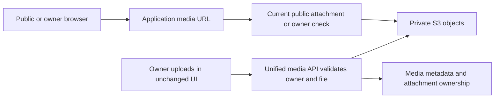

# Final grooming: readiness, media and external inputs

**Current verdict: product scope settled; plans corrected; external configuration not yet cleared.** No implementation, cloud changes, secret-value reads or deployment occurred. This is the dependency closure list to resolve before starting the affected work, not a claim that existing server secrets cover everything.

**Discussion update:** the owner confirmed Google Cloud project access and accepted organized private S3 with authorized application media delivery. The media design is settled; actual bucket/IAM and callback configuration remain unverified. See [owner setup checklist](owner-setup-checklist.md) for exact proposed configuration names and responsibilities.

## 1. Review outcome

Three subagents reviewed operations, media/auth and feature coverage independently. The review found missing collection deletion, incorrect parent ownership for place-linked lists, missing account-deletion feedback writes, omitted image-byte delivery policy, unsafe assumptions about GitHub merge gates and an unspecified QA artifact producer. These are substantive corrections, not cosmetic grooming.

The planning sources are updated and the individual tickets regenerated. Review reports retain the original findings for traceability: [operations](grooming-operations-review.md), [media/auth](grooming-media-auth-review.md), [features](grooming-feature-review.md).

## 2. What we actually know about credentials

Read-only GitHub metadata confirms deployment, AWS, Resend and several catalog-provider **secret names**. It does not expose their values, establish permission to use them locally or prove their validity. GitHub-stored secret values generally cannot be retrieved through a listing; workflows can reference configured secrets under their permitted scope. Local tests can use fixture services; real provider checks run with explicit nonproduction configuration.

No Google OAuth client-ID/client-secret names appeared in the inspected Explorers/Strapi repository or Tunes production-environment lists. Google configuration may instead exist in Strapi's database or a host. Maps/Books API keys are not Google sign-in credentials. We must locate that configuration or obtain Google Cloud project access through the normal secure channel. No secret should be pasted into chat.

## 3. Required inputs and who closes them

| Dependency | Known now | Closure / owner | Needed before |
|---|---|---|---|
| Google OAuth client | Not located in inspected secret scopes | Agent locates authorized existing config; Google project owner grants access or enters client secret/redirects securely if inaccessible | 2.1 configuration, real login acceptance 2.4/3.5 |
| Local/QA/prod callback URLs | Production product domain known; exact local/QA routing not pinned | Agent records exact origins and callback path after routing; DNS/project owner only if access or hostname choice is missing | Google configuration |
| Google consent audience/test users | Unverified | Inspect project settings; project owner handles inaccessible configuration | Real Google acceptance/public release |
| Auth signing/session secret | New Better Auth secret not verified | Generate per environment into the approved secret mechanism, not manually supplied by user | Auth startup |
| S3 bucket/region/IAM | Strapi bucket secret name exists; effective policies unknown | Read-only AWS/config preflight; bind QA/prod resources and least-privilege credentials through existing system | Real upload acceptance 2.3/3.5 |
| Media delivery policy | Design accepted; implementation pending | Accepted private S3 + authorized application media endpoint below; verify implementation | Media implementation |
| QA hostname and DNS/TLS | Current Tunes host allocated for QA; public hostname unconfirmed | Agent checks existing setup; DNS owner supplies access or preferred name only if needed | QA provisioning and callback registration |
| Host capability and access | SSH secret names exist, no host preflight performed | Agent checks trusted host identity, architecture, disk/memory, Docker and isolated volumes using authorized access | QA/prod deployment work |
| GitHub enforced checks | Main has no required status checks in returned settings | Configure exact required check after first real run, using authorized repo administration | Merge readiness |
| QA environment | Absent in inspected environments | Create restricted QA environment and bind existing Tunes host credentials; no production secret reuse by assumption | QA candidate deployment |
| Catalog/maps/music providers | Relevant secret names present | Agent verifies scopes/origin restrictions/quota and runs nonproduction smoke; provider owner fixes inaccessible configuration | Each corresponding feature acceptance |
| Reference/help/legal content | Schemas available, rows absent | Selective read-only export of current approved content or owner-reviewed seed file; no invention of legal text | Seed/content acceptance |
| Backups and recovery policy | Not configured/verified for target topology | Agent proposes measurable retention/recovery settings and verifies off-host storage access; owner input only for material cost/recovery preference | Production readiness |

Deletion reasons are **not reference seed rows**: existing Settings writes the user's freeform feedback before the final deletion step. That command is now explicitly in ticket 2.4.

We can complete local fixture work without cloud secrets, but it would be inaccurate to say real Google/S3/QA acceptance has no external dependencies. The user's request is to clear these before implementation: complete a nonsecret readiness manifest and resolve unavailable access/preferences first. Verification should request only the specific missing input, not a broad credential dump.

## 4. S3: current behavior and proposed replacement

**Current verified source:** the browser uploads to Strapi, Strapi uses S3, and returned media URLs are used by the frontend. The public profile API returning JSON is different from the browser requesting the image bytes. A universal image-byte proxy was not found. Optional CDN configuration exists, but its live values were not inspected. Thus we cannot currently promise that the S3 hostname is hidden or that all objects are private.

**Accepted first-release flow:**

The browser gets a stable application media URL, not AWS credentials or a caller-selected bucket/key. The API streams media bytes after checking current visibility. Public visitors can load images when the relevant account/category/list/item permits it; unpublished/claim evidence remains restricted. This preserves the page design and avoids requiring a new CDN setup for the first milestone.

Use private S3, no public-read upload default. Initially deliver mutable uploaded media with `Cache-Control: no-store`; this is simple and avoids stale public URL access after hiding content, at the cost of backend bandwidth. Support video byte ranges where the retained screens need them. A CDN can be added after measurement, with an explicit public/private policy and revocation window. Hiding a hostname is not itself a privacy guarantee, and already-downloaded bytes cannot be recalled.

Deletion first marks/detaches data transactionally, then a retryable job removes unreferenced objects. Replacement uploads must succeed before the old image is detached. Abandoned uploads need bounded cleanup. Provider-hosted catalog photos are a separate class; not every image is our S3 object.

**Accepted decision:** preserve normal public image display through controlled application URLs, with private storage and the full upload/replacement/deletion lifecycle. One bucket and existing AWS credentials are selected; prefix separation is application-enforced unless the verified IAM policy provides an additional boundary.

## 5. Google: what may be needed from the owner

Better Auth's code flow requires a Google Web OAuth client ID, server-side client secret, explicit base URL and registered callback. For the default auth mount the path is `/api/auth/callback/google`; the actual local/QA/prod origins must be registered. Consent-screen audience/test-user settings are separate from possessing the secret. [Better Auth Google documentation](https://better-auth.com/docs/authentication/google).

An existing suitable Google client can be reused after configuration review; a new client is not automatically necessary. The owner selected one shared Google Web OAuth client with separately registered callbacks. Ordinary sign-in needs identity scopes, not Gmail/Drive access or YouTube account authorization.

If the current Google project is accessible through available approved access, the agent can prepare the configuration. Otherwise the project owner must provide access or enter the credentials/redirects into the approved systems. This is a real possible owner dependency that was understated earlier.

## 6. Implementation readiness gate

Before starting application work, review this input list and record where each dependency will come from, its owner and its verification step. Do not mark a provider “ready” from secret-name presence alone. No production or cloud configuration changes are bundled into this documentation review.

## Simplified hosting decision

QA and production use the two existing servers, each with self-hosted PostgreSQL and independent data/volumes. No RDS provision is planned. One Google OAuth client and one S3 bucket are shared. App secrets remain distinct. Existing AWS credential reuse is owner-confirmed but permission checks remain pending. The same tested artifact is promoted with environment-specific runtime configuration; QA data is never promoted.
