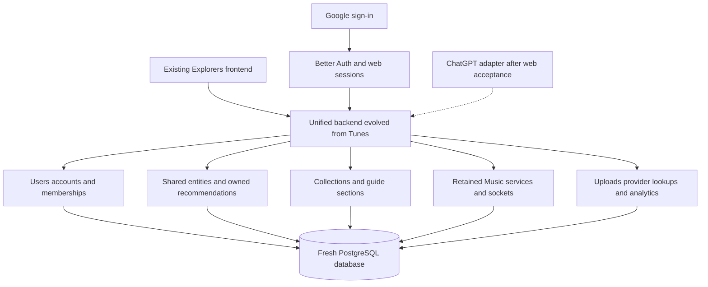

# Revised direction after product discussion and Strapi audit

**Current review baseline · 30 September 2026 · discovery only**

This document supersedes the live-user migration assumptions in the original investigation and migration proposal. The original source findings remain useful; historical imports, credential migration and dual-write/reverse-sync planning are **not required for the agreed first release**. Nothing has been implemented, deleted, deployed or reset.

The current [epic-and-ticket backlog](epics-and-tickets.md) organizes execution around four agreed milestones. Its working agreement includes one integration branch, early CI, local-first testing, QA on the current Tunes host and production on the main host. It supersedes the intermediate phase grouping below for milestone reporting.

## 1. Decisions agreed with the product owner

| Topic | Agreed scope |
|---|---|
| Existing users/data | No existing users to migrate. The new database may start empty. Required reference data can be seeded. This is not permission to erase a deployed database during discovery. |
| Backend | Evolve the existing Tunes server into the unified Explorers backend; reuse working services and operational controls. Do not build a parallel backend from scratch. |
| Frontend | Keep the Explorers screens, layout, navigation and working feature behavior. Internal API/auth wiring may change. No redesign. |
| Tunes frontend | Remove the duplicate frontend during implementation after dependencies and existing Explorers Music coverage are verified. |
| Categories | Preserve all nine current categories and their working flows. |
| Music | Preserve existing functionality already present in Explorers; no Music rebuild or deliberate feature reduction. |
| Authentication | Better Auth is the preferred implementation, with Google-only sign-in initially. Password registration/reset screens are the agreed visible exception to frontend parity. |
| Ownership | User is login identity; account owns profile, recommendations, collections, guides and Music. One account per user initially, with separate records/membership so future switching/team access is possible. |
| Catalog | Shared identifiable entities plus account-owned recommendations. Keep ambiguous entities separate. |
| Following/community | Excluded even though Strapi schemas exist. Public creator profiles remain in scope. |
| Admin interface | Deferred. Required reference data uses repeatable seeds initially. |
| ChatGPT | Immediate follow-up after unified web acceptance; use the same operations. No MCP implementation in the current discovery task. |
| Monetization | Deferred; do not rebuild retired billing/integration surfaces simply because files exist. |

“Preserve everything” means preserve the current functioning Explorers experience, subject to the explicit exclusions above. It does not mean restoring previously retired endpoints or implementing unused Strapi models. The existing People feature's external follower-count field is ordinary profile metadata and is not the excluded Explorers following network.

## 2. Source baseline and newly verified evidence

- Explorers/Tunes: `MeteoriteLabs/explorers.earth`, commit `79ef17d0b88c7e11b49d618fc7c888a513f29fa8`.
- Strapi: `MeteoriteLabs/localqr-strapi-v2`, main at `50b6c6e180de4a1290b0c0a3c8450ac5947566d5`.
- Read all **40 content-type schemas**, **117 controller/router/service files**, and seven configuration/startup/package/deployment files. The controller/router/service files use Strapi core factories; no separate lifecycle or policy source files were present in the repository tree. Registration/bootstrap are empty. This does not establish administrator-configured permissions or webhooks in a deployed database.
- [Verified field/relationship/default inventory](strapi-schema-inventory.md) and [raw schema evidence](strapi-schema-inventory.json) are retained locally. The read-only extraction script is `inspect-strapi.cjs`.
- The public documentation URL could not be fetched by the browser tool. Repository source was accessible through the existing authenticated GitHub connection, so no export was needed.

### What the backend source changes or confirms

| Finding | Evidence | Target implication |
|---|---|---|
| Strapi version is explicit | `package.json` pins Strapi/core GraphQL/users-permissions/documentation/S3 packages to 5.43.0 | No longer infer backend version from frontend response shapes. Deployed image may still differ. |
| Account/user is many-to-many | Account and users-permissions schemas; additional primary/all-admin relations | Separate canonical user, creator account and membership. Do not copy overlapping admin relations into three competing ownership sources. |
| Account username lacks a schema uniqueness declaration | Account `username` is a string; user `username` is unique | New public handles need explicit case-normalized uniqueness and reserved-route rules. |
| Required account fields differ from completed-profile checks | `Primary_Address` and `localtunes_integrated` required in schema | Model onboarding as a state; do not require fabricated address data merely to create a Google identity/account shell. Preserve completion UX requirements. |
| Visibility defaults are explicit | Profile defaults Yes; category flags default No; auto-pinning true | Preserve defaults deliberately in seeds/domain policies; do not expose all categories because the profile is public. |
| Draft/publish is inconsistent across families | App list/category, game category and guide section enable it; many other types do not | Separate publication state from visibility; reproduce observed public behavior instead of blindly copying Strapi flags. |
| Some schema fields are localized | Account, FAQ, platform terms and recommendation category | Preserve existing language/UI behavior and inspect locale-dependent responses; no need to invent a new multilingual authoring UI. |
| Category relationships are inconsistent | Movie categories belong to a single recommended movie; place category/subcategory links are one-to-one; books/games use many-to-many | Use correctly reusable taxonomies where appropriate, retaining the frontend-selected values. Do not clone legacy cardinality mistakes. |
| User has a suspicious movie-list relation | User `movie_lists` maps through `account`, whose target is the account model | Treat as schema inconsistency to exclude, not as a second valid ownership path. |
| Analytics IDs are strings | Public-page analytics has required Account_Id and JSON Stats rather than FK-backed event rows | New event store uses validated account/resource references from the beginning. No historical analytics backfill required. |
| Upload/email providers verified | `config/plugins.ts`: S3 and Resend | Reuse provider integration where appropriate; seed nothing secret. Fresh storage can be used because media migration is not required. |
| REST pagination configured | Default 25, maximum 100, counts enabled | Existing bridge assumptions have a concrete source limit; target endpoints still need explicit bounded pagination. |
| Follower/community/supporter/subscription tables exist | Schema inventory | Existence does not establish active frontend scope. Followers/community excluded; subscription monetization deferred; supporter model not automatically rebuilt. |

The schema exports contain **structure, not seed rows**. Category names, FAQ/terms content and reasons-for-leaving values cannot be recovered from type definitions alone. Before acceptance, create explicit reviewed seed fixtures from product requirements or a selective read-only reference-data export. No complete content/user migration is needed.

### Historical data: confirmed out of scope (owner decision, 2026-10-05)

**There is no historical data to migrate.** The repository owner confirmed on 2026-10-05 that the legacy Strapi instance holds no production content worth carrying over. The no-import position stated above is therefore now an explicit decision rather than an unexamined assumption, no import ticket is owed, and no final export or archive step is required before decommissioning. Whether anything is worth recovering can be revisited after the replatform is complete; nothing in Epics 1–10 depends on that revisit.

**This decision does not reduce the canonical schema work, and must not be read as doing so.** The 122 MISSING attributes recorded in the [coverage register](strapi-coverage-register.md) are missing *structure for future content*, not unmigrated rows. Every one of them still has to be built before Strapi can be switched off. Three consequences specifically are **not** covered by "no historical data":

- **An email suppression table is still required.** `unsubscribe.email` is one of only two unique constraints in the entire legacy schema. "No users to migrate" authorizes **zero rows**, not **no table**: a new unsubscribe must be honored from the first outbound email, or an opted-out address can be mailed again. Owner: 7.2.
- **Seed rows must be authored, not recovered.** Category names, FAQ text and legal/policy copy are product content to be written fresh and reviewed. Their absence is a content-authoring obligation on the owning category tickets and 7.2, unaffected by this decision.
- **Live quota and presentation fields are features, not history.** `song-limit` (live in `BillingTab.tsx`, `Checkout.tsx`, `useAIGuideQuota.ts`), `recommendation_list.List_Name_Details` (live in three components) and `account.localtunes_public` are in-use behavior with no canonical destination. Dropping the quota in particular removes an abuse/cost control, which this document's deferral of *monetization* does not authorize. These remain open owner decisions in the coverage register's decision list.

Genuinely safe drops, confirmed by live-reference search: `account.profile_place_media_details` and `account.Is_Claimable` have zero live references anywhere in the tree.

### Operational observations to avoid carrying forward

The Strapi workflow generates environment configuration before the Docker build and the Dockerfile copies that file into the image. The unified backend should inject secrets at runtime rather than reproduce this pattern. This audit did not read secret values or determine exposure of any deployed image.

The checked CORS source names older domains and an incomplete localhost origin. Effective production behavior remains unverified; configure the unified web/API origin deliberately. Prefer same-origin API proxying where deployment allows it to simplify cookies and CSRF, while keeping explicit socket/origin policy.

Administrator roles, permissions, Google provider settings, live webhooks and actual seed rows can be database-configured and are not proved by source. With a fresh launch, define an explicit new authorization matrix rather than depending on legacy role exports to infer intended policy.

## 3. Recommended target, now simplified

One login initially provisions one account and its owner membership, atomically and idempotently. Concurrent callbacks must not create duplicates. Keep the one-account restriction in a named policy that can later be relaxed; keep unique membership pairs and exactly one initial owner. Better Auth's provider-account table must have an unambiguous name separate from creator accounts.

Public profile ownership is account-based; audit events can also record which user acted. Account content remains in place if ownership or membership changes later. Shared entities do not belong to a login user: recommendations, commentary, ratings, publication and collection membership belong to the creator account.

Better Auth adds no requirement for a separate Keycloak service. Google identity must be keyed by provider subject, not a display name. Web sessions, blocked/deactivated accounts, CSRF and socket authentication still need explicit handling. Do not carry forward Strapi proof exchange, absence polling or password-migration machinery as permanent requirements.

For Music, reuse domain services and transactional guarantees but replace the source-dependent principal resolution with canonical account membership. Keep guest capability/publication/revision/idempotency behavior. A short-lived socket credential may remain useful, but it must be issued from canonical identity, not from a second Strapi bridge. Choose this in the implementation design; “one identity” does not prohibit purpose-limited socket credentials.

## 4. Frontend preservation and API strategy

No UI rewrite, framework change, broad state-library migration or layout cleanup belongs in this effort. Capture a route/feature acceptance baseline for desktop and mobile first. Keep form validation, ordering, visibility, public profiles, maps, QR flows and Music behavior observable to users.

Some frontend code **must** change: Strapi queries/hooks, response normalizers, uploads and authentication cannot remain connected to a removed service. Prefer replacing behind existing feature hooks/adapters so components keep their view models. Use typed HTTP application APIs as the default target. For a deeply coupled slice, a small temporary GraphQL compatibility facade is acceptable if it materially reduces UI regression risk; do not rebuild Strapi's universal GraphQL/filter API as the new domain architecture. Record and remove any such compatibility layer deliberately.

Google-only sign-in removes email/password registration/reset and verification flows. Preserve onboarding/profile completion after Google login. Existing lifecycle/account settings must continue to work; a provider login is not permission to access a suspended account.

Public URLs and route behavior remain the product contract even though historical data is empty. New slug/handle uniqueness should not change the visible URL structure. Do not introduce profile switching or team-management screens in this phase.

## 5. Can the Tunes frontend be deleted and backend renamed?

**Yes, during implementation, after separating its build dependencies.** Existing Explorers screens provide the intended Music interface, as confirmed by the product owner. Current runtime static serving explicitly tolerates API-only deployments, which supports the direction.

It is not currently safe to just delete `tunes/client`:

- `tunes/package.json` runs `vite build` before the server bundle.
- `tunes/vite.config.ts` points at the client and generates the public build.
- `tunes/server/vite.ts` imports that configuration for development.
- Docker build arguments/build output still include frontend concerns.
- Critical coverage scripts reference client credential/publication tests; retain equivalent contract coverage in Explorers before removing those files.
- Repository commands, CI paths, image labels, local scripts and deployment configuration refer to Tunes by name.

Make the package API-only first, validate development/production startup and Music flows, then remove duplicate client dependencies and tests that are truly obsolete. Rename the backend package/folder in a separate mechanical change with all CI/build/deployment references updated. Prefer `apps/api` eventually, but moving the Explorers frontend folder is optional and unrelated to UI parity. Do not combine a mass rename, identity rewrite and category rewrite in one review.

## 6. Proposed phase outline for the next planning discussion

This is a dependency outline, not authorization to execute. Detailed tasks, estimates and phase acceptance will be agreed next.

| Phase | Outcome | Exit evidence |
|---|---|---|
| 0. Contract baseline | Current screens/flows mapped; schema fields and necessary seed values classified; deferred models excluded | Signed-off feature matrix, fixture dataset, ownership/visibility rules, external-provider configuration checklist |
| 1. Backend foundation | Existing Tunes server prepared for unified API; fresh DB and reviewed migrations; API-only build separation | Backend starts without duplicate frontend, migration/reset in local test environment, health/CI contract checks |
| 2. Google identity and accounts | Better Auth, Google sessions, one account/owner membership, onboarding and account-owned authorization | Google callback/retry, public/owner/other-owner/suspended tests; Music principal adaptation has a defined path |
| 3. Recommendation core vertical slice | Shared entities, owned recommendations, collection order, media and seeds; one existing category works end to end | Existing screens unchanged; full create/read/edit/archive/order/visibility tests and public URL parity |
| 4. Complete Explorers parity | Remaining categories, rich guides/places, settings, profiles, maps/QR, analytics and platform content on new backend | All nine categories and current active flows pass desktop/mobile acceptance; no required Strapi calls |
| 5. Music and runtime completion | Canonical identity for retained Music, socket/guest/publication parity; duplicate frontend removed; backend renamed | Server-only image, deployment rehearsal, Music contracts and shutdown/reconnect behavior verified |
| 6. Unified web acceptance | Full app works with fresh seeded data and external providers; old services can be retired separately | Smoke/E2E/authorization checks, restore/deployment checks; explicit launch/retirement decision |
| 7. Immediate ChatGPT follow-up | Public tools then protected actions using existing application operations | Actual OAuth/client compatibility, tool tests/privacy/disclosure review; web remains independent |

Music identity adaptation should begin alongside phase 2 rather than wait until phase 5 to discover an incompatible ownership model. Analytics event contracts begin in the foundation/core work and dashboard behavior is complete before web acceptance. Uploads and provider lookups also belong inside vertical slices, not a final cleanup phase.

No historical ID map/import ledger/backfill/dual-write is necessary for the agreed fresh database. Existing SQL migration history remains source evidence: do not casually rewrite it while old environments still use it. A new database baseline can be evaluated against retained Music constraints/functions, then adopted deliberately. Fresh database does not mean omitting FK, replay or lifecycle guarantees.

## 7. Remaining implementation inputs, not more product decisions

### Execution and verification agreement

Implementation is local-first: use an isolated branch/checkout, a disposable local PostgreSQL database, deterministic reference/acceptance fixtures and separate nonproduction provider configuration. Never point local tests at production data or storage. Google login needs a configured development callback and real provider smoke test; mocks cannot prove it. Equivalent real-provider checks are required where fixtures cannot establish behavior.

CI evolution starts in the foundation and accompanies each ticket. Inventory required checks, workflow triggers, path filters, build contexts, package commands, environment inputs and deployment triggers before the first push. Add checks for the replacement path while retaining applicable legacy checks. Update them atomically with moves/removals; do not disable meaningful checks merely to obtain green status. Retire a legacy check only with documented replacement coverage or an explicitly retired feature. Distinguish pre-existing failures from regressions.

Keep validation and deployment separate. In particular, inspect existing push/merge/workflow-completion triggers so a development push cannot accidentally publish a half-converted frontend or backend. Use feature-branch PR validation, preserve production gates, and require a separate release decision for deployment and live retirement. Local passing results do not imply GitHub CI passed; report both independently.

Each functional ticket requires appropriate unit/domain and database integration checks, authorization/visibility cases, and browser acceptance scenarios on the existing screens. Include mobile/desktop, errors/empty states, uploads and provider failures where relevant. Music acceptance includes guest requests, sockets/reconnect, publication/replay and ownership. Retain useful existing tests; change tests that encode intentionally replaced Strapi contracts without weakening the behavioral invariant.

Perform agent-run UAT-style acceptance for each feature and regression checks across each milestone. This supplements automated tests and does not claim product-owner sign-off. Record scenario, expected/actual result, build/commit, environment, screenshots or traces where useful, defects and unresolved limitations. Never describe mock-only or unexecuted cases as live end-to-end verification.

The product owner wants reports at **four major milestones**, with optional personal testing, rather than approval on every ticket or feature. The milestones are: (1) Google login/profile/Books end to end; (2) all nine categories including Music; (3) final web acceptance, backend rename and old dependency/frontend retirement; (4) ChatGPT. Normal technical work can progress without requesting routine per-ticket approval once implementation is authorized. This planning task itself does not authorize implementation or deployment.

Each milestone report must state delivered scope, local automated results, agent-run acceptance results, remote CI status where run, known defects/blocked tests and how the owner can try the build. Lack of owner testing is not a substitute for technical evidence and is not permission for production deployment.

- A safe nonproduction database and upload-storage target, plus normal deployment configuration. Do not request secrets in chat.
- Google OAuth application ownership and configured redirect origins when implementing sign-in.
- Required reference-data values and public legal/help content; types alone are insufficient.
- Provider credentials/configuration for the currently working catalog/maps/music/upload/email integrations, supplied through the usual secret mechanism when needed.
- An executable acceptance dataset covering all categories, private/public behavior and Music guest flows. These can be fixtures rather than imported user data.

There is enough product direction to produce the detailed phased implementation plan. The schema gap is now closed for repository source; deployed settings and runtime behavior remain unverified. No application tests were run in this documentation-only follow-up, and no live service was modified.
