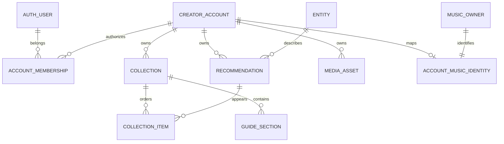

# Unified Explorers target database schema

**Status: consolidated application design; pinned auth schema locally qualified. No application migrations implemented or deployed.** This is the authoritative target database design for the accepted fresh-database replatform. The older [schema and migration investigation](target-schema-and-migration.md) is historical research and must not override this document.

**Scope:** all retained Explorers categories, profiles, media, analytics, lifecycle, existing Music behavior and subsequent delegated ChatGPT access. No historical imports, followers/community, admin UI, monetization or revival of retired services. Existing SQL histories remain append-only; a fresh database still applies the reviewed chain and target transformations.

**Source baseline:** Explorers commit `79ef17d0b88c7e11b49d618fc7c888a513f29fa8`, Strapi schema snapshot `50b6c6e180de4a1290b0c0a3c8450ac5947566d5`. See [source inventory](source-inventory.md), [Strapi field inventory](strapi-schema-inventory.md), [implementation plan](implementation-plan.md), and [ticket index](ticket-index.md).

**Authority:** application tables below are proposed design contracts, not inspected live database state. Retained Music SQL is source evidence plus explicit target transformations. Better Auth tables are library-owned: documented logical fields are recorded, and exact physical definitions for the pinned compatible package are linked below after local generation and disposable-database checks. This qualification boundary is intentional; no unsupported library DDL is represented as verified.

## Relationship overview



A Google identity authenticates a user. The creator account owns all editorial content. The first interface provisions one account per user; membership avoids hardwiring content to that identity and supports later switching without a content-model rewrite. Catalog entities are shared, while recommendations and display overrides remain account-owned. A Places recommendation may target a person; recommendation category and entity kind are distinct concepts.

## Deployment boundary

QA and production have separate PostgreSQL databases and volumes on the two existing hosts; no RDS is required. The same schema/migration versions run in both; QA data is never copied into production. One S3 bucket has configured QA/production prefixes. Database rows store opaque storage keys and attachment ownership, not public S3 URLs. Reusing one AWS principal provides application-enforced separation unless actual policy proves a stronger boundary. Credentials are never columns in application configuration tables or browser DTOs.

## Ownership of schema delivery

| Tickets | Schema responsibility |
|---|---|
| 1.2–1.4 | Disposable DB, migration harness, runtime roles and schema assertions |
| 2.1–2.4 | Library auth, accounts/membership, profile/media foundation, lifecycle/recovery |
| 3.1–3.4 | Shared catalog/recommendations/collections, Books, media extension and analytics |
| 4.1–4.5 | Movies, Games, Apps, Products and People typed detail/override mapping |
| 5.1–5.4 | Places/taxonomy, linked collections, Guides and claims |
| 6.1–6.3 | Canonical Music mapping and retained SQL invariants |
| 7.1–7.3 | Public query parity, reference content and cross-category evidence |
| 8.1–8.5 | Obsolete schema retirement, rename-safe migrations, backup/restore and production qualification |
| 9–10 | Shared discovery queries; native OAuth/plugin schemas and delegated grant bindings |


## Core identity, content and media

**Proposed authoritative application schema for consolidation — no migration executed.** This is the core portion of the unified PostgreSQL schema, derived from `implementation-backend.md`, the verified Strapi schema inventory and current frontend/server types. Category-specific facts, guide sections, taxonomy, claims and retained Music tables are supplied by the companion schema portions; they must reference the keys defined here rather than create competing account/entity tables.

### Conventions and engineering decisions

- PostgreSQL 15; UUID primary keys use `gen_random_uuid()`. IDs on the wire are strings. `timestamptz` values are stored as instants and serialized as ISO timestamps. `bigint` revision/counters are checked within JavaScript's safe integer range before number serialization.
- Every column is listed below. `N` means NOT NULL, `Y` nullable. `—` means no database default. All FKs default to `ON UPDATE RESTRICT`. Delete actions are explicit. Text codes use `text` plus CHECK, avoiding difficult enum replacement during category rollout.
- `stamp` means exactly `created_at timestamptz N DEFAULT now()`, `updated_at timestamptz N DEFAULT now()`; tables which include it list it explicitly. A database trigger updates `updated_at`; application-only timestamps are not the concurrency boundary. `revision bigint N DEFAULT 1 CHECK (revision BETWEEN 1 AND 9007199254740991)` is incremented atomically under optimistic predicates.
- `CategoryKey` is exactly `places,guides,music,movies,books,games,apps,products,people`. Catalog recommendation categories exclude guides/music; guides are structured collections, Music retains its specialized tables. No followers/community/admin/commerce schema is introduced.
- Soft archive is the normal content delete operation. Terminal account deletion strips profile/content and revokes access through an explicit orchestrated job; restrictive FKs stop accidental cascading deletion of shared catalog facts. Hard cleanup is performed in a documented child-first transaction/job sequence.
- Auth user IDs are text, because Better Auth owns their generation; creator account and content IDs are UUID. Do not force library IDs to UUID without qualifying the pinned adapter. One initial account per auth user is a provisioning policy enforced by `initial_account_bindings`; membership/content does not encode a permanent one-account limitation.
- Source-fact category tables attach to `entities.id` with one row per entity. Rich text and presentation settings use versioned, strictly validated JSONB where existing data is inherently structured; raw arbitrary Strapi payloads are not accepted. JSON checks below enforce container/type/version at DB level; typed runtime validators enforce individual keys and limits.
- S3: one existing bucket, `qa/` and `prod/` prefixes, existing shared AWS principal. Server configuration fixes prefix. These are application boundaries, not independent IAM credentials. No bucket credentials in DB rows or public DTOs. Media URL is derived from media ID, not stored raw S3 URL.

### 1. Better Auth-owned schema — pinned and locally qualified

The exact generated definitions for Better Auth **1.7.6**, Drizzle adapter **1.7.6**, Drizzle ORM **0.45.2** and Drizzle Kit **0.31.10** are attached: [core columns/relations](auth-qualification/generated-core-schema.ts), [core SQL](auth-qualification/generated-core.sql), [later MCP/JWT/CIMD SQL](auth-qualification/generated-mcp.sql). These files specify every generated column, SQL nullability/default, PK/FK/index and deletion action. They are documentation evidence, not repository migrations.

The core four tables have 34 columns and use configured auth_user/auth_session/auth_account/auth_verification names. Auth IDs are text. Generated time columns are timestamp without time zone; use UTC consistently, unlike application timestamptz columns. Drizzle on-update behavior is not a database trigger/default. Generated user deletion cascades provider accounts/sessions; application tombstone policy prevents an ordinary account deletion from blindly deleting auth_user.

The generator does not create provider-subject uniqueness: add the reviewed [provider identity index](auth-qualification/provider-identity-index.sql). Its duplicate rejection was tested. Preserve the generated nullable password column but disable password authentication; its presence is not enrollment support.

[Qualification report](auth-schema-qualification.md) records successful TypeScript compile, disposable PostgreSQL application, eight core adapter/constraint assertions and five MCP startup/discovery assertions. This closes the unknown generated-schema gate for the pinned configuration. Ticket2.1 must integrate the same schema into append-only project migrations and run application tests; upgrading packages or plugin options requires regeneration and review. Live Google and later token-generation/revocation acceptance remain separately identified checks.

### 2. `user_security_state`

Application revocation generation independent of library session implementation; must be checked with actual current session validity.

| Column | Type | Null | Default / rule |
|---|---|---|---|
| user_id | text | N | PK; FK auth_user.id DELETE RESTRICT |
| session_version | bigint | N | 1; CHECK 1..9007199254740991 |
| blocked_at | timestamptz | Y | — |
| created_at, updated_at | stamp | N | now() each |

No extra indexes beyond PK. Logout-all/compromise/deactivation increments version in the revocation transaction; ordinary logout must still invalidate the specific library session. Retain minimal identity binding after terminal account deletion to prevent accidental resurrection; removal follows reviewed identity-erasure policy and must not transfer ownership to a new identity with the same email.

### 3. `creator_accounts`

| Column | Type | Null | Default / rule |
|---|---|---|---|
| id | uuid | N | PK; gen_random_uuid() |
| handle | text | Y | —; incomplete onboarding may have none |
| handle_key | text generated always as lower(handle) stored | Y | derived |
| display_name | text | Y | —; trim length 1..200 when present |
| account_type | text | Y | —; Personal/Creator/Business |
| onboarding_status | text | N | 'incomplete'; incomplete/complete |
| status | text | N | 'active'; active/suspended/pending_deletion/deleted |
| public_profile | boolean | N | true |
| auto_pinning | boolean | N | true |
| locale | text | N | 'en'; supported locale validator |
| mobile_number | text | Y | —; normalized validated phone, not unique identity |
| mobile_number_visible | boolean | N | false |
| bio_plain | text | Y | —; maps Bio_1 |
| bio_rich | jsonb | Y | —; versioned rich-text document, maps Bio |
| primary_address | jsonb | Y | —; validated AddressSnapshot; no fabricated onboarding address |
| additional_addresses | jsonb | N | '[]'; array of AddressSnapshot, maps Addresss |
| public_address | jsonb | Y | —; separately selected public projection |
| profile_place_details | jsonb | Y | —; versioned selected place details |
| revision | bigint | N | 1; safe-positive revision |
| suspended_at | timestamptz | Y | — |
| deletion_requested_at | timestamptz | Y | — |
| deleted_at | timestamptz | Y | — |
| created_at, updated_at | stamp | N | now() each |

Unique non-null `handle_key`; preserve verified `src/utils/usernameValidation.ts` / Profile validator behavior: length 3..30, starts with a lowercase letter, remaining lowercase letters/digits/hyphens, no trailing or consecutive hyphens. CHECK `handle ~ '^[a-z][a-z0-9-]{2,29}$' AND handle !~ '--' AND right(handle,1)<>'-'` when non-null. Reserved routes are validated against the application route registry transactionally with handle allocation, not only in the input widget. Complete onboarding requires handle/display_name/account_type; extra actual screen requirements remain domain validation. CHECK deleted status iff deleted_at non-null; pending_deletion requires deletion_requested_at; suspended requires suspended_at. Status transitions clear obsolete timestamps consistently.

Indexes: `(status,id)` for lifecycle work; `(handle_key)` unique; `(created_at,id)`. Do not index phone/email for identity matching. Deletion leaves a stripped account tombstone until operations/media cleanup are complete; no contact/bio/address retained in tombstone. Releasing handles is permitted only on terminal deletion; handle changes invalidate old public caches but historical redirect migration is not required for the fresh launch.

### 4. `account_memberships` and `initial_account_bindings`

| Table.column | Type | Null | Default / rule |
|---|---|---|---|
| account_memberships.account_id | uuid | N | composite PK; FK creator_accounts.id DELETE CASCADE |
| account_memberships.user_id | text | N | composite PK; FK auth_user.id DELETE RESTRICT |
| account_memberships.role | text | N | 'owner'; CHECK role='owner' for current release |
| account_memberships.created_at | timestamptz | N | now() |
| initial_account_bindings.user_id | text | N | PK; FK auth_user.id DELETE RESTRICT |
| initial_account_bindings.account_id | uuid | N | UNIQUE; FK creator_accounts.id DELETE RESTRICT |
| initial_account_bindings.created_at | timestamptz | N | now() |

Membership PK `(account_id,user_id)` plus index `(user_id,account_id)`. Initial binding uses composite FK `(account_id,user_id)` to membership with DELETE RESTRICT, deferrable initially deferred, so provisioning inserts all rows in one transaction. Exactly one owner exists initially; avoid adding team roles/screens now. Terminal deletion may retain the binding/membership to a stripped tombstone so subsequent Google login cannot auto-provision resurrected content. Future team switching requires relaxing policy, not moving recommendations.

### 5. Account presentation tables

#### `account_category_settings`

| Column | Type | Null | Default / rule |
|---|---|---|---|
| account_id | uuid | N | PK part; FK creator_accounts.id DELETE CASCADE |
| category | text | N | PK part; CategoryKey CHECK |
| is_public | boolean | N | false |
| display_order | integer | N | —; CHECK >=0 |
| pinned_order | integer | Y | —; CHECK >=0 when present |

PK `(account_id,category)`; unique `(account_id,display_order)` DEFERRABLE INITIALLY DEFERRED; unique `(account_id,pinned_order)` likewise (nulls allowed). Initial seed inserts all nine rows deterministically; category changes increment account revision. Maps legacy public category flags and pinned_nav_tabs. Ordered reorder is exact-set transaction.

#### `account_presentation`

| Column | Type | Null | Default / rule |
|---|---|---|---|
| account_id | uuid | N | PK/FK creator_accounts.id DELETE CASCADE |
| schema_version | smallint | N | 1; CHECK =1 |
| theme_settings | jsonb | N | '{}' object; normalized defaults from existing theme normalizer |
| social_links | jsonb | N | '[]' array of validated platform/url/visible records |
| business_details | jsonb | N | '{}' object; existing profile/business keys only |

No extra indexes. Theme payload keys are explicitly the current `ThemeSettingsWire` set: preset, wallpaperMode, wallpaperUrl, accentColor, customTextColor, landingTab, visibleTabs, footerBranding, recommendations(layout/categoryOrder). Uploaded wallpaper URL is derived from a `profile_media` relation; do not let arbitrary JSON URLs grant media ownership. Source `social_media.theme_settings` maps here; other actual social/business fields use typed adapters, unknown/unapproved keys fail validation instead of becoming public. Root account revision controls all changes.

#### `profile_feed_items`

| Column | Type | Null | Default / rule |
|---|---|---|---|
| id | uuid | N | PK; gen_random_uuid() |
| account_id | uuid | N | FK creator_accounts.id DELETE RESTRICT |
| media_id | uuid | Y | —; composite FK account/media described below |
| external_url | text | Y | —; approved provider URL only |
| source | text | N | —; manual/google/instagram |
| media_type | text | N | —; image/video |
| caption | text | Y | — |
| display_order | integer | N | —; CHECK >=0 |
| details | jsonb | N | '{}' object; schema-validated existing Feed_Data metadata |
| created_at, updated_at | stamp | N | now() each |

CHECK exactly one of media_id/external_url; source manual requires media_id. Unique `(account_id,display_order)` deferrable; index `(account_id,id)`. An external URL is not evidence we may copy bytes; preserve baseline provider rules. Account terminal purge deletes feed rows before media. Existing imported feed presentation works without reviving retired Instagram fetch services.

### 6. `entities` and `entity_identifiers`

#### `entities`

| Column | Type | Null | Default / rule |
|---|---|---|---|
| id | uuid | N | PK; gen_random_uuid() |
| kind | text | N | —; place/movie/book/game/app/product/person |
| title | text | N | —; trim length 1..500 |
| origin | text | N | —; provider/manual |
| facts_version | smallint | N | 1; CHECK >0 |
| search_document | tsvector | N | ''::tsvector; maintained from approved public fact fields |
| created_at, updated_at | stamp | N | now() each |

Unique `(id,kind)` supports typed FK; GIN search_document; index `(kind,id)`. Category details are companion one-to-one typed tables; no unlimited unvalidated facts JSON. Shared entity is not account-owned. An entity is not discoverable simply because it exists; public discovery requires a public recommendation path. DELETE RESTRICT while referenced by recommendations; owned identifier/detail rows cascade only when a deliberate unreferenced entity purge is allowed. No fuzzy merge; provider facts are re-fetched/validated by server.

#### `entity_identifiers`

| Column | Type | Null | Default / rule |
|---|---|---|---|
| entity_id | uuid | N | FK entities.id DELETE CASCADE |
| provider | text | N | —; approved provider registry |
| external_kind | text | N | —; provider-specific kind incl movie vs tv |
| external_id | text | N | —; trim length 1..512 |
| fetched_at | timestamptz | N | now() |
| source_url | text | Y | —; approved provenance URL |

PK `(provider,external_kind,external_id)`; unique `(entity_id,provider,external_kind)`; index entity_id. One Google volume is an edition identifier, not a title-level canonical book merge. Manual entities have no identifier rows by default. New identifiers cannot silently reassign an existing provider key to another entity.

### 7. `collections`, `recommendations`, `collection_items`

#### `collections`

| Column | Type | Null | Default / rule |
|---|---|---|---|
| id | uuid | N | PK; gen_random_uuid() |
| account_id | uuid | N | FK creator_accounts.id DELETE RESTRICT |
| category | text | N | —; CategoryKey except music |
| title | text | N | —; trim length 1..200 |
| description | text | Y | —; plain list description |
| description_rich | jsonb | Y | —; validated guide rich-text document; guides use this, not lossy plain conversion |
| slug | text | N | —; normalized route-safe value |
| visibility | text | N | 'private'; private/public |
| publication_state | text | N | 'draft'; draft/published |
| display_order | integer | N | —; >=0 |
| pin_order | integer | Y | —; >=0 |
| heading | text | Y | —; top reads/picks/people heading |
| revision | bigint | N | 1; safe-positive revision |
| archived_at | timestamptz | Y | — |
| created_at, updated_at | stamp | N | now() each |

Unique `(id,category)`, `(id,account_id)` and `(id,account_id,category)` for child FKs. Unique `(account_id,category,slug)` including archived rows so stale URLs do not resolve to unrelated replacements; domain may explicitly rename/release only through a controlled operation. Partial indexes `(account_id,category,display_order,id)` and `(account_id,category,pin_order,id)` WHERE archived_at IS NULL. CreateCollectionInput parentLocationCollectionId populates the companion `location_linked_collections` relation atomically; do not also store a parent column here. Guide-specific header data is a companion extension. Existing UI create operation passes observed visibility/publication explicitly; conservative SQL defaults do not change current UI defaults.

#### `recommendations`

| Column | Type | Null | Default / rule |
|---|---|---|---|
| id | uuid | N | PK; gen_random_uuid() |
| account_id | uuid | N | FK creator_accounts.id DELETE RESTRICT |
| entity_id | uuid | N | FK entities.id DELETE RESTRICT |
| category | text | N | —; catalog categories only |
| note | jsonb | Y | —; versioned validated rich-text document |
| user_rating | smallint | Y | —; CHECK BETWEEN 1 AND 10 |
| publication_state | text | N | 'draft'; draft/published |
| revision | bigint | N | 1; safe-positive revision |
| archived_at | timestamptz | Y | — |
| created_at, updated_at | stamp | N | now() each |

Unique `(id,category)`, `(id,account_id)` and `(id,account_id,category)`; indexes `(account_id,category,created_at,id)` WHERE not archived, `(entity_id,account_id)` WHERE not archived. A deferred constraint trigger enforces the category→entity-kind map: places→place or person; movies→movie; books→book; games→game; apps→app; products→product; people→person. Category discriminator is presentation context, not always entity kind. **No unique account/entity pair:** same account may recommend the same entity in different contexts; overlap search counts distinct accounts. RecommendationDto display order comes from selected collection membership; pin state comes from category_recommendation_pins, not a second conflicting recommendation order. Publication also requires eligible public parent/account/category. Category-owned title/cover/offer overrides use the companion one-to-one `recommendation_display_overrides`, not a second JSON field here, and never mutate global provider facts. Price wire values are decimal strings; companion schema specifies exact numeric storage/precision.

#### `collection_items`

| Column | Type | Null | Default / rule |
|---|---|---|---|
| collection_id | uuid | N | PK part; composite FK collections(id,account_id,category) DELETE CASCADE |
| recommendation_id | uuid | N | PK part; composite FK recommendations(id,account_id,category) DELETE RESTRICT |
| account_id | uuid | N | —; participates in both composite FKs |
| category | text | N | —; catalog categories only |
| display_order | integer | N | —; >=0 |
| created_at | timestamptz | N | now() |

PK `(collection_id,recommendation_id)`. Unique `(collection_id,display_order)` DEFERRABLE INITIALLY DEFERRED. Index recommendation_id. Recommendation is_pinned/pin_order DTO comes only from category_recommendation_pins; do not persist a second membership pin flag. Reorder checks exact active item set, locks collection, changes positions and increments parent revision atomically. Archiving a collection hides items but does not delete shared catalog or a recommendation referenced elsewhere. Guides use companion section rows instead of forcing blocks into this table; Music uses retained playlist membership.


### Category-wide recommendation pins (frontend parity correction)

Ticket3.1 owns these tables; Books/Movies/Games/Apps/Products/People consume them. Places and Guides pin collections through collections.pin_order; no catalog cap is inferred for those categories. Replace collection_items.pin_order with category pins as the sole recommendation pin authority; ordinary display_order stays collection-local.

| Table | Complete columns | Constraints/indexes |
|---|---|---|
| account_category_pin_state | account_id uuid NOT NULL; category text NOT NULL; revision bigint NOT NULL DEFAULT1 | PK(account_id,category); account FK creator_accounts(id) DELETE CASCADE; category CHECK books/movies/games/apps/products/people; revision CHECK1..9007199254740991 |
| category_recommendation_pins | account_id uuid NOT NULL; category text NOT NULL; recommendation_id uuid NOT NULL; collection_id uuid NOT NULL; position integer NOT NULL | All columns no defaults; PK(account_id,category,recommendation_id); position CHECK>=0; composite recommendation/account/category and collection/account/category FKs DELETE CASCADE; collection_id/recommendation_id FK collection_items DELETE CASCADE; account/category FK pin_state DELETE CASCADE |

Indexes pins `(account_id,category,position,recommendation_id)`, `(collection_id,recommendation_id)`, `(recommendation_id)`. Parent archive or item removal removes affected pins and increments pin_state revision transactionally. Same recommendation referenced in several lists has one explicit selected membership for its top-pick link.

**Preserved save timing:** source managers stage membership changes, but a drag/move autosave upserts all currently selected rows, including newly selected ones, and does not unpin omitted rows until Save. Preserve that behavior using atomic `upsertCategoryTopPickOrder(actor,category,{expectedRevision,orderedPins},context)`; it changes only supplied memberships/ranks, leaves omitted saved rows untouched, and rejects foreign or duplicate IDs. `setCategoryTopPicks` is the explicit Save action: replaces all pins, validates at most15, and assigns contiguous ranks. Both return `{pins,revision}` and use existing request idempotency. GET `/categories/:category/top-picks`, PUT same route for Save, PATCH same route `/order` for autosave. Each pin is `{recommendationId,collectionId}`.

Position is deliberately not globally UNIQUE nor bounded14: legacy mixed staged-unpin/autosave can temporarily retain omitted rows with equal ranks. Public ordering uses position then stable recommendation ID. The max15 applies to the selected manager set/explicit Save, not an invented constraint which would reject a currently possible intermediate state. A later UX consistency change would be a separate decision; no silent change to Save/close semantics is made here. Test add→drag→close, unpin→close, unpin→Save, pure reorder→close, cross-list pins, stale revision and transaction rollback.

### 8. Media persistence and typed attachments

#### `media_assets`

| Column | Type | Null | Default / rule |
|---|---|---|---|
| id | uuid | N | PK; gen_random_uuid() |
| account_id | uuid | N | FK creator_accounts.id DELETE RESTRICT |
| purpose | text | N | —; profile/background/feed/collection/recommendation/guide/claim-evidence |
| status | text | N | 'uploading'; uploading/ready/pending_delete/deleted/failed |
| mime_type | text | N | —; server-sniffed allowlist |
| byte_size | bigint | N | —; CHECK >=0, per-purpose limit validated server-side |
| content_sha256 | bytea | Y | —; CHECK octet_length=32 when present |
| original_filename | text | Y | —; metadata only, not storage key |
| width_px | integer | Y | —; CHECK >0; server-decoded image/video width |
| height_px | integer | Y | —; CHECK >0; server-decoded image/video height |
| alternative_text | text | Y | — |
| caption | text | Y | — |
| ready_at | timestamptz | Y | — |
| delete_requested_at | timestamptz | Y | — |
| deleted_at | timestamptz | Y | — |
| created_at, updated_at | stamp | N | now() each |

CHECK width_px and height_px are both null or both present; aspect ratio is derived from them, never an independent conflicting value. Unique `(id,account_id)`. Index `(account_id,status,id)`; partial `(created_at,id)` WHERE status IN ('uploading','failed') for abandoned cleanup; partial `(delete_requested_at,id)` WHERE status='pending_delete'. CHECK ready requires ready_at/hash; deleted requires deleted_at. Delete is state transition; object cleanup completes before hard deleting metadata. No cross-account deduplication grants access to another account's bytes.

#### `media_objects`

| Column | Type | Null | Default / rule |
|---|---|---|---|
| media_id | uuid | N | PK part; FK media_assets.id DELETE RESTRICT |
| variant | text | N | PK part; original/thumbnail/display |
| storage_environment | text | N | —; local/qa/prod |
| object_key | text | N | —; UNIQUE; server-assigned prefixed key |
| mime_type | text | N | — |
| byte_size | bigint | N | —; >=0 |
| content_sha256 | bytea | N | —; exactly32 bytes |
| storage_version_id | text | Y | —; only if S3 returns versioning ID |
| deleted_at | timestamptz | Y | — |
| created_at | timestamptz | N | now() |

CHECK object_key begins exactly storage_environment + '/' and does not include traversal/control bytes. DB can't know its host environment, so validated runtime rejects any row not matching its configured environment before storage access. S3 bucket is runtime config, not user-selectable per-row. PK `(media_id,variant)`; index `(storage_environment,object_key)` already served by unique key where appropriate. Cleanup job uses stored version ID if deleting a versioned object; metadata cannot assert permanent purge while versioned bytes remain contrary to retention policy.

#### Typed media attachment tables

| Table | Complete columns | Keys/index/delete behavior |
|---|---|---|
| profile_media | account_id uuid N; slot text N CHECK profile/background/wallpaper; media_id uuid N; created_at timestamptz N DEFAULT now() | PK(account_id,slot); account FK DELETE CASCADE; composite (media_id,account_id) FK media_assets DELETE RESTRICT; index(media_id); same asset may occupy two slots |
| collection_media | collection_id uuid N; account_id uuid N; slot text N CHECK cover; media_id uuid N; created_at timestamptz N DEFAULT now() | PK(collection_id,slot); composite collection/account FK DELETE CASCADE; composite media/account FK DELETE RESTRICT; index(media_id) |
| recommendation_media | recommendation_id uuid N; account_id uuid N; media_id uuid N; display_order integer N CHECK>=0; created_at timestamptz N DEFAULT now() | PK(recommendation_id,media_id); composite recommendation/account FK DELETE CASCADE; composite media/account FK DELETE RESTRICT; unique(recommendation_id,display_order) deferrable; index(media_id) |

`profile_feed_items(media_id,account_id)` references media_assets(id,account_id) DELETE RESTRICT when media_id non-null. Guide/claim attachments require equivalent typed companion joins with composite ownership FKs; never a generic target_type/target_id FK-less media table. A deferred constraint trigger rejects attach of non-ready asset or claim-evidence purpose to public-content slots. Public delivery is derived from current live attachments, account/category/list state, not a stale public flag on media_assets. Detached assets remain owner-readable until deleted/grace cleanup. Claim evidence never has a public attachment path.

### 9. `application_command_receipts`

General authenticated create/update/archive/recovery replay; not a replacement for existing durable Music publication receipts.

**Ticket 3.1 implementation ruling (2026-10-01):** the append-only `0027_explorers_lifecycle` source already supplies the shared receipt authority: `id`, `account_id`, `operation`, 32-byte `idempotency_key_hash`, 32-byte `request_hash`, `status` (`completed`/`retired`), nullable `response`, `replay_until`, and `created_at`. Its response check requires exactly completed rows to carry a response. The larger field layout below is a proposed future expansion, not the current physical schema or a prerequisite for catalog commands. Ticket 3.1 preserves the actual shape and lifecycle consumers: account-row locking precedes receipt lookup; canonical validated input is hashed into `request_hash`; resource changes and sanitized `response` commit together; changed input, retired status or database-clock expiry returns conflict before re-execution. Account ownership is the replay scope, and the operation input includes resource/revision when applicable. Existing maintenance retires expired responses while keeping key/hash markers; no new receipt store or speculative shared-schema rename is authorized by this ruling.

| Column | Type | Null | Default / rule |
|---|---|---|---|
| id | uuid | N | PK; gen_random_uuid() |
| account_id | uuid | N | FK creator_accounts.id DELETE RESTRICT |
| actor_user_id | text | Y | —; FK auth_user.id DELETE SET NULL |
| operation | text | N | —; named application operation registry |
| idempotency_key_hash | bytea | N | —;32 bytes |
| input_hash | bytea | N | —;32 bytes, canonical validated input |
| status | text | N | 'pending'; pending/succeeded/failed/retired |
| response_status | smallint | Y | —;100..599 |
| response_body | jsonb | Y | —; sanitized DTO only, never credentials/provider tokens |
| resource_id | uuid | Y | —; diagnostic only, not generic authority FK |
| completed_at | timestamptz | Y | — |
| replay_until | timestamptz | N | —; explicit operation policy |
| created_at, updated_at | stamp | N | now() each |

Unique `(account_id,operation,idempotency_key_hash)`; index `(status,replay_until)`. Mutations and successful receipt commit atomically; in-progress concurrent calls serialize/wait under database row lock, never leave a successful resource with no receipt. Same key/different input conflicts. After replay expiry, strip response data and retain a retired hash marker for the account lifetime so a stale create cannot silently execute again. State failed does not imply external effects absent; resumable job operations return operation ID and consult lifecycle/outbox. Auth/key secrets use purpose-specific receipts rather than this plaintext sanitized-response table.

### 10. Lifecycle, feedback and recovery

#### `account_lifecycle_operations`

| Column | Type | Null | Default / rule |
|---|---|---|---|
| id | uuid | N | PK; gen_random_uuid() |
| account_id | uuid | N | FK creator_accounts.id DELETE RESTRICT |
| requested_by_user_id | text | Y | —; FK auth_user.id DELETE SET NULL |
| kind | text | N | —; deactivate/delete/reactivate/cancel_deletion |
| state | text | N | 'pending'; pending/running/succeeded/failed/cancelled |
| expected_revision | bigint | N | —; safe positive |
| feedback_id | uuid | Y | —; same-account composite feedback FK DELETE RESTRICT |
| receipt_id | uuid | N | UNIQUE; FK application_command_receipts.id DELETE RESTRICT |
| failure_code | text | Y | —; safe internal code, no raw token/provider response |
| created_at, updated_at | stamp | N | now() each |
| completed_at | timestamptz | Y | — |

Unique `(id,account_id)`; partial unique account_id WHERE state IN ('pending','running') prevents conflicting lifecycle operations. Index `(state,created_at,id)`. Delete kind requires feedback_id; same-account FK `(feedback_id,account_id)` ensures ownership. Status/revision changes and event-outbox insertion occur in same transaction. AccountLifecycleDto.operationId resolves the active/latest relevant operation, not a free mutable account JSON value.

#### `deletion_feedback`

| Column | Type | Null | Default / rule |
|---|---|---|---|
| id | uuid | N | PK; gen_random_uuid() |
| account_id | uuid | N | FK creator_accounts.id DELETE RESTRICT |
| user_id | text | Y | —; FK auth_user.id DELETE SET NULL |
| reason | text | Y | —; length(trim(reason)) 1..2000 while present |
| purged_at | timestamptz | Y | — |
| created_at | timestamptz | N | now() |

Unique `(id,account_id)`; index account_id. CHECK exactly one of non-null reason / non-null purged_at. Raw feedback is not reference seed data. On terminal deletion clear reason/user_id, retaining minimal ID linkage until lifecycle operation cleanup; abandoned feedback uses explicit retention job. Time-based retention follows the consolidated retention policy below.

#### `account_recovery_proofs`

| Column | Type | Null | Default / rule |
|---|---|---|---|
| id | uuid | N | PK; gen_random_uuid() |
| user_id | text | N | FK auth_user.id DELETE RESTRICT |
| account_id | uuid | N | FK creator_accounts.id DELETE RESTRICT |
| token_hash | bytea | N | UNIQUE;32-byte digest of opaque random token |
| purpose | text | N | 'account-recovery'; CHECK exact value |
| authenticated_at | timestamptz | N | —; verified fresh Google auth time |
| issued_at | timestamptz | N | now() |
| expires_at | timestamptz | N | —; CHECK expires_at=issued_at+interval '5 minutes' |
| consumed_at | timestamptz | Y | — |
| revoked_at | timestamptz | Y | — |

Composite `(account_id,user_id)` FK membership DELETE RESTRICT. Index `(expires_at,id)` and `(account_id,user_id)`. Transaction consumes only unused/unrevoked/unexpired proof at database time and transitions eligible account revision. A recovery proof authorizes no ordinary Actor operation; terminally deleted account never recovers. No raw token, cookie or Google token stored here. Remove expired consumed rows after a bounded operational retention period; that period is documented before launch, while replay denial is immediate via consumed_at.

### 11. `application_outbox`

Only required durable side effects: media cleanup, account purge/revocation notifications, cache/public snapshot invalidation. This is not a general event-sourcing system.

| Column | Type | Null | Default / rule |
|---|---|---|---|
| id | uuid | N | PK; gen_random_uuid() |
| account_id | uuid | Y | —; FK creator_accounts.id DELETE RESTRICT |
| topic | text | N | —; allowlisted job/event kind |
| dedupe_key | text | N | UNIQUE |
| payload | jsonb | N | —; typed minimal object, IDs only except storage cleanup descriptor |
| state | text | N | 'pending'; pending/leased/done/dead |
| attempts | integer | N | 0; >=0 |
| available_at | timestamptz | N | now() |
| lease_until | timestamptz | Y | — |
| lease_token | uuid | Y | — |
| last_error_code | text | Y | —; sanitized |
| completed_at | timestamptz | Y | — |
| created_at | timestamptz | N | now() |

CHECK leased iff both lease fields present; done requires completed_at. Partial `(available_at,id)` WHERE state='pending'; `(lease_until,id)` WHERE state='leased'. Claim using row locks/SKIP LOCKED; completion requires matching lease token. Post-commit delivery only; rollback emits nothing. Idempotent consumers tolerate at-least-once delivery. For deletion, durable job retains exact server-owned object reference until storage deletion verified; never caller-provided key.

### 12. Analytics events and retry receipts

#### `analytics_events`

| Column | Type | Null | Default / rule |
|---|---|---|---|
| id | uuid | N | PK; gen_random_uuid() |
| account_id | uuid | N | FK creator_accounts.id DELETE RESTRICT |
| client_event_id | text | N | —; length8..128 |
| event_type | text | N | —; view/click/interaction |
| page | text | N | —; exact existing analyticsPageSchema enum |
| category | text | Y | —; CategoryKey |
| collection_id | uuid | Y | —; same-account composite FK collections DELETE RESTRICT |
| recommendation_id | uuid | Y | —; same-account composite FK recommendations DELETE RESTRICT |
| occurred_at | timestamptz | N | —; validated input time |
| received_at | timestamptz | N | now() |
| canonical_path | text | N | —; safe public path max2048, no query/fragment |
| element | text | Y | —; max256 |
| referrer_origin | text | Y | —; origin only max255 |
| utm | jsonb | N | '{}' object; only existing five utm fields each max100 |
| metadata | jsonb | N | '{}' object; exact existing metadataSchema allowlist |
| country_code | text | Y | —; two-letter uppercase code when resolved |
| consent_version | text | N | —; configured consent contract version |

Unique `(account_id,client_event_id)`, indexes `(account_id,occurred_at,id)`, `(account_id,category,occurred_at)`, `(collection_id,occurred_at)` and `(recommendation_id,occurred_at)`. No raw IP, full referrer URL, provider credential, chat prompt or permanent anonymous-user identifier. Server validates public ownership/visibility before insertion. Guides/music events use their companion validated target mapping without assigning their IDs to recommendation FK; typed guide_collection_id can use collection_id, Music public descriptor is validated against canonical Music account and allowable metadata, not an invented FK to catalog recommendations.

Domain rejects consent=false without inserting an event. Separate receipt store below may record only accepted retry state; consent-denied input does not preserve payload. Aggregates use occurred_at UTC with inclusive from/exclusive to and max366-day query window. Account terminal deletion removes event payloads before account hard purge; no historic import required. Time-based retention follows the consolidated retention policy; do not build partitioning/warehouse infrastructure before measured need.

#### `analytics_event_receipts`

| Column | Type | Null | Default / rule |
|---|---|---|---|
| account_id | uuid | N | PK part; FK creator_accounts.id DELETE RESTRICT |
| client_event_id | text | N | PK part; length8..128 |
| input_hash | bytea | N | —;32 bytes |
| event_id | uuid | Y | —; FK analytics_events.id DELETE SET NULL |
| accepted_at | timestamptz | N | now() |
| retired_at | timestamptz | Y | — |

PK `(account_id,client_event_id)`; unique event_id where non-null; CHECK event_id not null OR retired_at not null; index `(accepted_at,account_id)`. Insert event+receipt atomically, making external publisher leases unnecessary on the new PG-only path. Concurrent same-key retries produce one event; changed body is conflict. On event retention purge mark retired_at and clear event_id atomically; retain hash marker for the receipt retention policy so old retries do not recreate expired data. Legacy `explorers_analytics_receipts` is not repurposed in place while old runtime uses it; append new schema and retire old table in the explicit cleanup epic.

### 13. Deletion, defaults and contracts cross-check

- AccountDto uses creator_accounts, category settings and presentation. Profile media/feed attachment IDs generate application URLs. No provider-auth rows join the public projection.
- CollectionDto uses collections plus ordered collection_items/media or guide sections. RecommendationDto uses recommendations + shared entity/category details + selected membership display order and category-wide recommendation pins; display overrides win only for that recommendation.
- MediaDto derives URL from asset ID, size/type from ready asset; no object key or AWS credential. Public bytes require at least one currently public eligible attachment; claim purpose never qualifies.
- Actor user/account/member is resolved against library session, user_security_state and creator_accounts.status. RecoveryPrincipal uses recovery proof instead of Actor and cannot pass content authorization.
- Required command dedupe is in application_command_receipts; Music publication operations remain specialized. SQL constraints do not replace HTTP/domain permission checks.
- New indexes listed are minimum workload-driven indexes; no speculative graph/vector database, analytics warehouse, feed-follow tables or multi-tenant organization hierarchy.

### 14. Remaining exactness gates for the consolidated schema

1. Better Auth 1.7.6 generated physical schema is attached and locally qualified. Requalify any package/configuration change; full application migration tests remain required.
2. Companion category/guide/claim/Music schemas must use the exact keys above. Product/People optional `parentLocationCollectionId` maps to `location_linked_collections`; direct place-recommendation links, if separately present in the verified flow, need a distinct typed companion relation rather than overloading this ID.
3. Rich JSON validators require field-level schema definitions from existing theme/address/feed/rich-text models and full source fixtures before accepting writes; storage version1 alone is not validation. This document records the DB container and mapping; companion DTO appendix should list those payload keys.
4. Retention durations follow the consolidated engineering-default policy. Verify deletion jobs and operational evidence before production; these are product defaults, not a legal-compliance claim.
5. Account handle character/length rule was aligned to the existing Profile/username validator; retain its reserved-word tests when moving availability checking to the new API.


## Category and guide extensions

**Proposed database design, not an applied migration.** Complements the parent's core identity/account/entity/recommendation/collection/media schema. Reviewed against the saved Strapi schemas and current category TypeScript/forms, including Places' person variant and both guide budget representations. This document chooses the target representation explicitly; historical data import is out of scope.

### Conventions and core dependencies

The SQL-like table definitions below enumerate **every column** of each feature table. `NOT NULL` means required; a column without it is nullable and defaults to SQL NULL. No implicit extra timestamp/ID columns are assumed. Defaults are written explicitly. All primary/unique keys create their normal B-tree indexes. Additional indexes are listed after each family. All FKs use `ON UPDATE RESTRICT`; delete behavior is explicit. Ordinary deletion is archival in core, not physical cascade; physical cascade below applies only to a deliberate authorized purge.

Core tables consumed, not redefined here: `entities(id uuid,kind text)`, `recommendations(id uuid,account_id uuid,category text,entity_id uuid,...)`, `collections(id uuid,account_id uuid,category text,...)`, `creator_accounts(id uuid)`, `media_assets(id uuid,account_id uuid,...)`, and canonical users with Better Auth's text identifier. Parent must supply unique `(id,account_id)` on recommendations, collections and media_assets. Core owns titles, notes, ratings, visibility, pin/order, revisions and lifecycle timestamps; this file does not duplicate them. Entity kind is singular (`book`, `movie`, `game`, `app`, `product`, `person`, `place`); recommendation category is the nine-category plural navigation key. If parent chooses different spelling, consolidate once in the master schema.

Each typed entity table has exactly one PK/FK `entity_id`. A deferred constraint trigger `entity_detail_kind_guard` rejects a row whose parent kind is not its table's kind, and rejects parent kind changes that invalidate an existing detail row. Do not compare entity kind directly with recommendation category: a Places recommendation may intentionally refer to a person. Provider identities are exclusively in core `entity_identifiers`; no duplicate TMDB/IGDB/Google IDs here. `entities.title` supplies source title/name; creator overrides are described below.

All text URLs in source metadata must pass server HTTP(S)-scheme/provider-origin policy; PostgreSQL text alone does not make a URL safe. Empty optional strings normalize to NULL. Text arrays have no null members; limits: maximum 200 entries, each at most 1,000 characters. Rich JSON payloads have versioned runtime schemas, maximum encoded size 1 MiB per row, maximum nesting 32; DB checks enforce JSON container/type/version, application validators enforce member shapes. Source/catalog refresh can update shared facts; a recommendation write cannot.

### 1. Canonical entity detail tables

#### Books

```sql
book_entity_details (
  entity_id uuid PRIMARY KEY REFERENCES entities(id) ON DELETE CASCADE,
  subtitle text,
  authors text[] NOT NULL DEFAULT '{}',
  publisher text,
  published_date_text text,
  year_text text,
  description text,
  cover_url text,
  cover_large_url text,
  subjects text[] NOT NULL DEFAULT '{}',
  page_count integer CHECK (page_count >= 0),
  isbn_13 text CHECK (isbn_13 ~ '^[0-9]{13}$'),
  isbn_10 text CHECK (isbn_10 ~ '^[0-9]{9}[0-9X]$'),
  provider_rating numeric(3,2) CHECK (provider_rating BETWEEN 0 AND 5),
  ratings_count bigint CHECK (ratings_count >= 0),
  language_tag text,
  preview_url text
)
```

No unique ISBN constraint: duplicate/malformed provider identifiers require explicit resolution, not silent merges. Google `volume_id` is core external ID `(google_books,volume,id)`. Preserve partial publication dates as text. Index: GIN `(subjects)` for existing subject browse; GIN authors only if measured query needs it (not initially).

#### Movies and shows

```sql
movie_entity_details (
  entity_id uuid PRIMARY KEY REFERENCES entities(id) ON DELETE CASCADE,
  media_type text NOT NULL CHECK (media_type IN ('movie','tv')),
  original_title text,
  year_text text,
  poster_url text,
  backdrop_url text,
  genres text[] NOT NULL DEFAULT '{}',
  director text,
  runtime_minutes integer CHECK (runtime_minutes >= 0),
  provider_rating numeric(4,2) CHECK (provider_rating BETWEEN 0 AND 10),
  overview text,
  season_count integer CHECK (season_count >= 0),
  watch_providers jsonb NOT NULL DEFAULT '{}' CHECK (jsonb_typeof(watch_providers) = 'object'),
  cast_details jsonb NOT NULL DEFAULT '[]' CHECK (jsonb_typeof(cast_details) = 'array'),
  CHECK (media_type = 'tv' OR season_count IS NULL)
)
```

Normalize Strapi `Movie`→`movie`, `Show`/`TV`→`tv`; compatibility adapter preserves current UI spelling. Core external uniqueness is `(tmdb,movie,id)` or `(tmdb,tv,id)`, never TMDB number alone. Watch providers are a bounded region-keyed object with provider id/name/logo/link plus rent/buy/flatrate arrays as returned/consumed; cast entries have provider id/name/character/profile/order. Index GIN `(genres)`; no standalone rating index until a ranked query requires it.

#### Games

```sql
game_entity_details (
  entity_id uuid PRIMARY KEY REFERENCES entities(id) ON DELETE CASCADE,
  provider_slug text,
  provider_image_id text,
  cover_url text,
  cover_large_url text,
  summary text,
  release_date_text text,
  release_year_text text,
  provider_rating numeric(5,2) CHECK (provider_rating BETWEEN 0 AND 100),
  ratings_count bigint CHECK (ratings_count >= 0),
  genres text[] NOT NULL DEFAULT '{}',
  platforms text[] NOT NULL DEFAULT '{}',
  developer text,
  publisher text,
  game_modes text[] NOT NULL DEFAULT '{}',
  screenshot_ids text[] NOT NULL DEFAULT '{}',
  provider_url text
)
```

IGDB identity is `(igdb,game,id)` in core. Preserve text release precision. Index GIN `(genres)` and GIN `(platforms)` for existing filters.

#### Apps and Tools

```sql
app_entity_details (
  entity_id uuid PRIMARY KEY REFERENCES entities(id) ON DELETE CASCADE,
  app_url text NOT NULL,
  description text,
  logo_url text,
  developer text,
  platforms text[] NOT NULL DEFAULT '{}',
  price_tier text CHECK (price_tier IN ('Free','Freemium','Paid','Subscription')),
  download_url text,
  screenshot_urls text[] NOT NULL DEFAULT '{}'
)
```

No URL uniqueness; similar URLs are not identity proof. Price tier is nullable to preserve unknown external metadata; the existing new-form default may remain Freemium in UI without fabricating a database fact. Index GIN `(platforms)`; title search uses core search projection.

#### Products

```sql
product_entity_details (
  entity_id uuid PRIMARY KEY REFERENCES entities(id) ON DELETE CASCADE,
  product_url text NOT NULL,
  brand text,
  logo_url text,
  description text,
  specifications jsonb NOT NULL DEFAULT '{}' CHECK (jsonb_typeof(specifications) = 'object'),
  image_urls text[] NOT NULL DEFAULT '{}'
)
```

Specifications are string→string only, maximum 200 entries; no merchant URL uniqueness. **Price, currency and buy URL are creator offer context below**, not universal catalog facts. No extra index initially; core entity search handles discovery.

#### People

```sql
person_entity_details (
  entity_id uuid PRIMARY KEY REFERENCES entities(id) ON DELETE CASCADE,
  username_handle text,
  headline text,
  location_text text,
  avatar_url text,
  primary_platform text CHECK (primary_platform IN ('instagram','linkedin','twitter','github','youtube','website','other')),
  social_urls jsonb NOT NULL DEFAULT '{}' CHECK (jsonb_typeof(social_urls) = 'object'),
  skills_tags text[] NOT NULL DEFAULT '{}',
  external_follower_count_text text
)
```

Core title supplies name; map frontend `x` to stored `twitter`. Social object allows only primary/instagram/linkedin/twitter/github/youtube/website/other with validated URL values. Follower count is external presentation metadata only. No FK to users/accounts, no global unique handle/name; there is no following network. Index GIN `(skills_tags)`.

#### Places

```sql
place_entity_details (
  entity_id uuid PRIMARY KEY REFERENCES entities(id) ON DELETE CASCADE,
  formatted_address text,
  address_components jsonb NOT NULL DEFAULT '[]' CHECK (jsonb_typeof(address_components) = 'array'),
  latitude numeric(10,7) CHECK (latitude BETWEEN -90 AND 90),
  longitude numeric(10,7) CHECK (longitude BETWEEN -180 AND 180),
  provider_types text[] NOT NULL DEFAULT '{}',
  provider_rating numeric(3,2) CHECK (provider_rating BETWEEN 0 AND 5),
  ratings_count bigint CHECK (ratings_count >= 0),
  public_phone text,
  public_phone_normalized text,
  website_url text,
  price_level smallint CHECK (price_level BETWEEN 0 AND 4),
  price_range jsonb,
  CHECK ((latitude IS NULL) = (longitude IS NULL)),
  CHECK (price_range IS NULL OR jsonb_typeof(price_range) IN ('object','string'))
)
```

Provider Google Place ID is in core; private owner contact never populates public_phone. Zero coordinates are valid, missing remains null. Index `(public_phone_normalized)` WHERE nonnull; GIN `provider_types`; public address search uses a normalized/FTS query over approved public facts plus public-eligibility joins, not a separate claimable directory. No PostGIS extension in launch schema until a distance query is actually defined.

### 2. Creator-specific context and overrides

#### `recommendation_display_overrides`

```sql
recommendation_display_overrides (
  recommendation_id uuid PRIMARY KEY,
  account_id uuid NOT NULL,
  schema_version smallint NOT NULL DEFAULT 1 CHECK (schema_version = 1),
  display_values jsonb NOT NULL DEFAULT '{}' CHECK (jsonb_typeof(display_values) = 'object'),
  FOREIGN KEY (recommendation_id,account_id)
    REFERENCES recommendations(id,account_id) ON DELETE CASCADE
)
```

Index `(account_id,recommendation_id)` for account purge/audit. This is a **typed sparse display object**, not an arbitrary metadata bag. Runtime validation chooses the category variant, forbids unknown keys, and forbids provider IDs/owner IDs/visibility/revision/taxonomy/media storage keys. Allowed keys are title and nullable display fields from that category detail table above (same types/ranges), excluding immutable media_type, source identity and provider_rating/ratings_count. For products, price/currency/buy URL live only in the typed context table below. Book buy links live below. Null explicitly clears an overridable field; absent inherits canonical source. Arrays/objects replace as a whole. Uploaded media is always linked through FK tables, never embedded as an asset URL override; external approved provider images can use the corresponding URL key. A's edits do not alter B or catalog facts. One source of truth: this table owns overrides; core `recommendations` must not retain a second inline override object.

#### `book_recommendation_context`

```sql
book_recommendation_context (
  recommendation_id uuid PRIMARY KEY,
  account_id uuid NOT NULL,
  buy_links jsonb NOT NULL DEFAULT '[]' CHECK (jsonb_typeof(buy_links) = 'array'),
  FOREIGN KEY (recommendation_id,account_id)
    REFERENCES recommendations(id,account_id) ON DELETE CASCADE
)
```

Each buy link is `{name:string,url:http(s),logo?:string}`; maximum 20. Category guard requires books. Index account_id. Editorial note/rating/media/pin remain core.

#### `product_recommendation_context`

```sql
product_recommendation_context (
  recommendation_id uuid PRIMARY KEY,
  account_id uuid NOT NULL,
  price numeric(20,6) CHECK (price >= 0),
  currency_code text CHECK (currency_code ~ '^[A-Z]{3}$'),
  buy_url text,
  FOREIGN KEY (recommendation_id,account_id)
    REFERENCES recommendations(id,account_id) ON DELETE CASCADE
)
```

Category guard products. Currency may be unknown even when amount exists; no implicit USD. Validate known currency precision in application against versioned ISO metadata; unknown three-letter code is rejected at API boundary. Wire amounts are decimal strings; adapter converts only for current display. Index `(account_id,price,recommendation_id)` WHERE price nonnull. Do not compare mixed currencies as an economic conversion; retain current explicit UI sort behavior. Numeric scale is not a claim every currency supports six minor digits.

#### `place_recommendation_context`

```sql
place_recommendation_context (
  recommendation_id uuid PRIMARY KEY,
  account_id uuid NOT NULL,
  recommendation_type text NOT NULL DEFAULT 'place' CHECK (recommendation_type IN ('place','person')),
  source_of_recommendation text NOT NULL DEFAULT 'self' CHECK (source_of_recommendation IN ('self','suggestion')),
  contact_name text,
  contact_number text,
  contact_visibility text NOT NULL DEFAULT 'private' CHECK (contact_visibility IN ('private','public')),
  place_social_url text,
  place_website_url text,
  creator_social_url text,
  legacy_place_note jsonb,
  person_profile_url text,
  person_address text,
  FOREIGN KEY (recommendation_id,account_id)
    REFERENCES recommendations(id,account_id) ON DELETE CASCADE,
  CHECK (legacy_place_note IS NULL OR jsonb_typeof(legacy_place_note) IN ('object','array')),
  CHECK (recommendation_type = 'person' OR (person_profile_url IS NULL AND person_address IS NULL))
)
```

Category guard places. A deferred invariant verifies core recommendation entity kind = place when type place, person when type person. This preserves `Recommendation_Type:'person'` in the Places form; it does not force the item into the separate People category or infer a login identity. Existing `Person_Details.instagram` maps person_profile_url; `address` maps person_address. Legacy `Users_Place_Note` is separate from core `user_recommendation_note` where both are still consumed; remove only after caller proof. No supporters/community relationships copied. Index account_id. Public DTO applies contact_visibility plus parent policy; seeded fresh rows default private, and adapter must explicitly carry the existing user's public-disclosure selection when present.

### 3. Collection extensions, taxonomy and associations

#### Core collection presentation mapping

All category heading aliases (`top_reads_heading`, `top_games_heading`, `top_apps_heading`, `top_products_heading`, `top_people_heading`, `top_picks_heading`) map core `collections.heading`; no separate presentation table. List name/description/slug/visibility/display order and cover FK remain core.

#### `place_collection_details`

```sql
place_collection_details (
  collection_id uuid PRIMARY KEY,
  account_id uuid NOT NULL,
  location_entity_id uuid REFERENCES entities(id) ON DELETE RESTRICT,
  location_snapshot jsonb NOT NULL DEFAULT '{}' CHECK (jsonb_typeof(location_snapshot) = 'object'),
  instagram_media_url text,
  FOREIGN KEY (collection_id,account_id)
    REFERENCES collections(id,account_id) ON DELETE CASCADE
)
```

Category guard places; location_entity kind guard place if supplied. `List_Name_Details` maps versioned location_snapshot containing the current location/city selection display fields (name, address, provider ID, coordinates); identity is separately linked. `Sequence` aliases core display_order. Index `(account_id,location_entity_id)` and `(location_entity_id)` WHERE nonnull.

#### `location_linked_collections`

```sql
location_linked_collections (
  child_collection_id uuid PRIMARY KEY,
  account_id uuid NOT NULL,
  location_collection_id uuid NOT NULL,
  position integer NOT NULL DEFAULT 0 CHECK (position >= 0),
  FOREIGN KEY (child_collection_id,account_id)
    REFERENCES collections(id,account_id) ON DELETE CASCADE,
  FOREIGN KEY (location_collection_id,account_id)
    REFERENCES collections(id,account_id) ON DELETE CASCADE,
  CHECK (child_collection_id <> location_collection_id)
)
```

Deferred trigger requires parent places and child products/people. PK enforces one location parent per child. Index `(location_collection_id,position,child_collection_id)`, `(account_id)`. Parent archive explicitly deletes association rows in the same transaction while preserving child collections; physical parent purge also removes links only. Linking to an individual place recommendation is invalid. Create child+link is atomic.

#### Taxonomy

```sql
taxonomy_terms (
  id uuid PRIMARY KEY DEFAULT gen_random_uuid(),
  category text NOT NULL CHECK (category IN ('places','books','movies','games','apps','products','people','guides')),
  parent_id uuid REFERENCES taxonomy_terms(id) ON DELETE RESTRICT,
  slug text NOT NULL CHECK (length(slug) BETWEEN 1 AND 100),
  position integer NOT NULL DEFAULT 0 CHECK (position >= 0),
  active boolean NOT NULL DEFAULT true,
  UNIQUE(category,slug),
  UNIQUE(id,category),
  CHECK (parent_id IS NULL OR parent_id <> id)
)
taxonomy_term_translations (
  term_id uuid NOT NULL REFERENCES taxonomy_terms(id) ON DELETE CASCADE,
  locale text NOT NULL,
  label text NOT NULL CHECK (length(label) BETWEEN 1 AND 200),
  PRIMARY KEY(term_id,locale)
)
recommendation_taxonomy (
  recommendation_id uuid NOT NULL,
  account_id uuid NOT NULL,
  term_id uuid NOT NULL REFERENCES taxonomy_terms(id) ON DELETE RESTRICT,
  position integer NOT NULL DEFAULT 0 CHECK (position >= 0),
  PRIMARY KEY(recommendation_id,term_id),
  FOREIGN KEY(recommendation_id,account_id)
    REFERENCES recommendations(id,account_id) ON DELETE CASCADE
)
```

Deferred taxonomy trigger requires same category between parent/child term and no cycles; Places uses at most two levels. Assignment trigger requires recommendation category = term.category; multiple assignments are allowed to preserve books/games reusable taxonomies, and Places stores selected parent+child. For apps/products/people UI expects one selected leaf: enforce at most one leaf in its application command (the table does not pretend those records are one-to-one with the term). Index taxonomy `(parent_id,position,id)`, translations `(locale,term_id)`, assignments `(term_id,recommendation_id)`, `(account_id,recommendation_id)`. Do not copy legacy one-to-one taxonomy errors. Category labels/locale values are seed inputs unavailable from schema exports.

### 4. Guide aggregate and sections

Guides are core collections, not canonical entity detail rows. Recommendation entity sharing does not erase authored itinerary structure.

```sql
guide_collection_details (
  collection_id uuid PRIMARY KEY,
  account_id uuid NOT NULL,
  guide_type text NOT NULL CHECK (guide_type IN ('Itinerary','Theme')),
  estimated_budget_amount numeric(20,6) CHECK (estimated_budget_amount >= 0),
  estimated_budget_currency text CHECK (estimated_budget_currency ~ '^[A-Z]{3}$'),
  budget_type text CHECK (budget_type IN ('Budget','Mid-Range','Luxury','Backpacker','Ultra-Luxury')),
  is_multicity boolean NOT NULL DEFAULT false,
  number_of_days integer CHECK (number_of_days > 0),
  tags text[] NOT NULL DEFAULT '{}',
  tips jsonb,
  place_details jsonb NOT NULL DEFAULT '{}' CHECK (jsonb_typeof(place_details) = 'object'),
  transportation jsonb,
  best_time_to_visit text[] NOT NULL DEFAULT '{}',
  section_details_version smallint NOT NULL DEFAULT 1 CHECK (section_details_version = 1),
  section_details jsonb NOT NULL DEFAULT '[]' CHECK (jsonb_typeof(section_details) = 'array'),
  FOREIGN KEY(collection_id,account_id)
    REFERENCES collections(id,account_id) ON DELETE CASCADE,
  CHECK (tips IS NULL OR jsonb_typeof(tips) IN ('array','object')),
  CHECK (transportation IS NULL OR jsonb_typeof(transportation) IN ('array','object'))
)
guide_taxonomy (
  collection_id uuid NOT NULL,
  account_id uuid NOT NULL,
  term_id uuid NOT NULL REFERENCES taxonomy_terms(id) ON DELETE RESTRICT,
  PRIMARY KEY(collection_id,term_id),
  FOREIGN KEY(collection_id,account_id)
    REFERENCES collections(id,account_id) ON DELETE CASCADE
)
guide_sections (
  id uuid PRIMARY KEY DEFAULT gen_random_uuid(),
  collection_id uuid NOT NULL,
  account_id uuid NOT NULL,
  title text NOT NULL CHECK (length(title) BETWEEN 1 AND 300),
  description jsonb,
  position integer NOT NULL CHECK (position >= 0),
  block_schema_version smallint NOT NULL DEFAULT 1 CHECK (block_schema_version = 1),
  timeline jsonb,
  transport jsonb,
  stay jsonb,
  activities jsonb,
  budget jsonb,
  map_details jsonb,
  packing_list jsonb,
  pre_tasks jsonb,
  tags text[] NOT NULL DEFAULT '{}',
  created_at timestamptz NOT NULL DEFAULT now(),
  updated_at timestamptz NOT NULL DEFAULT now(),
  archived_at timestamptz,
  UNIQUE(id,account_id),
  FOREIGN KEY(collection_id,account_id)
    REFERENCES collections(id,account_id) ON DELETE CASCADE,
  CHECK (description IS NULL OR jsonb_typeof(description) IN ('array','object')),
  CHECK (timeline IS NULL OR jsonb_typeof(timeline) = 'object'),
  CHECK (transport IS NULL OR jsonb_typeof(transport) = 'object'),
  CHECK (stay IS NULL OR jsonb_typeof(stay) = 'object'),
  CHECK (activities IS NULL OR jsonb_typeof(activities) = 'object'),
  CHECK (budget IS NULL OR jsonb_typeof(budget) = 'object')
)
guide_section_media (
  section_id uuid NOT NULL,
  account_id uuid NOT NULL,
  media_id uuid NOT NULL,
  position integer NOT NULL DEFAULT 0 CHECK (position >= 0),
  PRIMARY KEY(section_id,media_id),
  FOREIGN KEY(section_id,account_id) REFERENCES guide_sections(id,account_id) ON DELETE CASCADE,
  FOREIGN KEY(media_id,account_id) REFERENCES media_assets(id,account_id) ON DELETE RESTRICT
)
guide_collection_media (
  collection_id uuid NOT NULL,
  account_id uuid NOT NULL,
  media_id uuid NOT NULL,
  position integer NOT NULL DEFAULT 0 CHECK (position >= 0),
  PRIMARY KEY(collection_id,media_id),
  FOREIGN KEY(collection_id,account_id) REFERENCES collections(id,account_id) ON DELETE CASCADE,
  FOREIGN KEY(media_id,account_id) REFERENCES media_assets(id,account_id) ON DELETE RESTRICT
)
```

Guide detail/category triggers require parent collections.category guides; guide_taxonomy term category guides. Guide title/description/publication/pin/display order/cover media remain core. Core collections.description_rich must accept the same validated rich-text document as guide `Description`; do not silently collapse it to plain text. Budget source can be scalar or `{amount,currency}`; target amount+currency preserves both, adapter retains expected screen representation, unknown currency stays NULL. `section_details` preserves the wizard's journey/destination arrangement separately from canonical section rows; commands update both coherently where the same current UI edit affects both, never use this JSON as the authoritative section ownership/order list.

Indexes: guide details `(account_id)`; guide_taxonomy `(term_id,collection_id)` and `(account_id)`; guide_sections `(collection_id,position,id)` WHERE archived_at NULL, `(account_id,id)`; guide_section_media `(media_id)` and `(account_id,section_id)`; guide_collection_media `(media_id)` and `(collection_id,position,media_id)`. Guide gallery keeps all `Guide_Media` values; its first item is the compatibility cover. Do not also write a conflicting core collection_media cover for a guide: core cover junction is used by ordinary lists. A deferred guard requires guide_collection_media parent category guides and forbids claim-evidence/nonready assets. Do not unique-constrain section positions because reorder may temporarily overlap; reorder holds the parent collection lock, validates exact active section IDs and rewrites positions atomically with its revision bump. `updated_at` is explicitly changed by write statements; no presumed auto-update default.

#### Section JSON v1 field contract

Port current `guideSectionTypes.ts` shapes exactly, with decimal-string monetary amounts at the storage/wire boundary. `timeline` = morning/afternoon/evening arrays of DayPlace. `transport` = `{segments:[{fromPlaceId,toPlaceId,mode,distanceKm,estimatedMinutes}]}` with mode walk/drive/bike/public_transit/taxi/auto/ferry/flight; nonnegative finite distance/time. `stay` = accommodations DayPlace array. `activities` = activities DayPlace array. `budget` = period arrays of BudgetPlace (place_id,name,optional priceLevel/priceRange/customBudget/budgetAmount/budgetCurrency). Maximum 500 total places per section; no duplicate DayPlace.id within a section. Transport endpoints refer to existing DayPlace.id in that section.

DayPlace fields: id, name, formatted_address, place_id; optional geometry.location.lat/lng, types, tips, photos, priceLevel, priceRange, customBudget, budgetAmount, budgetCurrency, isVerified, source (google/ai-unverified/manual). Do not persist `photosLoading`; it is UI state. Photos contain stable media ID or approved provider reference, fileName,width,height,aspectRatio; do not persist signed/public byte URL as ownership. Uploaded IDs must also exist in guide_section_media with matching account; recursive JSON validator rejects unlinked media references. Provider place IDs are external references, not UUID FKs; if linking canonical entities is needed later add an explicit junction rather than treating JSON as FK enforcement. Map/packing/pre-task payloads preserve current supported object/array shapes under the size/depth limits; they cannot hold actor/visibility/order fields or executable HTML.

### 5. Pending claims and evidence

```sql
place_claims (
  id uuid PRIMARY KEY DEFAULT gen_random_uuid(),
  claimant_account_id uuid NOT NULL REFERENCES creator_accounts(id) ON DELETE CASCADE,
  entity_id uuid NOT NULL REFERENCES entities(id) ON DELETE RESTRICT,
  name text NOT NULL CHECK (length(name) BETWEEN 2 AND 50),
  email text NOT NULL,
  phone text NOT NULL CHECK (length(phone) BETWEEN 10 AND 20),
  message text NOT NULL CHECK (length(message) BETWEEN 10 AND 500),
  status text NOT NULL DEFAULT 'pending' CHECK (status = 'pending'),
  created_at timestamptz NOT NULL DEFAULT now(),
  UNIQUE(id,claimant_account_id)
)
place_claim_evidence (
  claim_id uuid NOT NULL,
  claimant_account_id uuid NOT NULL,
  media_id uuid NOT NULL,
  position integer NOT NULL DEFAULT 0 CHECK (position >= 0),
  PRIMARY KEY(claim_id,media_id),
  FOREIGN KEY(claim_id,claimant_account_id)
    REFERENCES place_claims(id,claimant_account_id) ON DELETE CASCADE,
  FOREIGN KEY(media_id,claimant_account_id)
    REFERENCES media_assets(id,account_id) ON DELETE RESTRICT
)
```

Claim entity kind must be place. Index claims `(claimant_account_id,created_at,id)`, `(entity_id,created_at,id)`; evidence `(media_id)`, `(claimant_account_id,claim_id)`. Email/phone/message/evidence never enter public projections or search documents. Pending-only status intentionally has no review/admin workflow or inferred ownership. Core operation idempotency deduplicates retries; do not add a conflicting global unique (claimant,place) that forbids a legitimate later submission. A deferred constraint trigger requires at least one evidence row before the claim transaction commits; this matches the mandatory document in `Authentication/data.ts:228`. That validator also requires both email and phone, name 2–50 and message 10–500: update the previously optional claim-contact API proposal accordingly. API validates current name/phone/email formats and 5 MiB maximum PDF/DOC/DOCX/JPEG/PNG evidence with actual MIME inspection; no broader image/video default overrides this screen-specific policy. Private media purpose constraint prevents a claim evidence asset from being attached to public content; validate in a database guard/application transaction as specified by media owner. Evidence remains private even when the place is public.

**No `claimable_place_profiles` target table.** Lookup joins canonical place facts to current public eligible recommendations and account/category/collection visibility, with distinct recommending accounts. `Recommendation_Count` and `Added_By_User` are derived, not mutable client JSON. `Is_Claimed`/`Claiming_Account` are not set by a pending receipt; no verified-ownership feature is invented.

### 6. Reference/legal content

```sql
reference_content (
  id uuid PRIMARY KEY DEFAULT gen_random_uuid(),
  content_key text NOT NULL,
  kind text NOT NULL CHECK (kind IN ('faq','terms','privacy','cookies')),
  locale text NOT NULL,
  title text NOT NULL,
  answer_text text,
  rich_body jsonb,
  position integer NOT NULL DEFAULT 0 CHECK (position >= 0),
  active boolean NOT NULL DEFAULT true,
  revision integer NOT NULL DEFAULT 1 CHECK (revision > 0),
  updated_at timestamptz NOT NULL DEFAULT now(),
  UNIQUE(content_key,locale),
  CHECK ((kind = 'faq' AND answer_text IS NOT NULL AND rich_body IS NULL)
      OR (kind <> 'faq' AND answer_text IS NULL AND rich_body IS NOT NULL)),
  CHECK (rich_body IS NULL OR jsonb_typeof(rich_body) IN ('array','object'))
)
```

Partial unique `(kind,locale)` WHERE kind IN ('terms','privacy','cookies') ensures one legal body per kind/locale; FAQ has many stable content keys. Index `(kind,locale,active,position,id)`. No FKs or delete cascades. Seed updater uses content_key+locale and explicit revision; active=false removes normal presentation without losing audited change history in core. Locale format/allowlist and fallback come from the configured UI locale manifest; do not permit arbitrary unbounded locale strings. FAQ title/answer/position map Question/Answer/Sequence. Terms/Privacy/Cookies map the three separate platform-term rich fields. Account exit reasons are private lifecycle writes owned by core, never reference seeds.

### 7. Core media linkage requirements and source-field coverage

Core supplies account-checked recommendation media and ordinary collection-cover media junctions with order and FK ownership; media captions/alternativeText come from `media_assets`. `Media`, `media_details.imageDetails`, thumbnail and cover fields are compatibility DTO projections from those junctions plus approved external image metadata, not another unchecked blob containing raw S3 keys. Core media columns are `width_px integer NULL CHECK(width_px>0)` and `height_px integer NULL CHECK(height_px>0)` with no defaults; both are null or both present. Derive aspectRatio from those measured values rather than storing a second independent ratio or accepting caller-trusted dimensions. These preserve `ActivityPhoto.width/height/aspectRatio`; original filename comes from the core filename field. Uploaded image/video byte delivery remains the parent media design; this draft does not introduce a public bucket or new URL authority.

#### Explicit field map

Notation: `E` = core entity title/identifier, `R` = core recommendation, `C` = core collection, `RM` = core recommendation media, `CM` = core collection cover, `O` = typed recommendation display override of the named source detail field. Every inherited account/ID/list relation uses canonical keys; there is no silent raw-source JSON fallback for a missing mapping.

| Source type | Field → target |
|---|---|
| Common recommended item | title/name→E.title with O.title; user_recommendation_note→R.note; user_rating→R.user_rating; is_pinned/pin_order/display_order→core category recommendation pins and collection membership display_order; account→R.account_id; *_list→core collection membership; Media→RM; media_details.imageDetails/thumbnail→ordered RM DTO; documentId→R.id |
| Common lists | List_Name→C.title; list_description→C.description; slug→C.slug; Visibility/visibility→C.visibility; cover_image→CM; display_order/Sequence→C.display_order; all top_*_heading→C.heading; account→C.account_id; recommended_*→membership query; is_pinned/pin_order→C pin fields |
| RecommendedBook | volume_id→entity_identifiers google_books/volume; subtitle→subtitle; authors→authors; publisher→publisher; published_date→published_date_text; year→year_text; description→description; cover_url→cover_url; cover_url_large→cover_large_url; subjects→subjects; page_count→page_count; isbn_13→isbn_13; isbn_10→isbn_10; google_rating→provider_rating; ratings_count→ratings_count; language→language_tag; preview_link→preview_url; buy_links→book_recommendation_context.buy_links; book_categories→recommendation_taxonomy |
| RecommendedMovie | tmdb_id→entity_identifiers tmdb/movie or tmdb/tv; media_type→media_type; original_title→original_title; year→year_text; poster_path→poster_url; backdrop_path→backdrop_url; genres→genres; director→director; runtime→runtime_minutes; tmdb_rating→provider_rating; overview→overview; season_count→season_count; watch_providers→watch_providers; cast_details→cast_details; movie_categories→recommendation_taxonomy |
| RecommendedGame | igdb_id→entity_identifiers igdb/game; igdb_slug→provider_slug; igdb_image_id→provider_image_id; cover_url→cover_url; cover_url_large→cover_large_url; summary→summary; release_date→release_date_text; release_year→release_year_text; igdb_rating→provider_rating; igdb_rating_count→ratings_count; genres→genres; platforms→platforms; developer→developer; publisher→publisher; game_modes→game_modes; screenshot_ids→screenshot_ids; igdb_url→provider_url; game_categories→recommendation_taxonomy |
| RecommendedApp | app_url→app_url; description→description; logo_url→logo_url; developer→developer; platforms→platforms; price_tier→price_tier; download_url→download_url; screenshots→screenshot_urls; app_category→recommendation_taxonomy |
| RecommendedProduct | product_url→product_url; brand→brand; logo_url→logo_url; description→description; specifications→specifications; images→image_urls; price/currency/buy_url→product_recommendation_context.price/currency_code/buy_url; product_category→recommendation_taxonomy |
| RecommendedPerson | username_handle→username_handle; headline→headline; location→location_text; avatar_path→avatar_url; primary_platform→primary_platform; social_urls→social_urls; skills_tags→skills_tags; people_category→recommendation_taxonomy; frontend follower_count→external_follower_count_text/O; aliases full_name,handle,avatar_url,platform,tags,bio/profile_url derive from mapped name/handle/avatar/platform/skills/headline/social primary URL |
| RecommendedPlace | Place_Details.Title→E.title/O.title; Place_Name/Place_Address→formatted_address/O; Place_Id→entity_identifiers google_places/place; Geometry→latitude/longitude; Rating/google_rating→provider_rating; Rating_Count→ratings_count; Price_Range→price_range; Contact_Name/Number→place_recommendation_context.contact_name/contact_number; Places_Social_Link→place_social_url; Places_Website→place_website_url; Users_Social_URL→creator_social_url; Users_Place_Note→legacy_place_note; Source_Of_Recommendation→source_of_recommendation; Recommendation_Type→recommendation_type; Person_Details.instagram/address→person_profile_url/person_address; recommendation_category/sub_category→recommendation_taxonomy; supporters/supporter→explicitly excluded |
| RecommendationList location fields | List_Name_Details→place_collection_details.location_snapshot; Instagram_Media_URL→instagram_media_url; person_lists/product_lists→location_linked_collections child records |
| Guide parent | Title/Description/Visibility/slug/account/pins/order→core collection fields; Guide_Type→guide_type; Estimated_Budget scalar or object→estimated_budget_amount/currency; Tips_Notes→tips; Guide_Section_Details→section_details; Guide_Media→guide_collection_media; Guide_Tags→tags; Place_Details→place_details; Transportation→transportation; Number_Of_Days→number_of_days; Category→guide_taxonomy; Best_Time_To_Visit→best_time_to_visit; Budget_Type→budget_type; is_Multicity→is_multicity; guide_sections→guide_sections query |
| Guide section | Title→title; Sequence→position (integer ordinal at target); Description→description; Recommendation_Activity→activities; guide→collection_id; Recomendation_Media→guide_section_media; Map_Details→map_details; Packing_List→packing_list; Pre_Tasks→pre_tasks; Section_tags→tags; Timeline→timeline; Transport→transport; Stay→stay; Budget→budget |
| Taxonomy source names | Category_Name/Category_name/name/subject_name/sub_category→taxonomy_term_translations.label; slug→taxonomy_terms.slug; every source category relation→taxonomy_terms parent or recommendation/guide assignment; source one-to-one item cardinality is intentionally replaced by reusable assignment |
| VerifyClaim | Email→email; Phone→phone; Message→message; Name→name; Attachment→place_claim_evidence; target account/place references are new server-resolved authority fields |
| ClaimablePlaceProfile | Place_Id/Name/Address/Lat/Long/Phone/Website/Meta_Data→canonical place/provider data; Recommendation_Count→distinct eligible recommender count; Added_By_User→derived eligible account query; Is_Claimed/Claiming_Account→not granted or synthesized by pending claims |
| FAQ/legal | Question→reference_content.title; Answer→answer_text; Sequence→position; Terms_and_Condition→kind terms.rich_body; Privacy_and_Policy→kind privacy.rich_body; Cookie_Policy→kind cookies.rich_body; locale→locale |

Unlisted creator-editable canonical display fields above use O with the same typed value; IDs, source rating and kind are never overrideable. The ticket contract now uses `estimatedBudget: {amount:decimal-string|null,currency:string|null}|null` and required claim contacts. These corrections are grounded in `GuideHeader.tsx` object-budget rendering and `Authentication/data.ts` validation, not speculative scope expansion.

| Existing field group | Target |
|---|---|
| All `documentId`/numeric REST IDs | Canonical UUID rendered as compatibility documentId at edge; no historical ID columns needed for fresh DB |
| Account, *_list, guide relations | Core account-owned aggregate FKs; linked location lists use location_linked_collections |
| Name/title, note/rating, pin/order/publication | Core entity title or recommendation override; core recommendation/collection authored fields |
| Book bibliographic fields/provider rating | book_entity_details; external volume identity core; buy_links account context |
| Movie/TV facts and metadata | movie_entity_details with kind-aware core external ID |
| Games metadata and screenshots | game_entity_details; provider IDs core |
| Apps descriptive tier/platform/download | app_entity_details plus creator overrides; no paid entitlement meaning |
| Products specs/images/brand, price/currency/buy link | product_entity_details plus product_recommendation_context |
| People name/handle/social/skills/avatar | person entity/details plus local overrides; no auth/follow relation |
| Place_Details, Google rating, geometry | place_entity_details and entity_identifiers provenance and approved typed place facts; account editorial fields separate |
| Recommendation_Type person, Person_Details | place_recommendation_context referencing person entity while retaining Places category |
| Guide parent fields including amount+currency | core collection and guide_collection_details |
| Every guide section field | guide_sections columns and JSON v1; media FK junction |
| Categories and subcategories | taxonomy_terms/translations/assignment junctions |
| Claim submission evidence | place_claims/place_claim_evidence, pending-only private |
| FAQs and all three legal documents | reference_content kinds/locales |
| Followers, supporters, community, unused billing models | Excluded, not placeholder tables |

### 8. Required database qualification

Test all composite FK wrong-account cases, detail-kind mismatches, invalid subtype enums and rating ranges, latitude/longitude pairing, decimal round-trip, taxonomy cycles/cross-category assignment, location parent category/single-parent invariant, section reorder rollback/parent revision, JSON media reference ownership, public-versus-private direct media access, pending claim no-membership side effects, and seed rerun uniqueness. Every property enforced only in application validation must have a contract test; every deferred trigger/FK must have a direct SQL negative integration test under the disposable database authority. Deleting one creator must not delete another's canonical entity or recommendation. Draft JSON columns are not permission to omit validators.

**Genuine external inputs:** reviewed reference/taxonomy labels and legal copy/locales; actual provider field/usage permissions; approved media limits/provider metadata caching policy. Missing values do not require redesigning these tables. No schema, constraint or test described here has been applied or executed.


## Retained Music and operational tables

**Status:** design and source evidence only; no DDL executed or application code changed. Audited repository revision: `79ef17d0b88c7e11b49d618fc7c888a513f29fa8`. This is the Music contribution to the authoritative target schema; canonical auth/accounts, category content and new analytics events are defined by their respective schema drafts.

**Authority order:** ordered SQL migrations `tunes/migrations/0001_runtime_baseline.sql` through `0021_explorers_analytics_receipts.sql`, plus journal DDL in `tunes/server/db/migrate.ts:243`, govern existing database behavior. `tunes/shared/schema.ts` is a partial ORM mapping and is not the complete catalog. The exact migration text is reproduced in the evidence appendix below, including every column, default, constraint, FK, index, trigger, function and privilege statement. Later replacements override earlier definitions. This is repository-intended schema, not an inspected live database.

### 1. Target ownership and retained model

Keep the numeric Music owner identity independent of login identity. Final target renames internal `users` to **`music_owners`**; this is an internal physical cleanup in the explicit canonical migration, not a frontend or public API rename. Existing `users` remains the transitional physical name until that migration and repository changes land together. A canonical account maps to exactly one numeric Music owner through `account_music_identity`.

Proposed target mapping (new):

| Column | Type/null/default | Constraint |
|---|---|---|
| account_id | uuid NOT NULL | PRIMARY KEY; FK canonical `creator_accounts(id)` ON DELETE RESTRICT |
| music_user_id | integer NOT NULL | UNIQUE; FK `music_owners(id)` ON DELETE CASCADE; CHECK >0 |
| created_at | timestamptz NOT NULL DEFAULT transaction_timestamp() | immutable |

Mapping PK/unique indexes serve both directions. Both columns are immutable after creation. Provisioning takes canonical account advisory lock then numeric owner lock, checks canonical tombstone/active state, creates owner and mapping in one transaction. Membership controls **who may operate** the account; the mapping does not point to an arbitrary current owner login. Creator account deletion first executes the authorized Music lifecycle deletion, which cascades the mapping and Music content, then strips canonical profile/content and retains the minimal creator-account, membership and initial-binding tombstone required by the core policy. An exceptional identity-erasure hard purge requires a separately verified child-first sequence and replacement denial boundary; it is not the normal terminal-deletion path. `ON DELETE RESTRICT` prevents bypassing the Music saga by directly deleting the parent account.

Target Music tables retain their internal integer keys and `user_id` column names for compatibility, but every such retained FK points to `music_owners(id)` and every request resolves it server-side from `Actor.accountId`. A caller-provided numeric ID is never authority. Catalog entities do not replace queue occurrences or playlist track snapshots: the same YouTube video may appear multiple times with distinct queue IDs/positions.

### 2. Complete target music_owners columns

The following is the **complete retained column set**, not an abbreviated list. `timestamp` means the existing timestamp-without-time-zone type; preserving it avoids an accidental conversion. New control metadata uses timestamptz. Values crossing the app boundary must have explicit UTC interpretation. `serial` remains the existing integer sequence, NO CYCLE, no reuse after tombstone.

| Columns | Type/null/default | Rules/index |
|---|---|---|
| id | serial PRIMARY KEY | >0; numeric identity immutable; tombstoned ID cannot be reinserted |
| guest_url | text NOT NULL | UNIQUE, nonsecret public slug; capability is separate |
| venue_name | text NOT NULL | Music presentation value, not identity; derive/update from account presentation contract |
| theme | jsonb NOT NULL DEFAULT '{"primary":"#6E56CF"}' | validated current theme shape in service |
| allow_song_requests | boolean NOT NULL DEFAULT true | guest request policy |
| allow_guest_play_on_device | boolean NOT NULL DEFAULT true | guest device playback policy |
| allow_playlist_sharing | boolean NOT NULL DEFAULT false | sharing policy |
| allow_recently_played_visibility | boolean NOT NULL DEFAULT true | history visibility |
| allow_queue_visibility | boolean NOT NULL DEFAULT false | migration0019; do not infer from sharing flag |
| created_at, updated_at | timestamp NOT NULL DEFAULT now() | existing type; updated_at service/trigger policy explicit |
| identity_status | text NOT NULL DEFAULT 'active' | CHECK active/suspended/pending_deletion; canonical account lifecycle is authority, Music value maintained transactionally, not independent editable status |
| session_version | integer NOT NULL DEFAULT1 | CHECK >=1; monotonically nondecreasing; Music revocation generation, not Better Auth session identifier |
| entitlement_state | text NOT NULL DEFAULT 'unknown' | CHECK unknown/included/eligible/entitled/revoked |
| entitlement_version | bigint NOT NULL DEFAULT0 | CHECK >=0 |
| entitlement_source_updated_at | timestamptz NULL | CHECK version=0 OR timestamp IS NOT NULL |
| lifecycle_operation_id | text NOT NULL | nonempty; FK `music_identity_lifecycle_operations(operation_id)` ON DELETE NO ACTION; no longer unique after0003 |
| lifecycle_state | text NOT NULL DEFAULT 'none' | CHECK none/requested/running/completed/failed/cancelled |
| lifecycle_attempt_count | integer NOT NULL DEFAULT0 | CHECK >=0 |
| lifecycle_last_attempt_at | timestamptz NULL | durable retry metadata |
| lifecycle_error_code | text NULL | bounded service code, never upstream response secrets |
| lifecycle_retention_stage | text NOT NULL DEFAULT 'identity-active' | lifecycle retention marker |
| guest_capability_hash | text NOT NULL | UNIQUE; exactly64 lowercase hex characters; plaintext never stored |
| guest_capability_issued_at | timestamptz NOT NULL DEFAULT now() | issuance |
| guest_capability_rotated_at, guest_capability_revoked_at | timestamptz NULL | each absent or >=issued_at; changed hash requires rotation metadata |
| guest_discoverable | boolean NOT NULL DEFAULT false | discoverability differs from possession of an unlisted capability |
| music_queue_revision | bigint NOT NULL DEFAULT0 | source0018 has no nonnegative CHECK; **target adds >=0** and rejects decrement in protected mutation path |
| public_snapshot_revision | bigint NOT NULL DEFAULT0 | source0020; **target adds >=0**; DB-backed invalidation counter |

Retained secondary indexes: entitlement state/source timestamp; lifecycle state/last attempt; partial discoverability WHERE true. Drop selected-Strapi-account and reconciliation indexes after canonical replacements. Mapping's account PK replaces selected account lookup. Do not copy `username`, `password`, `email`, OTP/verification fields, `is_admin` or team manager ownership into this target.

Explicit removed existing `users` columns: `username`, `password`, `email`, `otp`, `otp_expiry`, `email_verification_token`, `email_verification_expiry`, `is_email_verified`, `account_manager_id`, `is_admin`; `strapi_user_document_id`, `strapi_account_document_id`, `strapi_username_snapshot`, `strapi_email_snapshot`, `strapi_account_name_snapshot`, `strapi_account_type_snapshot`, `strapi_account_mobile_snapshot`, `strapi_provider_snapshot`; `last_identity_sync_at`, `last_reconciled_at`, `reconciliation_observation_version`, `reconciliation_mismatch_count`. Auth and profile data have canonical owners. No placeholder Strapi IDs, random login passwords or fake external snapshots are required in the final target.

The complete old users definition remains in the evidence appendix, including all removed column constraints; changing required fields requires replacing dependent triggers/functions and repository insert statements in the same migration release. Do not drop NOT NULL constraints indiscriminately.

### 3. Content and operational tables retained unchanged structurally

Below, `NN` means NOT NULL, `?` nullable, `PK` primary key. All unspecified FK actions are PostgreSQL NO ACTION. These tables keep existing fields; replacing owner FK target is the only structural change unless marked new.

| Table | Every column (SQL type / null / default) | Keys, checks, deletion and indexes |
|---|---|---|
| playlists | id serial PK; user_id integer NN; name text NN; description text?; is_visible_to_guests boolean NN false; created_at timestamp NN now(); updated_at timestamp NN now() | user_id→music_owners CASCADE; idx_playlists_user(user_id) |
| songs | id serial PK; user_id integer NN; youtube_id/title/artist/thumbnail_url text NN; position integer NN; status text NN 'queued'; played_at timestamp? | owner CASCADE; status queued/playing/played; idx_songs_user_status_position(user_id,status,position) |
| played_songs | id serial PK; user_id integer NN; song_id integer NN; played_at timestamp NN now() | owner CASCADE; song→songs CASCADE; idx_played_songs_user_played(user_id,played_at) |
| playlist_songs | id serial PK; playlist_id integer NN; youtube_id/title/artist/thumbnail_url text NN; position integer NN; added_at timestamp NN now() | playlist→playlists CASCADE; idx_playlist_songs_playlist_position(playlist_id,position) |
| guest_interactions | id serial PK; user_id integer NN; guest_id text NN; page_view boolean? true; song_request boolean? false; interaction_type text NN; created_at timestamp NN now(); session_duration integer? | owner CASCADE; idx_guest_interactions_user_created(user_id,created_at) |
| youtube_api_usage | id serial PK; endpoint_type text NN; user_id integer?; quota_cost integer NN0; created_at timestamp NN now() | owner SET NULL; cost>=0; idx_youtube_api_usage_user_created(user_id,created_at) |
| playback_states | id serial PK; user_id integer NN UNIQUE; state jsonb NN '{}'; updated_at timestamp NN now() | owner CASCADE; SQL-only baseline table; retain until active player state is proven to use solely canonical queue state and parity-covered replacement |

Source has **no unique position constraints** on queue or playlist songs and no database CHECK that queue positions are nonnegative. Do not invent a zero/one-based rule without matching current service behavior. Retain owner row locks, exact ordered-set validation and transactional renumbering. Target adds composite owner validation for played history: `UNIQUE songs(id,user_id)` plus composite FK `played_songs(song_id,user_id) REFERENCES songs(id,user_id) ON DELETE CASCADE`, replacing the single-column song FK, so a mismatched history owner cannot reference another account's queue. Preserve the separate owner cascade. Validate its index/query cost.

### 4. Durable control tables: canonical transforms

These tables are **not** ordinary account-owned rows to cascade away. Operation records surviving owner deletion prevent replay against a new resource. Canonical account IDs and actor audit IDs deliberately have no FK where immutable deletion history must outlive the referenced account/user. An absent FK is intentional here, not permission to accept client IDs.

#### music_identity_lifecycle_operations

Target columns: `operation_id text PK`; `account_id uuid NN` replaces the two Strapi document IDs; `initiated_by_user_id text?` is a non-FK audit snapshot, not ownership; `music_user_id integer NN CHECK >0` (legacy SQL allowed NULL for unmappable historical rows; fresh canonical data does not need those rows); `operation_kind text NN`; `requested_identity_status text NN`; `operation_state text NN DEFAULT 'requested'`; `attempt_count integer NN DEFAULT0`; `result_session_version integer?`; `error_code text?`; `created_at,updated_at timestamptz NN DEFAULT now()`; `operation_phase text NN DEFAULT 'single'`.

Checks: operation nonempty; kind provision/suspend/reactivate/delete/cancel_deletion/tombstone; requested status active/suspended/pending_deletion; state requested/running/completed/failed/cancelled; attempt>=0; result NULL or>=1; phase single/prepared/finalized. Index `(account_id,created_at)` replaces source subject index; `(music_user_id,operation_kind)` retained, no partial predicate needed with target NN. No FK to music owner/account/user; surviving history is required.

Triggers preserve immutable operation ID/account/numeric resource/kind/requested status; attempt increment exactly on requested→running and failed→requested; allowed transitions requested→running/failed/cancelled, running→completed/failed/cancelled, failed→requested; updated_at maintained by DB. Only completed delete operation may transition prepared→finalized. Source of final semantics: migrations0004–0006.

#### music_identity_tombstones

Target columns: `account_id uuid PK`; `music_user_id integer NN UNIQUE CHECK >0`; `reason text NN`; `lifecycle_operation_id text NN UNIQUE CHECK length>0` FK lifecycle operations ON DELETE NO ACTION; `retention_stage text NN DEFAULT 'tombstone-retained'`; `source_updated_at timestamptz?` becomes canonical lifecycle source timestamp (no remote absence proof); `created_at timestamptz NN DEFAULT now()`. Remove both Strapi document IDs. Numeric/account uniqueness are independent; prevent re-provision of either retired account or numeric owner.

Tombstone identity immutability and restricted insertion remain. No CASCADE FK to deleted owner/account. `account_id` PK replaces subject/account duplicate indexes. Deletion replay requires matching numeric owner, account and operation—not a mere reused operation key. Source0005 explicitly rejects binding a historical external-only tombstone to an arbitrary numeric identity; target keeps equivalent resource-bound replay.

#### music_credential_revocation_operations

Target columns: `operation_id text PK`; `music_user_id integer NN CHECK>0`; `account_id uuid NN`; `initiated_by_user_id text?`; `reason text NN`; `expected_session_version integer NN`; `result_session_version integer NN`; `operation_state text NN DEFAULT 'completed'`; `completed_at timestamptz NN DEFAULT now()`. Remove two Strapi document IDs. No owner/account/user FKs. Checks preserve UUIDv4 regex for operation ID, reason logout_all/entitlement_security_revocation/credential_compromise, expected>0, result=expected+1, state exactly completed. UNIQUE(music_user_id,expected_session_version); index(account_id,music_user_id) replaces subject pair index. Runtime SELECT/INSERT only; ALWAYS immutability trigger rejects UPDATE/DELETE. Exact retry returns same result; conflicting operation/resource/version rejects.

#### music_reactivation_tokens

Target columns: `token_hash text PK CHECK /^[a-f0-9]{64}$/`; `account_id uuid NN`; `requesting_user_id text NN` canonical identity snapshot; `operation_id uuid NN UNIQUE`; `expires_at timestamptz NN`; `lease_owner uuid?`; `lease_expires_at timestamptz?`; `consumed_at,revoked_at timestamptz?`; `created_at timestamptz NN DEFAULT clock_timestamp()`. Replace numeric Strapi user and both document IDs. No cascading history FK; authenticated reactivation resolves current canonical Google user/account membership before consuming authority. Token is hashed, never plaintext at rest.

Checks: lease owner/expiry both null or both present; expires>created. Partial expiry index on expires_at WHERE consumed_at IS NULL AND revoked_at IS NULL. Trigger locks identity/hash/operation/expiry/created fields and makes consumed/revoked timestamps one-way. Runtime SELECT/INSERT/UPDATE, no DELETE/TRUNCATE/REFERENCES/TRIGGER. Expiration/lease/idempotency tests remain; recovery code never clears a consumed token to reuse it.

### 5. Publication and queue receipts retained exactly

#### music_publication_operations

Columns: `music_user_id integer NN CHECK>0`; `idempotency_key_hash char(64) NN`, `request_fingerprint char(64) NN` (both lowercase64hex); `request_mode varchar(16) NN` private/unlisted/public; `operation_state varchar(24) NN` completed/replay_expired; `created_at,completed_at,expires_at,updated_at timestamptz NN`; `shredded_at timestamptz?`; `response_key_id varchar(64)?`; `response_nonce,response_ciphertext,response_tag bytea?`. PK(music_user_id,idempotency_key_hash). No owner FK: replay history must survive owner deletion.

Checks: completed>=created; expires=completed+24hours; updated>=completed; completed state requires no shred timestamp, valid key ID pattern, nonce12bytes, ciphertext1–4096bytes, tag16bytes; replay_expired requires shred timestamp and all cipher fields NULL. Expiry index `(expires_at,music_user_id,idempotency_key_hash) WHERE response_ciphertext IS NOT NULL`; compaction index same columns WHERE state='replay_expired'. Final trigger overwrites creation/completion/update times with database transaction time on INSERT, derives expiry and prevents mutation except expiry-qualified one-way shredding and archive-backed expired deletion. Runtime SELECT/INSERT/UPDATE only; compaction deletes through the bounded SECURITY DEFINER function. SQL0011 initial trigger is superseded by0012/0013/0015; do not copy only the original.

#### music_publication_operation_archive

Columns: music_user_id integer NN CHECK>0; idempotency_key_hash char(64) NN hex; request_fingerprint char(64) NN hex; request_mode varchar(16) NN private/unlisted/public; completed_at,expires_at timestamptz NN; archived_at timestamptz NN DEFAULT clock_timestamp(). PK(music_user_id,idempotency_key_hash); expires=completed+24h; archived>=expires. Index `(archived_at,music_user_id,idempotency_key_hash)`. No owner FK. Runtime has no direct table rights; function-mediated lookup/compaction only. Archive immutable during30-day retention; DB trigger permits aged deletion, compactor limited1–1000 rows and SKIP LOCKED. Historical publication key cannot become a new write after archive deletion: application validates timestamp-bearing key age against DB time.

Application contract source `tunes/shared/musicPublicationContract.ts`: replay24h, key retention30days, future skew5minutes. Repository `musicPublicationOperationRepository.ts` bounds100 active operations per owner and10,000 globally with advisory locks. Preserve these initial limits pending measured qualification. Capability replay ciphertext has key ID/nonce/tag; backups without the corresponding protected decryption keys cannot reproduce pending replay responses. Do not publish the keys in schema/data exports.

#### music_owner_operations

Columns: music_user_id integer NN FK music_owners CASCADE; operation text NN; idempotency_key_hash text NN hex64; request_hash text NN hex64; status_code integer NN; response_body jsonb NN; created_at timestamptz NN DEFAULT transaction_timestamp(); expires_at timestamptz NN. PK(music_user_id,operation,idempotency_key_hash); expires>created. Index `(expires_at,music_user_id,operation)`. Runtime SELECT/INSERT/DELETE only, not UPDATE. Unlike publication/lifecycle history, this owner-command cache cascades when the owner is finalized; numeric IDs remain nonreusable, so the old receipt cannot target a new account.

Queue replace/append in `musicDomainRepository.ts:319` onward uses command hash/replay lookup, owner row FOR UPDATE, expected queue revision, ordered snapshot mutation and receipt in one transaction. Failed transaction preserves old queue. Duplicate same command replays without reappending; same key different request conflicts; stale expected revision conflicts. Public and owner revision notifications must become observable only after commit. `publicMusicRevision.ts` and repository calls are authoritative for actual notification protocol. Retain public revision for queue visibility and publication changes, not solely track inserts.

### 6. Every other baseline table: retained, replaced or retired

All columns/defaults/FKs/indexes of these source tables are reproduced verbatim in appendix0001; this table gives the target disposition without suggesting legacy admin features are required.

| Source table | Target disposition | Reason / constraint preservation |
|---|---|---|
| team_members | Retire after removing `users.account_manager_id` | Legacy admin/team model, not canonical creator membership |
| user_profiles | Replace by creator profile schema; retire | Do not maintain duplicate personal/address/social profile authority |
| session | Replace by Better Auth session table; retire | Existing sid/sess/expire is Passport express-session, not a second required session system |
| api_tokens | Retire | Legacy plaintext token/admin system; no conversion to MCP OAuth grants |
| page_contents | Replace with canonical reference/legal/help content | Admin UI deferred; repeatable seeds, locale support defined in core schema |
| seo_settings | Retire; deployment/reference content owns equivalent active metadata | No reintroduced settings admin; environment canonicals still required |
| system_settings | Retire after active config consumers use validated runtime config | `is_secret` flag is not encrypted storage or a reason to copy secrets into DB |
| youtube_music_playlists | Retire | Legacy external-import content; no active paid import revival |
| youtube_music | Retire | Same |
| youtube_tokens | Retire | Legacy provider credentials not needed by current API-key Music flow |
| youtube_playlists | Retire | Legacy integration snapshots |
| widgets | Retire | Legacy widget product excluded |
| youtube_api_calls | Retire after writer audit; retain `youtube_api_usage` as canonical quota writer | Avoid two counters; raw SQL baseline existence does not imply active route |
| user_sessions | Retire after replacing active analytics consumers with canonical minimal event model | This contains device/IP/location and must not be conflated with Better Auth sessions |
| user_activity | Retire after canonical audit/analytics replacement | Raw request path logging is not required indefinitely |
| activity_logs | Replace by canonical audit events | Preserve required audit behavior, not duplicate logs |
| analytics_snapshots | Replace by canonical analytics aggregates | Preserve existing dashboard totals using event fixtures; no historical backfill |
| email_templates | Retain as operational service table until canonical template ownership established | Existing fields below; do not rebuild email-admin UI |
| email_logs | Retain minimized operational delivery log | Existing fields below; replace legacy API-token attribution, do not drop required delivery evidence |
| explorers_analytics_receipts | Replace Strapi publisher dependency, retain idempotent receipt role | Fresh canonical analytics event storage owns payloads; receipt integration described below |
| music_schema_migrations | Retain | Audit/checksum/ordered migration authority, no app mutation |

Retirement is contingent on exact reader/writer replacement in source and parity tests. It is not permission to delete a table merely because its admin route is tombstoned. Current `storage.ts` still references many of these tables; explicit cleanup/recomposition must precede final DROP. Fresh database does not prevent runtime SQL from failing on absent relations.

**Retained email_templates complete target:** id serial PK; name,subject,html_content,text_content text NN; variables jsonb NN DEFAULT '{}'; created_at,updated_at timestamp NN DEFAULT now(); created_by_user_id text? FK canonical auth user ON DELETE SET NULL (replaces numeric created_by); is_active boolean NN DEFAULT true. Target adds UNIQUE(name); use stable canonical template names as seed keys. Seed collisions fail rather than overwrite arbitrary content. This is the sole operational email-template table; no admin UI is added.

**Retained email_logs complete target:** id serial PK; recipient,subject,status text NN; template_id integer? FK email_templates SET NULL; error_message text?; created_at timestamp NN DEFAULT now(); delivered_at timestamp?; message_id text?; metadata jsonb? DEFAULT '{}'; is_test boolean? DEFAULT false; variables text?. Remove api_token_id after retired legacy API-token routes are removed; never store entire credential-bearing template inputs in variables/metadata. Target adds index(created_at,id) for bounded retention and `(message_id)` partial WHERE NOT NULL for delivery lookup; whether unique requires provider-event semantics verification, so no invented unique constraint.

**explorers_analytics_receipts existing complete schema:** event_id text PK; payload_hash text NN; status text NN DEFAULT pending CHECK pending/committed/failed; strapi_document_id text?; last_error text?; lease_id text?; created_at,updated_at timestamp NN DEFAULT now(). Target retires this legacy table in Epic 8 after the canonical analytics_events and analytics_event_receipts tables replace every consumer. Do not mutate it into a second competing receipt store. Event payload and receipt commit must be one PG transaction; no external publisher lease is required for a local-only transaction. If retaining delivery leases for external telemetry, put them in an explicit outbox, not the receipt. Event IDs/hash equality enforce duplicate retry versus conflict. This source receipt table alone is not analytics storage.

**music_schema_migrations complete schema:** id text PK; checksum char(64) NN lowerhex64; schema_checksum char(64) NN lowerhex64; applied_at timestamptz NN DEFAULT now(). Runtime SELECT only. Migration executor compares actual catalog fingerprint and ordered chain, serializes authority, transacts each migration and records its checksum. No schema-push command bypass.

### 7. SQL/Drizzle alignment and canonical migration order

`schema.ts` has25 pgTable declarations; SQL migrations create35 tables and the runner creates the36th, `music_schema_migrations`. SQL additionally defines raw-control/legacy tables. Especially `music_publication_operations`, archive, reactivation tokens and migration journal remain SQL-owned. `public_snapshot_revision` exists in0020 but is not mapped in current users pgTable. ORM `.references()` alone does not reproduce source check constraints, triggers, partial indexes or function privilege boundaries. Target ORM must map all retained columns it reads/writes and leave explicit SQL-only authority documented; no autogenerated diff should drop unrecognized objects.

Append migrations after0021 rather than edit historical checksums. Canonical identity/media/category migrations may consume0022 onward; reserve the Music migration number in the shared migration plan before writing it. Implementation order:

1. Create canonical users/accounts/memberships and account lifecycle policy.
2. In one reviewed Music canonical migration release, replace external-ID columns/functions with account-bound equivalents, create mapping, add target checks/composite history FK, update runtime grants and repositories. Empty database means no historical data transform, but migrations0001–0021 still execute first and must be followed by compatible ALTERs.
3. Rename internal users to music_owners with all function bodies/raw SQL/ORM/FK/readiness manifests updated; any intermediate checkpoint retaining physical users must identify that as transitional; music_owners is the final target.
4. Replace analytics/session/profile/config consumers, remove retired tables only after route/storage reference audit; update table manifest and schema fingerprint expectations atomically.
5. Validate fresh migration, repeated migration no-op, wrong checksum/catalog rejection and final schema constraints/privileges against disposable PostgreSQL15. Assert no Strapi variable needed for API boot or canonical identity creation.

Numeric owner deletion cannot be a plain DELETE. The lifecycle service checks canonical account/user authority, locks account then numeric identity deterministically, records prepared durable operation, advances generation, transitions pending_deletion, finalizes the authorized delete and tombstone in one transaction, then emits disconnect. Remove external absence proof and HTTP exchange, but retain saga idempotency, operation/resource matching, immutable history and cancellation transition restrictions. Canonical account deletion must be orchestrated around these DB safeguards.

### 8. Operational roles, scalability and verification

Self-hosted PostgreSQL15 on each accepted QA/prod host, distinct databases/credentials/volumes. Runtime login inherits a NOLOGIN nonsuperuser capability role; no CREATEDB/CREATEROLE/REPLICATION/BYPASSRLS or schema CREATE. Migrator is a separate deployment authority. Source0010 default privileges grant broad future table DML: every new canonical auth/secret/control table must explicitly revoke inappropriate inherited rights in the migration. Do not claim least privilege because a role is nonsuperuser while exposing all new credentials tables to unnecessary code paths.

Security-definer functions pin `search_path=pg_catalog,public`, qualify tables and revoke PUBLIC execution. Runtime cannot rewrite migration journal, tombstones, revocation history or archive; function-mediated compaction/authorized lifecycle must remain bounded and test role permissions directly. Test rogue runtime DELETE/TRUNCATE/UPDATE failures, not only route403 responses. Migrator-only restore/provision authority must never be placed in web environment variables.

Index/query checks: explain plans for owner queue(status,position), playlist membership, recent history, public slug/capability lookup, current account mapping, lifecycle retry scan, receipt expiry and publication compaction using representative seeded cardinality. Add id tie-breakers to deterministic ordering where source only orders position/time. Bound all list reads and cleanup batches; SKIP LOCKED compaction avoids global stalls. Size database pool against colocated host limits and actual concurrent sockets; socket connections must not each reserve a PG connection. Retain PostgreSQL transactional notification semantics; no extra graph/cache service required for Music correctness.

Bigint counters exceed safe JS integer range eventually; use decimal strings at wire boundary or explicit checked safe-integer conversion, never silently truncate. Existing ORM mode number and raw `Number(row.revision)` are source behavior to harden deliberately. Preserve serial integer IDs until capacity demonstrates need; no speculative bigint migration hidden inside auth work.

Required tests: concurrent account provisioning yields one map; duplicate numeric ID blocked after tombstone; same-account team member future policy does not create new owner; wrong-owner queue/history/playlist mutation denied; queue expected-revision/retry semantics; public/private/unlisted/capability rotation; database-clock replay expiry; archive retention/key retirement; suspended/revoked socket access; deletion retry wrong resource fails; rollback produces no partial queue or premature public invalidation; entitlement unknown does not accidentally remove active core Music or revive retired paid integration; public snapshot revision increments and private metadata does not leak.

Backup/restore includes all durable control tables, sequences, checks/functions/triggers and grants, plus protected replay encryption key references. Dump each self-hosted DB consistently; restore into disposable PG15 with new role credentials, verify migration fingerprint and serial sequences, then exercise publication replay/deletion idempotency. Same accepted S3 bucket uses qa/prod prefixes for backups; keys shared across prefixes are application separation, not IAM isolation. No restore into production as a test. Retained immutable receipts are not silently excluded as “cache” because some underpin durable replay/security behavior.


[Complete ordered SQL evidence appendix](schema-music-draft.md#evidence-appendix--complete-ordered-source-ddl). This is historical source evidence; the target transformations above govern the final design.


## Delegated access, scale and qualification

### Later delegated access (Epic 10)

These application-owned tables bind verified OAuth consent and an application issuance generation to creator accounts. They do not replace Better Auth token/client/consent storage or implement custom OAuth. Native library identifiers are opaque text. Raw OAuth credentials never appear in these tables.

#### delegated_grant_bindings

| Column | PostgreSQL type | Null/default | Constraint/meaning |
|---|---|---|---|
| id | uuid | NOT NULL, gen_random_uuid() | PK; application Actor grantId |
| provider_consent_id | text | NULL, no default | FK oauth_consent(id), ON DELETE SET NULL; null always denies authorization |
| generation | bigint | NOT NULL, 1 | CHECK between 1 and 9007199254740991; original issuance generation must be bound into each token |
| user_id | text | NOT NULL, no default | FK auth_user(id), ON DELETE RESTRICT |
| account_id | uuid | NOT NULL, no default | FK creator_accounts(id), ON DELETE RESTRICT |
| client_id | text | NOT NULL, no default | Verified registered OAuth client; not supplied as authority by a tool |
| resource_audience | text | NOT NULL, no default | Exact canonical MCP resource |
| scopes | text[] | NOT NULL, no default | Nonempty subset of approved scope registry |
| created_at | timestamptz | NOT NULL, now() | Creation time |
| updated_at | timestamptz | NOT NULL, now() | Explicitly maintained on update |
| expires_at | timestamptz | NULL, no default | Application binding expiry if imposed; native consent itself has no expiry |
| revoked_at | timestamptz | NULL, no default | Local irreversible denial marker |

Index `(user_id, account_id)` where revoked_at IS NULL for disconnect/account revocation; index provider_consent_id supports live consent lookup. Partial UNIQUE(user_id,account_id,client_id,resource_audience) WHERE revoked_at IS NULL AND provider_consent_id IS NOT NULL permits only one current binding per context. CHECK expires_at IS NULL OR expires_at > created_at; CHECK cardinality(scopes)>0. Validate scope subset at runtime against a versioned registry rather than freezing library-supported future scopes into a misleading SQL enum. Native consent must still exist with matching verified user/client/resource/scopes and membership must be current; a row alone is never proof of authorization. Every protected request also compares the token's original application binding ID/generation to this active row. Scope reduction, disconnect or re-consent invalidates earlier generation; reconnect cannot revive old access or refresh credentials. Creation validates the existing account membership transactionally. Terminal account deletion revokes grants and removes these delegated bindings while retaining the core minimal account tombstone. Native consent deletion sets the FK null and denies use even if the row survives. Better Auth1.7.6 does not expose a universal token grant ID. Its customAccessTokenClaims extension is a candidate binding seam; runnable issuance/refresh tests must prove the original binding generation is preserved and old refresh credentials cannot adopt a new generation. Until that passes, Epic10 cannot claim delegated authorization complete. See [source qualification](auth-recovery-qualification.md).

#### mcp_analytics_preferences

| Column | PostgreSQL type | Null/default | Constraint/meaning |
|---|---|---|---|
| user_id | text | NOT NULL, no default | PK component; FK auth_user(id), ON DELETE CASCADE |
| account_id | uuid | NOT NULL, no default | PK component; FK creator_accounts(id), ON DELETE CASCADE |
| enabled | boolean | NOT NULL, false | Absent/false means no linked product analytics |
| policy_version | text | NOT NULL, no default | Version explicitly accepted |
| recorded_at | timestamptz | NOT NULL, now() | User preference evidence |
| withdrawn_at | timestamptz | NULL, no default | Withdrawal time |

PK `(user_id,account_id)`; CHECK enabled=false OR withdrawn_at IS NULL. No anonymous-user row, browser-cookie inference, or default opt-in. Native OAuth consent is separate; granting a tool scope does not set enabled. Do not build a new preference screen solely for analytics: leave disabled until an explicit supported consent interaction exists. These rows are unnecessary for Milestones 1–3 and are created only if Epic 10 introduces that explicit preference.

### Query growth and concurrency qualification

This design supports growth through indexed relationships and bounded queries; no capacity claim is made before measurement. Start with PostgreSQL on each existing host, no RDS, Redis, vector service, partitioning or replica requirement.

| Query/workload | Required access path and correctness check |
|---|---|
| Public creator by handle | Unique normalized handle lookup, then active/public gates; no sequential profile scan |
| Creator category feed | Account/category/visibility/order index with stable ID tie-breaker; signed opaque keyset cursor bound to filters |
| Shared entity discovery | Provider identifier unique lookup, or bounded text search; no title-based identity merge |
| Who recommends entity | Entity/account index, distinct active public accounts; repeated recommendations do not inflate creator count |
| Collection contents | Collection/position/ID index; ownership and visibility predicates apply to parent and child |
| Reorder and guide section edits | Lock parent; compare revision once; reorder atomically with deferrable uniqueness or equivalent transaction-safe mechanism |
| Owner analytics | Account/time index and bounded 366-day range; event dedupe transaction; no all-account event scan |
| Media retrieval | Asset primary key plus typed attachment lookup; current visibility each request, no public URL as authority |
| Job claiming | Partial eligible-job index; SKIP LOCKED leases, bounded batches, retries idempotent |
| Music publication/queue | Preserve existing advisory locks, transactional guards, revision/idempotency rules; measure socket reconnect and write contention |

Ticket 1.1 records baseline host capacity and product traffic assumptions. Tickets 3.1, 7.3 and 8.5 capture EXPLAIN (ANALYZE, BUFFERS) on disposable representative data, including one creator with many items, many creators sharing an entity and sparse private/public mixes. Test small and at least one materially larger dataset, record sizes, concurrency, p50/p95, buffer reads and query count, and agree observed acceptance limits before release. A small fixture choosing a sequential scan is not itself failure; unexplained unbounded scans at representative scale are. Use real query plans rather than inventing universal latency promises. Check N+1 behavior with query-count assertions. Add indexes only for observed/required predicates; include write/storage cost in review. Future partitioning/read replicas require measured need.

### Physical-schema completion gate

This document fixes application design; executable SQL still belongs to ticket implementation. Before an owning schema ticket passes:

1. Generate pinned Better Auth/Drizzle definitions where library-owned, and diff every field, nullability, default, PK/FK, unique/check, index, trigger and function against the reviewed contract.
2. Apply the complete append-only migration chain to an empty authorized PostgreSQL database. Test a prior milestone database upgrade separately; fresh production start does not excuse broken subsequent migrations.
3. Query pg_catalog to assert named constraints, FK actions, index order/predicates and runtime grants; ORM types alone do not prove SQL enforcement.
4. Exercise foreign ownership, invalid category, concurrent provision/reorder/retry, rollback, archive and terminal delete against the real database.
5. Restore a backup into a disposable database and verify domain counts, media manifest and migration journal before promoting the tested application artifact.

No schema push, library startup migration or modification of existing committed migration history is permitted as a shortcut. QA and production use the same migration version with separate data and credentials. Pinned generated library DDL has passed the isolated qualification report. Whole-application migrations and real OAuth issuance/revocation/client behavior remain separate acceptance gates.

### Bounded retention defaults

These are explicit initial engineering choices for implementation, not claims about legal retention requirements. Product/legal policy may shorten them; changes must update the schema contract, scheduled jobs and tests together. Jobs use database time and bounded batches.

| Data | Initial policy |
|---|---|
| Recovery proofs | Expire after exactly 5 minutes; delete expired rows after 24 hours; never retain raw proof |
| Unattached uploads | Mark for cleanup after 24 hours; only delete when no typed attachment exists; retry storage failures |
| Deletion feedback | Purge raw text/user attribution on terminal deletion or after 30 days, whichever occurs first |
| Analytics events | Keep at most 366 days; delete earlier on account terminal deletion |
| Analytics retry receipts | Keep minimized retired key/hash marker for account lifetime so old events cannot be replayed after event purge; no raw payload |
| General command receipts | Replay sanitized responses for 24 hours; retain only minimized key/hash marker for account lifetime; resource references are nonauthoritative |
| Successful outbox jobs | Remove payload after 7 days; terminal failed jobs keep minimized error/task context up to 30 days with an alert/retry decision |
| Email delivery logs | Redact message/template variables at creation; keep operational metadata up to 30 days |
| Music publication | Retain existing 24-hour replay, 30-day archive and timestamp-bearing key-retirement rules; never replace with general receipt policy |
| Account/Music tombstones | Keep only minimal identifier/generation/deletion boundaries required to prevent resurrection; strip contact/content immediately; no automatic expiry that could restore old authority |
| Backups | Daily, 14-day expiry as the deployment plan's initial default; off-host S3 copies; terminal deletion may remain in inaccessible backups until expiry, restore must reapply deletion boundaries before serving traffic |

Expired retries return an explicit retired/conflict response rather than silently re-executing writes. Future bounded-marker retirement needs an issued-at key protocol like Music's; do not delete replay guards solely to reduce table size. Storage prefix/backup access remains backend-only. Prove cleanup cannot erase currently referenced media or required lifecycle history.

### Ticket 4.1 reviewed Movies implementation clarification (2026-10-03)

Planning clarification only; migration0037 is controller-reserved, not implemented. Keep `movie_entity_details.genres` as immutable provider name `text[]`; add ordered `movie_entity_provider_genres(entity_id,position,provider_genre_id,name)` (maximum32, positive safe IDs, bounded1–200-character names, unique entity/position and entity/provider ID). Verified provider identity includes movie versus TV. Exact `(external_kind,provider_genre_id)` maps through `movie_provider_genre_terms` to Movies `taxonomy_terms`, with deliberate cross-kind merging only in reviewed migrator seed mappings. Account-owned `recommendation_taxonomy` uses recommendation/account/category and term/category composite FKs; caller labels cannot create or rename global terms, and missing mapping is an explicit recoverable error rather than lost association. Preserve genre slugs and deny collisions.

Add `movie_recommendation_context(recommendation_id,account_id,category,region,selected_provider_ids)` with composite recommendation/account/category FK; Movies only, uppercase two-letter region defaultUS, selected IDs nullable or up to8 distinct positive safe IDs. Null inherits the existing canonical regional default view; empty array explicitly clears; nonempty must be a subset of canonical regional facts. Default view merges flatrate/rent/buy in that order, first-ID deduplicates, priority sorts and takes8. This is existing representation parity, no new selection/region interface. Missing region allows null/empty only. Identity replacement preserves compatible context transactionally; incompatible explicit IDs reject422 with rollback until caller explicitly edits/clears context under its observed revision. Provider names/logo/link remain server-derived immutable facts; display overrides must not duplicate selection authority. Region facts are bounded32 regions/64 providers per mode and typed, never arbitrary metadata.

Runtime actors cannot mutate global taxonomy/provider mappings. Owner relation edits advance recommendation/category revisions; purge retains shared facts/global taxonomy and removes owned context/associations, and populated restore validates these companions. Controlled poster/backdrop/first10-cast media-copy relations belong to mandatory subsequent4.1PackageBwith separately allocated migration; no placeholder URL authority in0037. Exact implementation ownership, constraints and bounded both-kind search continuation are frozen in `.superpowers/sdd/epic-01/task4.1-movies-package-a-delta.md` for independent review before SQL/application edits.

Final4.1review correction: taxonomy_terms retains canonical full category discriminator, parent_id(RESTRICT),position(default0,>=0),active(defaulttrue),unique(id,category) and unique(category,slug); labels reside only in taxonomy_term_translations with required used English seed translations. recommendation_taxonomy adds category text NOT NULL with the canonical taxonomy category CHECK and no implicit default, retaining position NOT NULL DEFAULT0 CHECK>=0. Its composite FK(recommendation_id,account_id,category) targets the existing unique recommendations(id,account_id,category); FK(term_id,category) targets unique taxonomy_terms(id,category). Recommendation-owned rows CASCADE; globalterm/mapping references RESTRICT. Deferred samecategory/no-cycle parent guard and entity-parent locks for count/orderedgenre/namearray consistency are mandatory. Movie context subset compatibility is checked against actual destination canonical entity under the same recommendation transaction lock before receipt success/revision. Null elements/duplicates/unsafe IDs and selection duplicated in display overrides deny. Clarifications are planning-only until0037implementation qualified.


### Owner clarification: TMDB genre authority (2026-10-03)
Owner says "We use from TMDB only currently." Production taxonomy seeds must be explicit TMDB movie/TV kind plus genre-ID mappings; no custom or caller-created list. Exact mapping/English translations and unambiguous shared-ID merges are documented in task4.1-tmdb-genre-mapping-proposal.md for review. Official OpenAPI examples establish ID membership but are partly German-localized; live English provider compatibility is not yet claimed. Deterministic fixture mappings remain separate.
Canonical Drizzle mapping manifest correction: tunes/shared/explorersSchema.ts owns the seven 0037 table declarations; legacy shared/schema.ts is not the canonical Explorers schema. SQL owns composite FKs, deferred guards and grants.
