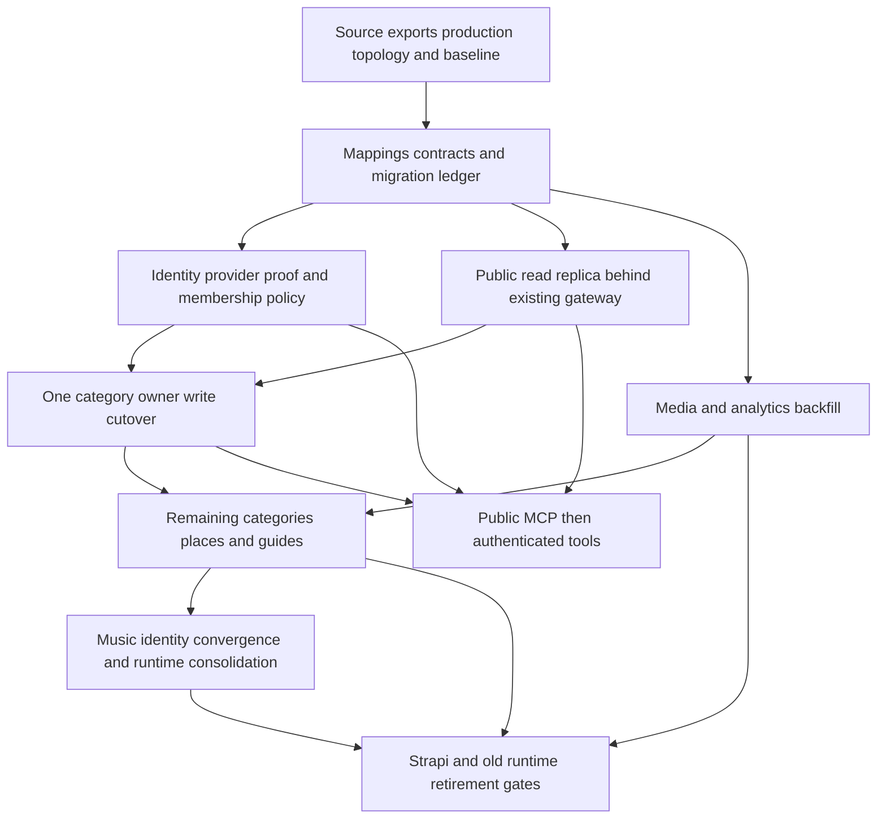

# Proposed contracts, schema and migration

> **Historical research only:** use the [consolidated target database schema](target-database-schema.md) for current table definitions and fresh-database implementation.

> **Superseded execution assumptions:** The agreed release starts with an empty database and Google-only login. Read [the revised direction and phase outline](revised-direction.md) first. Historical imports, credential migration, dual-write and reverse-sync phases below are retained as earlier research, not current requirements. Account ownership, shared entities, service contracts and parity principles remain relevant. Followers/community, admin UI and monetization are outside the first release.

**Proposal, not implementation.** Based on origin/main `79ef17d0b88c7e11b49d618fc7c888a513f29fa8`, investigated 30 September 2026. Read with [the architecture investigation](architecture-investigation.md). No migration files have been created.

## 1. Target identity and authorization

Use an established authentication implementation for credentials, Google federation, recovery, OAuth consent and token issuance. Better Auth is the preferred open-source candidate; Auth0 is the managed fallback. Explorers owns a stable internal user UUID and maps `(issuer, subject)` to it. Email and username are mutable attributes, not identity keys. Preserve Strapi user document ID, account document ID and Tunes numeric ID in explicit migration mappings. Do not automatically merge Google/password identities because their email strings match.

With Better Auth, mount its handlers in the API and use its Drizzle adapter with dedicated auth tables in PostgreSQL. Its provider-account records must be clearly distinguished from Explorers creator `accounts`. Keep generated auth-schema changes inside the existing reviewed migration process; do not run ad-hoc production schema synchronization. Login, consent, email delivery, recovery, key management and security updates remain our operational responsibility. For cookie-based web login, the auth handler can establish the session directly; a separate hosted-provider redirect is only needed for flows such as Google. The sequence below expresses the security boundary, not a requirement for another deployed auth service.

Separate users, accounts and account memberships. A person may manage more than one creator/business account; a creator may eventually have multiple editors. Every operation receives a server-resolved principal and explicit account context, then checks membership. A public recommended person has no authority merely because their handle matches an account.

### Web sequence

1. Browser starts login through an Explorers backend-for-frontend, which redirects to the provider using state, nonce where applicable, and authorization-code/PKCE controls.
2. Callback validates the response and resolves the stable issuer/subject mapping. New identities enter onboarding; existing identities require an import or verified account-linking match.
3. Backend creates an HttpOnly, Secure, appropriately SameSite session cookie; browser state contains presentation data, not a long-lived bearer token. State-changing cookie requests require CSRF/origin protection.
4. API loads canonical identity and account membership, applies lifecycle status and operation policy, and calls the shared application operation.
5. Logout terminates the web session. “Log out all devices” separately revokes sessions/grants and increments credential state. Define propagation bounds for provider JWTs and socket disconnection; do not claim that provider logout instantly invalidates all access tokens.

### MCP sequence

1. Anonymous tools use a public principal and return only public resources. Linking is unnecessary for discovery.
2. A protected tool returns the OAuth challenge/discovery metadata required by the current OpenAI flow. ChatGPT obtains consent for narrowly scoped access from the provider.
3. MCP validates issuer, audience/resource, signature, expiry and scope, then resolves the same canonical user and membership as HTTP. It must not accept a Strapi JWT or Music token merely because it is signed.
4. Account selection uses authorized account IDs returned by the service, not caller-supplied identity claims. The operation receives a validated principal and resource context.
5. Revoked membership, suspension and entitlement changes are enforced at operation time, with a documented cache lifetime. A refresh token is never returned by a tool.

Separate service credentials from delegated user credentials. A worker can have an explicit service principal and narrowly allowed operation set; it must not impersonate every creator using an admin token. If MCP later becomes a separate process, use an API token with the correct audience and supported delegated exchange. Do not forward the MCP access token to an unrelated upstream resource.

Proposed initial OAuth scopes: `profile:read`, `recommendations:read`, `recommendations:write`, `collections:write`, `analytics:read`. Scopes bound authority; they never replace row ownership, membership roles or entitlement checks. Add profile writes and destructive capabilities only when there is a concrete tool and consent use case.

## 2. Proposed logical schema

UUIDs below are stable application identifiers. Preserve legacy keys separately, including numeric media IDs. Use database foreign keys, unique constraints and check constraints for invariants; validated application commands for cross-resource policy. Names are illustrative and need final source schema/export verification.

| Table/family | Core columns and constraints | Purpose |
|---|---|---|
| `users` | id, lifecycle status, created/deleted timestamps | Canonical human identity; avoid credential data here |
| `identity_links` | user_id, issuer, subject; unique issuer+subject | IdP and historical identity bindings |
| `accounts` | id, type, display_name, bio, profile_visibility, lifecycle, revision | Creator/business publishing identity |
| `account_memberships` | account_id, user_id, role, status; unique pair | Ownership/editor authorization |
| `account_handles` | normalized_handle unique, account_id, canonical flag, retired_at | Canonical usernames and reserved historical redirects |
| `account_preferences` | account_id unique, validated category/nav/disclosure settings | Replace stringly typed Yes/No flags with explicit semantics |
| `account_contacts` | account_id, kind, value, visibility | Keep private contacts outside broad profile DTOs |
| `external_id_map` | source, resource_type, external_id, internal_id; unique source/type/key | Idempotent imports, reverse lookup, reconciliation |
| `entities` | id, type, display_name, lifecycle, canonical_entity_id optional, revision | Shared discoverable identity; reviewed merge/redirect history |
| `entity_external_ids` | entity_id, provider, kind, external_id; unique provider+kind+id | TMDB movie vs TV, Google Place, IGDB and other identifiers |
| `entity_source_assertions` | entity_id, source, observed_at, rights_reference, payload_version, snapshot JSONB | Provenance and reversible normalization |
| Typed entity detail tables | entity_id PK/FK and validated domain columns | Places, books/editions, screen works, games, apps, products, people, music references |
| `recommendations` | id, account_id, entity_id, commentary, rating/value scheme, visibility, disclosure_kind, published_at, reviewed_at, revision | Creator editorial assertion; soft archive; no global uniqueness that erases valid repeated contexts |
| `recommendation_provenance` | recommendation_id, source/import reference, authored/observed times | Distinguish creator assertion from imported catalog facts |
| `collections` | id, account_id, kind, title, slug, visibility, revision | Lists and guides; unique account+canonical slug with aliases |
| `collection_items` | id, collection_id, recommendation_id, position, context; uniqueness policy explicit | Ordered membership; creator ownership compatibility enforced |
| `guide_sections` | id, collection_id, title, position, block_schema_version, validated blocks JSONB | Itinerary/timeline/transport/stay/packing content preserved |
| `media_assets` | id, storage_key, checksum, MIME, byte_count, source, rights, processing_status | Original and derivative storage; do not use public URL as identity |
| `media_links` | asset_id, owned resource relation, role, order, visibility | Explicit allowed resource relations; enforce via real FKs/join tables |
| `claims` / `claim_evidence` | claimant, entity/account, evidence, review_status, reviewer, timestamps | Verified business ownership workflow distinct from recommendations |
| `follows` / `saves` | user_id and account/resource FKs; unique pairs | Optional new features, excluded from migration parity unless source data found |
| `music_*` | Preserve existing IDs/constraints initially; canonical user/account mapping added later | Playlists, queue, requests, publication, lifecycle and replay retain domain structure |
| `analytics_events` | event_id unique, event_type, source_surface, resource refs, occurred/received times, consent context, bounded metadata | Actual events, unlike current delivery-only receipt store |
| `analytics_rollups` | period, account/resource, event type, dimensions, counts; unique aggregate key | Rebuildable dashboard aggregates |
| `outbound_links` / `clicks` | validated destination/partner, resource, opaque correlation, time | Measurable referral boundary; no arbitrary redirect target |
| `conversions` | partner+external_event unique, click/order ref, status, amount, currency, evidence | Verified partner reports with adjustments |
| `products` / `prices` | product kind/resource, provider refs, currency, amount, period | Monetization product distinct from recommended product entity |
| `purchases` / `subscriptions` | buyer, provider/customer/order refs, state, period | Vendor-reconciled purchase lifecycle |
| `entitlement_grants` | subject, resource/capability, source purchase, valid interval, revocation | Access to paid guide or Pro feature; explicit, audited |
| `ledger_transactions` / `ledger_entries` | balanced currency-specific entries, source conversion, reversals | Auditable commission/revenue share; payout integration deferred |
| `operation_receipts` / `outbox` | actor+operation+key uniqueness, payload hash, result/replay state, lease | Durable idempotency and reliable external effects |
| `audit_events` | actor, action, resource, revision, request correlation, redacted change | Security/administrative history separate from marketing analytics |
| `import_runs` / `import_records` | source snapshot/watermark, counts, checksums, mapping, disposition/error | Reproducible migration and quarantine ledger |

**Avoid a universal polymorphic `resource_id` with no integrity.** Use concrete join tables/FKs where practical, or an explicitly validated resource registry. JSONB is for versioned rich payloads and retained source snapshots, not a substitute for ownership, visibility, ordering, money or identifiers.

### Typed entity decisions

- Places: provider identity, normalized address components, location coordinates, category and observed provider data. Store private creator contact notes separately. PostGIS when spatial queries are real requirements.
- Books: distinguish work from edition where source evidence permits. ISBN13 and Google volume IDs may identify editions differently; never merge solely by title/author.
- Movies/shows: external identity includes provider and media type. A numeric TMDB ID alone is insufficient.
- Games: preserve IGDB identity and licensed attribution; platforms and release variants may be many-to-many.
- Apps: canonical website/store identifiers where known; URL normalization cannot prove two apps are identical.
- Products: distinguish product, variant and merchant offer; convert floating legacy prices into validated decimal/minor-unit amounts with recorded interpretation and currency precision. Unknown currency stays unknown.
- People: retain name/handle/source; no automatic connection to a login account. Support reviewable merges and contested identity.
- Music: catalog references can be shared entities; live playlist/queue row identity and history remain separate.

### Essential indexes and concurrency

Index every frequently traversed ownership FK. Use `(account_id, visibility, published_at DESC, id)` on recommendation reads; `(entity_id, account_id)` for overlap; `(collection_id, position, id)` for ordering; unique normalized handle and source keys. Add FTS GIN on derived public search documents and spatial indexes only for supported query shapes. Event indexes start with `(account_id, occurred_at)` and source/resource filters; partition only after measured volume warrants it.

Use optimistic `revision`/ETag checks for edits and reorder commands. Command idempotency binds actor, operation, key and payload hash; a reused key with different payload fails. Use transactions for edits + outbox/audit, advisory/row locks only where required, and retain existing Music replay semantics rather than translating them prematurely to a weaker generic table.

## 3. Shared application and transport contracts

All operations apply input validation, principal resolution, authorization, lifecycle/visibility, persistence and audit once. Domain results are explicit DTOs. HTTP and MCP adapters translate errors and format responses without reimplementing permission or pricing logic.

| Application operation | Proposed HTTP adapter | Proposed MCP tool | Authorization/behavior |
|---|---|---|---|
| `searchRecommendations` | GET `/v1/recommendations` | `search_recommendations` | Public only; bounded filters/cursor; disclosure/provenance |
| `searchCreators` | GET `/v1/creators` | `search_creators` | Public account fields only |
| `getCreatorProfile` | GET `/v1/creators/:handle` | `get_creator_profile` | Public policy; canonical URL and historical handle resolution |
| `listCreatorRecommendations` | GET `/v1/creators/:id/recommendations` | `get_creator_recommendations` | Public or authorized owner mode explicitly separated |
| `getCollection` | GET `/v1/collections/:id` | `get_collection` | Public, member or entitled reader; children rechecked |
| `compareCreatorRecommendations` | GET `/v1/recommendations/overlap` | Search filter initially; separate tool only if useful | Bounded creator set; count distinct creators |
| `getMyAccounts` | GET `/v1/me/accounts` | `get_my_profile` | Linked identity; returns allowed account contexts |
| `resolveEntity` | POST `/v1/entities/resolve` | Optional resolution tool or structured candidates | No silent ambiguous match; upstream lookup quota |
| `createRecommendation` | POST `/v1/accounts/:id/recommendations` | `create_recommendation` | Member + write scope; idempotent; draft by default |
| `updateRecommendation` | PATCH `/v1/recommendations/:id` | `update_recommendation` | Ownership + expected revision; field allowlist |
| `archiveRecommendation` | POST `/v1/recommendations/:id/archive` | `archive_recommendation` | Explicit intent; reversible archive; truthful destructive annotation |
| `createCollection` | POST `/v1/accounts/:id/collections` | `create_collection` | Member; explicit kind/visibility |
| `updateCollection` / `moveItems` | PATCH collection / POST item move | `update_collection` | Atomic order and membership validation, expected revision |
| `updateProfile` | PATCH `/v1/accounts/:id/profile` | Deferred `update_profile` | Elevated fields/handle changes separately authorized |
| `getCreatorAnalytics` | GET `/v1/accounts/:id/analytics` | `get_creator_analytics` | Analytics scope + membership, bounded aggregates |
| Music application operations | Preserve `/api/music/*` compatibility first | No V1 music-control tools required | Existing principal/capability boundaries remain |

Typical result includes stable ID, canonical web URL, visible content, creator attribution, publication/review time where useful, disclosure, cursor and revision where editing needs it. Do not expose internal telemetry IDs or migration keys in MCP output. HTTP errors distinguish unauthenticated, forbidden/not found policy, conflict, rate limit, validation, upstream unavailability and gone. MCP produces structured recoverable errors without leaking internal exceptions.

For ambiguous “add this café,” resolve candidates and ask for selection rather than writing a guessed entity. An edit preview should show resource, account, fields and visibility. Publish/delete/purchase-like operations must require clear user intent and appropriate host confirmation; tool annotations alone are not the authorization mechanism. Avoid generic SQL, arbitrary fetch, bulk-admin or “execute action” tools.

## 4. Migration dependency graph and phases

These are exit-gated phases, not calendar estimates. Data volume, external access and source quality are unknown; committing to weeks now would be false precision.

| Phase | Work and owner responsibility | Exit criteria / rollback |
|---|---|---|
| 0. Establish baseline | Platform/data owner obtains Strapi schemas, permissions/hooks, rows/media, vendor configuration and actual deployment topology; product owner defines parity | Read-only exports restorable; URL/feature/permission matrix approved; authoritative release path identified |
| 1. Contracts and mapping | Backend/data owners define stable IDs, migration ledger, DTOs, ownership/visibility policy and source adapters | Deterministic import reruns; duplicate/orphan quarantine; source-to-target field map accounts for every field |
| 2. Parallel identity proof | Identity owner evaluates provider, import/hash support, Google linkage, recovery and MCP OAuth discovery; preserve source proof bridge | Existing-account login/mapping, ambiguous account denial, revocation and recovery demonstrated; no automatic email merge |
| 3. Public read shadow | Import profiles and a representative category, serve behind existing gateway contract; compare shadows without public impact | Complete pagination, fields/privacy, slugs/QR, cache invalidation and outage behavior match; flag switches back before new writes |
| 4. Media and analytics | Copy media and rewrite only after checksums; import events and replay with dedupe; retain receipt states | Object/variant and dashboard reconciliation; no missing private assets or double counting; old origins retained |
| 5. First owner write slice | Books is a reasonable first candidate after export confirms complexity; migrate its full CRUD/list/media/visibility path | Exactly one writer; transaction/revision/idempotency tests; canary cohort and reconciliation clean; rollback data path rehearsed |
| 6. Category expansion | Movies/games/apps/products/people, then richer places and guides; ordering adjusted to measured dependency graph | Each category meets same exit gate; place-linked lists and guide structured sections round-trip |
| 7. Identity cutover | Enable canonical web sessions and translate principal into existing Music ownership mapping | No duplicate users/accounts; old tokens no longer accepted where cut over; safe fallback and recovery period |
| 8. Music convergence | Reuse services/repositories/policies, maintain API/socket compatibility, converge ownership refs before package moves | Queue/history/publication/guest/sockets/lifecycle parity under load and failure; all retained IDs preserved |
| 9. Distribution | Public MCP after public contracts stabilize; authenticated tools after identity and write commands stabilize | Official auth/tool/privacy review, negative cases and submission evidence complete; plugin outage does not affect web |
| 10. Retirement | Remove traffic/dependencies only after remaining callers, jobs, uploads and analytics are accounted for | Retention/restore window met, zero required source calls, exports/restores verified, explicit operational retirement decision |

MCP public reads can be developed after the public seam stabilizes; they do not need to wait for every Music internal move. They also do not justify accelerating identity or data cutover. Commerce is a later independent product phase, not a prerequisite to replacing Strapi.

### Snapshot and incremental transfer

Capture a consistent source snapshot and a reliable change watermark. If Strapi/backend access cannot provide a complete incremental feed including deletes, use a controlled write freeze for final reconciliation. An `updatedAt` poll alone is insufficient if it misses deleted rows, relation-only updates or timestamp ties. Record source keys, raw snapshots, transforms, target IDs, checksums, errors and dispositions in the import ledger.

Backfill parents before children, media before replacing references, and validate ownership/visibility on every imported relationship. Quarantine rather than discard orphaned or malformed records. Preserve rich JSON losslessly in restricted source snapshots while deriving typed target fields. Map null/empty/case variants explicitly; do not silently “clean up” source meaning.

For each category, define a write-authority state: SOURCE, FROZEN, TARGET, or REVERSE_SYNC. Route all commands according to that state. Avoid independent best-effort dual writes. If an interim dual-write design is unavoidable, one system is authoritative and a durable outbox/reconciler handles delivery and conflict policy.

### Parity matrix

| Dimension | Required checks |
|---|---|
| Counts | Per model/account/visibility, child relations, deleted/quarantined records; exact explainable differences |
| Content | Normalized field comparison, rich JSON preservation, Unicode, decimal/currency, timestamps and timezone |
| Authorization | Anonymous vs owner vs another owner vs editor vs suspended; private category/list/child, nested contact fields, direct object access |
| Identity | Password/Google/recovery, blocked/unconfirmed, zero/multiple accounts, concurrent ensure, source outage, renamed email/handle |
| Public URLs | Every sampled canonical/legacy slug, QR target, username redirect, music guest/public/unlisted/revoked URL |
| Media | Original and variant checksums, embedded references, access control, deletion and cache behavior |
| Frontend | Mobile/desktop, list/detail/add/edit/delete/reorder/pin, category settings, maps, guide sections, loading/error/empty states |
| Analytics | Consent denied/granted, dedupe/retry, owner exclusion, receipts, dashboard ranges and late arrival |
| Music | Playlist/queue/history, concurrent reorder, publication replay, requests, socket reconnect/revision, suspension and entitlement freshness |
| Operations | Migration gate, backup restoration, least privileges, redacted logs, rate limits, provider timeouts and graceful shutdown |

Use existing Music tests as acceptance assets, plus golden response fixtures and export-level reconciliation. Run the configured suites during implementation; this investigation did not execute them and does not claim a green build.

### Cutover and rollback

Before target writes, rollback is a routing flag plus cache invalidation, with the source still authoritative. After target writes, rollback requires verified reverse mapping and synchronization of new/changed/deleted data, or a freeze and forward repair. Reverting application binaries does not reverse SQL migrations or data changes. Prefer expand/contract schema changes compatible with retained images.

Select canaries by account, not random individual requests that split an account across writers. Record release, mapping and watermark. Monitor error/latency, denied-access anomalies, row deltas, replay conflicts, missing media and analytics delivery. Define quantitative thresholds from the baseline before release; none can responsibly be invented from this source-only audit. Rehearse restore and reconciliation in a nonproduction environment.

Do not delete Strapi, its media origin, or the Tunes runtime until every retained read/write/job and lifecycle dependency has an owner and a passing retirement gate. Retain encrypted backups and documented restore procedures for the agreed retention period. Repository folder renaming is the last cleanup, not evidence of successful unification.

## 5. Decisions needed at the next review

1. Confirm the nine current category parity obligations and which retained, retired UI flows should disappear rather than be rebuilt.
2. Approve account/membership separation and entity-plus-recommendation modeling, including the deliberate exceptions for guides and live Music.
3. Assign access/owners for external Strapi exports, actual deployment configuration, media rights and production reconciliation.
4. Authorize a bounded identity-vendor/import proof and public gateway shadow slice; choose provider only on demonstrated compatibility and cost.
5. Keep paid guides, sponsorship, API billing and broad semantic search out of the initial migration critical path.
